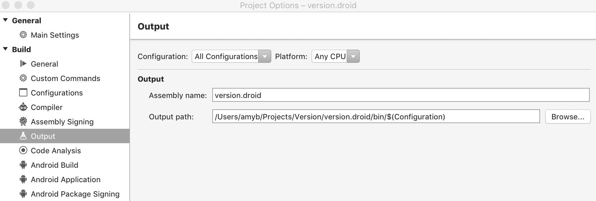
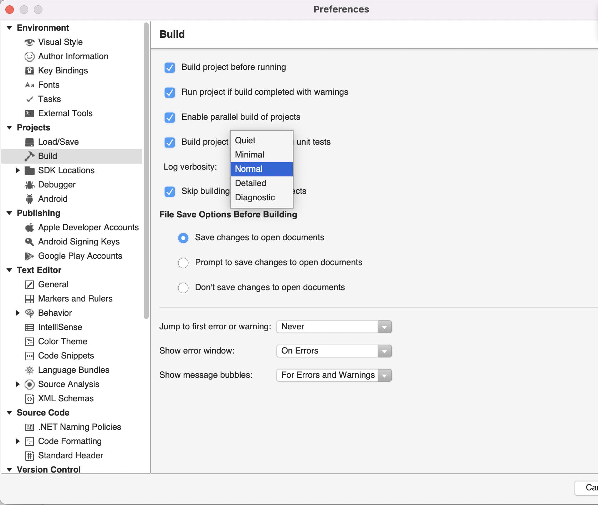

# Compiling and building in Visual Studio for Mac

Visual Studio for Mac can be used to build applications and create assemblies during the development of your project. It's important to build your code often to allow you to quickly identify type mismatches, erroneous syntax, misspelled keywords, and other compile-time errors. By building then debugging, you can also find and fix run-time errors such as logic, IO, and divide-by-zero errors.

A successful build means the source code contains correct syntax and all static references to libraries, assemblies, and other components can resolve. The build process produces an application executable. This executable may then be tested via debugging and different kinds of manual and automated tests to validate code quality. After your application is fully tested, you can compile a release version to deploy to your customers.

On the Mac, you can use any of the following methods to build your application: Visual Studio for Mac, MSBuild command-line tools, or Azure Pipelines.

| Build Method | Benefits |
| --- |--- | --- |
| Visual Studio for Mac |- Create builds immediately and test them in a debugger. - Run multi-processor builds for C# projects. -   Customize different aspects of the build system. |
| MSBuild command line| - Build projects without installing Visual Studio for Mac. - Run multi-processor builds for all project types. -   Customize most areas of the build system.|
| Azure Pipelines | - Automate your build process as part of a continuous integration/continuous delivery pipeline. - Apply automated tests with every build. - Employ virtually unlimited cloud-based resources for build processes. - Modify the build workflow and create build activities to perform deeply customized tasks.|

The documentation in this section goes into further details of the IDE-based build process. For more information about building applications via the command line, see [MSBuild](/visualstudio/msbuild/msbuild). For details on building applications with Azure Pipelines, see [Azure Pipelines](/azure/devops/pipelines).

> [!NOTE]
> This topic applies to Visual Studio for Mac. For Visual Studio on Windows, see [Compile and build in Visual Studio](/visualstudio/ide/compiling-and-building-in-visual-studio).

## Building from the IDE

Visual Studio for Mac lets you create and run builds instantly, while still giving you control over build functionality. When you create a project, Visual Studio for Mac defines a default build configuration that sets the context for builds. You can edit default build configurations and also create your own. Creating or modifying these configurations will automatically update the project file, which is then used by MSBuild to build your project.

For more information regarding how to build projects and solutions in the IDE, see the [Building and cleaning Projects and Solutions](building-and-cleaning-projects-and-solutions.md) guide.

Visual Studio for Mac can also be used to do the following:

* Change the output path. This is edited in your Project's options:

    

* Change the verbosity of the build output:

    

* Add Custom Commands before, during, or after Building or Cleaning:

    

## See also

- [Compile and build (Visual Studio on Windows)](/visualstudio/ide/compiling-and-building-in-visual-studio)
