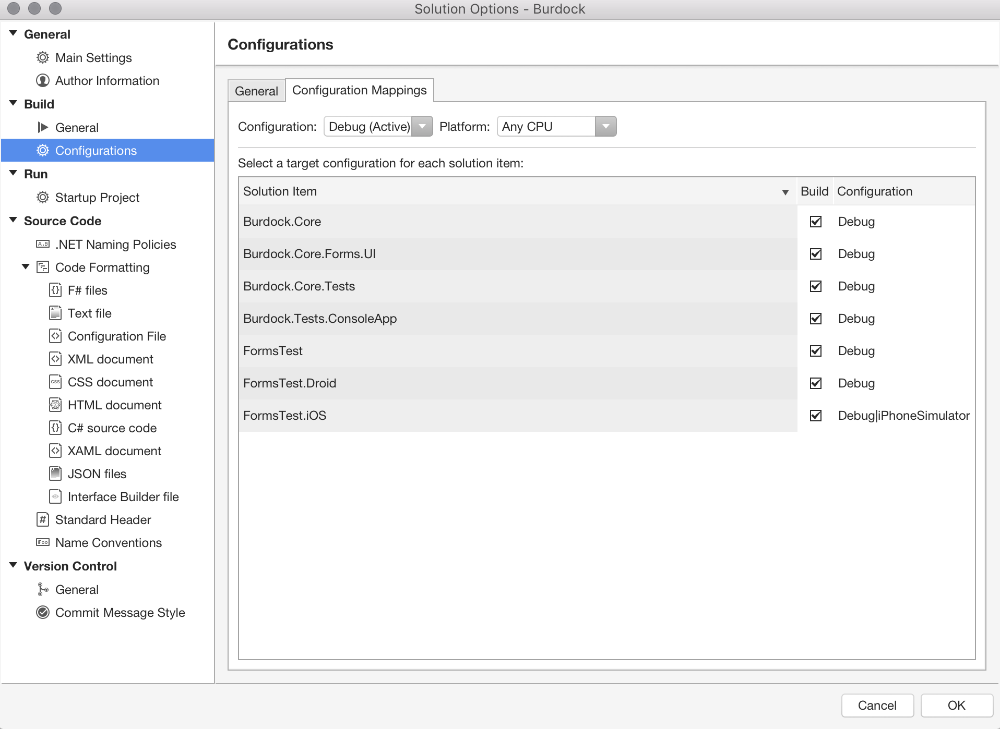
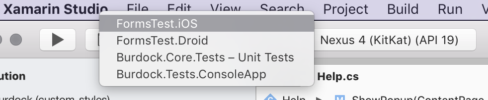

# Understanding build configurations

You can store different configurations of solution and project properties to use in different kinds of builds during the development process. Projects created by Visual Studio for Mac using a template will typically include Debug and Release configurations that support debugging of an app and deployment of an app, respectively. 

If you'd like to create custom configurations, see [Creating and editing build configurations](/visualstudio/mac/create-and-edit-configurations).

>[!NOTE]
>This topic applies to Visual Studio for Mac. For Visual Studio on Windows, see [Understand build configurations](/visualstudio/ide/understanding-build-configurations).

## Solution configurations

Solution configurations are used to specify configurations for all projects in a solution. By using the **Configuration Mappings** tab under the **Build > Configurations** item, you can assign a target configuration for each item in the opened solution. This is demonstrated in the following image:

For more information about configurations, see the [Configuration Manager](https://www.youtube.com/watch?v=tjSdkqYh5Vg) video by James Montemagno.

## Project build configurations

Projects tend to have multiple configurations. The configuration and platform a project targets are used together to specify the properties to use when it's built. Switching between configurations allows for different outputs at build time. For example, a Debug configuration will output debugging symbols, allowing the debugger to resolve function names, parameters, or variables from a crashed application's stack trace. While this additional information is useful during development, it leads to an inflated file size and isn't ideal for distribution.

Each platform has specific configurations for its build. The build configuration pages for projects can be accessed by navigating to the **Build** section in the **Project Options** dialog. Open up this dialog by right-clicking the project and selecting **Options** or by double-clicking the project in the solution explorer.

## Run configuration

Visual Studio for Mac allows you to set a _run configuration_. The run configurations are presented in a drop-down list in the toolbar, next to the build configuration selector as illustrated below:

A run configuration is a set of execution options with a name and several configurations that are defined in a project for different purposes. Run configurations are defined at the project level, and a default will be created automatically for each executable project, although it's possible to add as many as needed. Certain project types automatically generate additional run configurations. For example, watchOS projects may generate  _Glance and Notification configurations._

Configurations can be shared with other developers (in which case the configurations will be stored in the .csproj file) or kept locally (in which case they'll be stored in a .user file).

### Android run configurations

Run configurations for Android projects allow specification of a particular activity, service, or broadcast receiver to launch when running or debugging the project. You can pass intent extra data and set intent flags to test your components under different launch conditions.

Activities other than the `MainLauncher` will need to have `Exported=true` added to the Activity attribute for debugging on a physical device, or have Intent filters defined.

## Examples of data that might be included in run configurations

The following list provides some examples of data that could be included in run configurations:

* Regular .NET project
  * Alternative startup app
  * Start arguments
  * Working directory
  * Environment variables
  * Mono runtime options (to be used only when running on Mono)
* Android project
  * Entry point (activity, service, receiver)
  * Intent arguments and data
* iOS project
  * Mode (Normal, Background Fetch)
* iOS extension project
  * Startup app: default or custom
* WatchKit project
  * Mode (Glance, Notification)
  * Notification payload

## See also

- [Understand build configurations (Visual Studio on Windows)](/visualstudio/ide/understanding-build-configurations)
