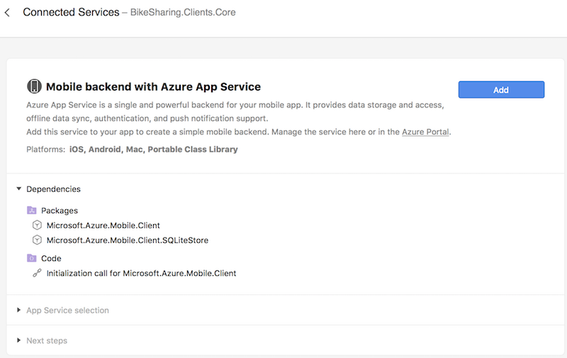
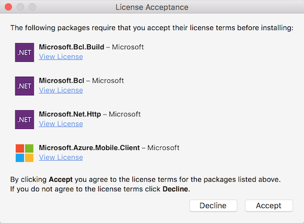
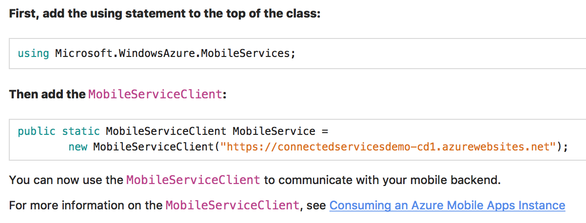
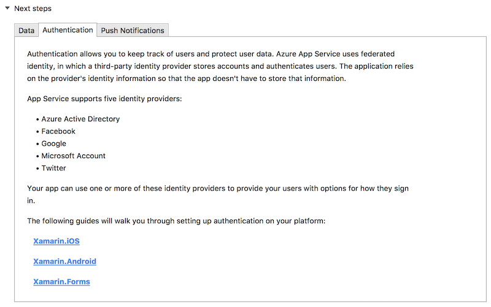

# Connected Services walkthrough

The Connected Services workflow brings the Azure portal workflow into Visual Studio for Mac, so you don’t have to leave your project to add services.

This walkthrough shows how to add an Azure backend service, which brings cloud data storage, authentication, and push notifications to a cross-platform Xamarin.Forms Portable Class Library (PCL) application.

1. Start by double-clicking on the **Connected Services** node in the solution, which brings up the **Services Gallery**.
  This is a list of all the available services for the application type. Select a service (such as **Mobile backend with Azure App Service**) by clicking on it.

    

2. The Service Details Page has a description of the service and the dependencies to be installed.
  Click the **Add** button to add the dependencies to the app:

    

3. The dependencies need to be added to both the PCL and the platform-specific projects to work.
  Select the checkboxes to add the service to every project that will reference it (either directly or indirectly):

    

4. Choose **Accept** on the **License Acceptance** dialogs for the NuGet packages.
  There may be two dialogs to accept, one for the MobileClient and dependencies, and another for SQLiteStore, which is required for offline data sync:

    

    

5. Once the dependencies are added, you'll be asked to log in with the account you want to use to communicate with Azure.
  If you’re already logged in with a Microsoft ID, Visual Studio for Mac will attempt to fetch your Azure subscriptions
  and any app services associated with them. If you do not have any subscriptions, you can add one by signing up for a free trial or purchasing a subscription plan in the Azure portal.

6. Select an app service from the list. This will fill the template code for the `MobileServiceClient` object with the corresponding URL of the app service on Azure:

    

    If there are no services listed, click the **New** button (see Step 9.)

7. Copy the template code for the `MobileServiceClient` into the PCL. The file location is not important, so long as there is only one instance of it.
  The recommended approach is to create an `AzureService` class that handles all Azure interactions and uses the `MobileServiceClient`:

    

8. Follow the documentation in **Next Steps** to add data, offline sync, authentication, and push notifications to your app:

    

9. If you don’t have any existing app services, you can create new services from within Visual Studio for Mac.
  Click the **New** button in the bottom left of the services list to open the **New App Service** dialog:

    

A new service requires the following parameters:

- **App service name** – unique name/id for the plan
- **Subscription** – the subscription you’d like to use to pay for the service
- **Resource Group** – a way or organizing all your Azure resources for a project. Option to use existing or create a new one. If this is your first Azure service, create a new one.
- **Service Plan** – Determines the location and cost of any resources that use it. Option to use existing or create a new one. If this is your first Azure service, use the default one or create a new one in the free tier (F1).

Visit the [Mobile apps documentation](/azure/app-service-mobile/) for more information.

## See also

- [Connected Services (Visual Studio on Windows)](/visualstudio/azure/vs-azure-tools-connected-services-storage)