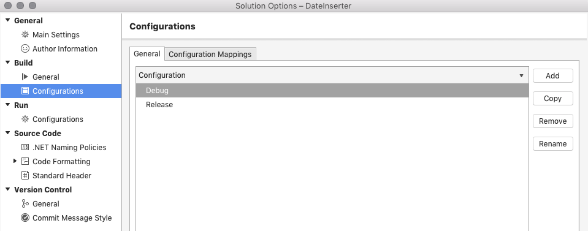

# Creating and editing build configurations

Build configurations can be created for individual projects or on a solution-wide basis. These configurations give you precise control over a build.

The options menu for both projects and solutions provide you with an area to create and edit new and existing configurations.

## Creating a project build configurations

To create a project build configuration, take the following steps:

1. Right-click on the project node and select **Options**.

2. In the Project Options dialog, select **Build > Configurations**:

    

3. To create a new configuration, select **Add**. Alternatively, you can copy one of the existing configurations.

Once the configuration has been created, you can use the **Build** section in the Project Options to adapt properties appropriate to your configuration:

## Creating a solution build configuration

To create a solution build configuration, take the following steps:

1. Right-click on the Solution node and select **Options**.

2. In the Solution Options dialog, select **Build > Configurations**:

    

3. To create a new configuration, select **Add**. Alternatively, you can copy one of the existing configurations.

Once the configuration has been created, you can use the **Build** section in each project's options to adapt properties appropriate to your configuration:

## Editing a build configuration

To rename a configuration, select it from the Configuration list in the Project or Solution Options:

Select the **Rename** button.

## Related Video

> [!Video https://channel9.msdn.com/Shows/Visual-Studio-Toolbox/Visual-Studio-for-Mac-Launch-Multiple-Projects/player]

## See also

- [Create and edit build configurations (Visual Studio on Windows)](/visualstudio/ide/how-to-create-and-edit-configurations)