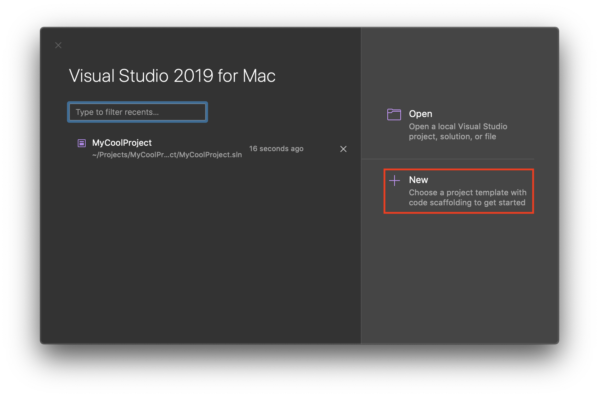
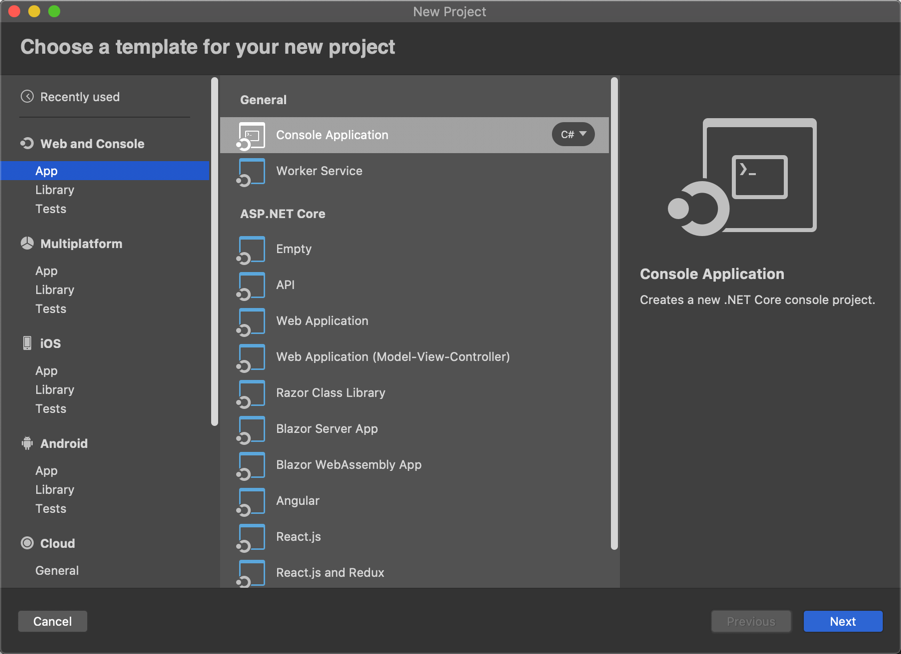
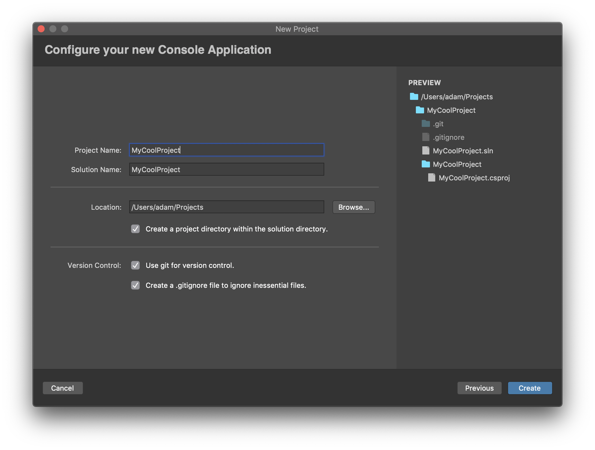

# Creating a New Project

## Opening the Project Creation Dialog

There are a few ways to create a new project in Visual Studio for Mac. When you first open Visual Studio for Mac, the welcome screen will be shown. From here you can choose **New** which will take you to the project creation screen.

> [!TIP]
> Additionally, from the welcome screen, you can also open, and search for, recent projects and solutions. You can also open recent projects by going to the menu bar and choosing **File > Recent Solutions**

If Visual Studio for Mac is already open with a solution loaded, you can create a new solution by going to the menu bar and choosing **File > New Solution**. Creating a new solution this way will close the solution that is already loaded.

## Creating a New Project from a Template

The **New Project** dialog, by default, will show your recently used templates sorted by *most recently used*.

If you do not want to use a recent template, you can choose from the categories on the left of the dialog. Each category contains several project templates for you to choose from. Clicking on a project type allows you to see a description on the right side of the screen.

## Configuring Your New Project

Once you have chosen a project template, the following screens will take you through any configuration steps required to set up the project; this can vary by project type.

All projects require a new project, along with a location to store the files. If the project is part of a new solution, rather than adding it to an existing solution, a solution name will also be required.

Optionally, at this stage you can also configure Git source control options. The following image is an example of the final configuration step for a .NET Core project:

## Adding Additional Projects to a Solution

You can add additional projects to a solution by right-clicking the solution in the Solution Pad and choosing either **Add > Add New Project** or **Add > Add Existing Project**.

Adding a new project will take you through project creation, as shown in [Configuring Your New Project](#configuring-your-new-project).

Choosing to add an existing project will allow you to browse for an existing project on your machine and add it to the solution.

## See also

- [Create solutions and projects (Visual Studio on Windows)](/visualstudio/ide/creating-solutions-and-projects)