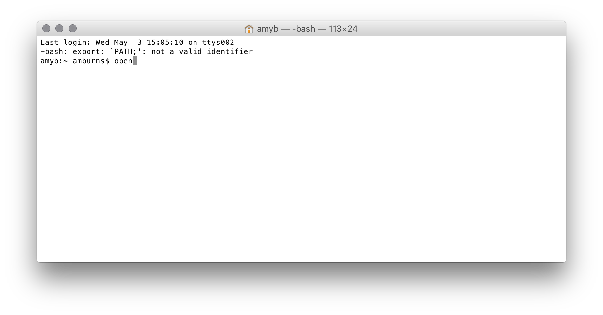
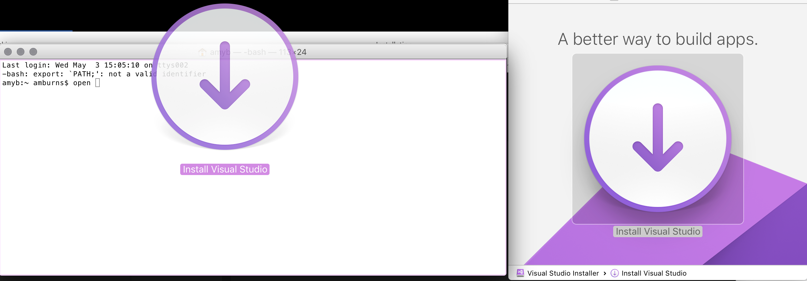
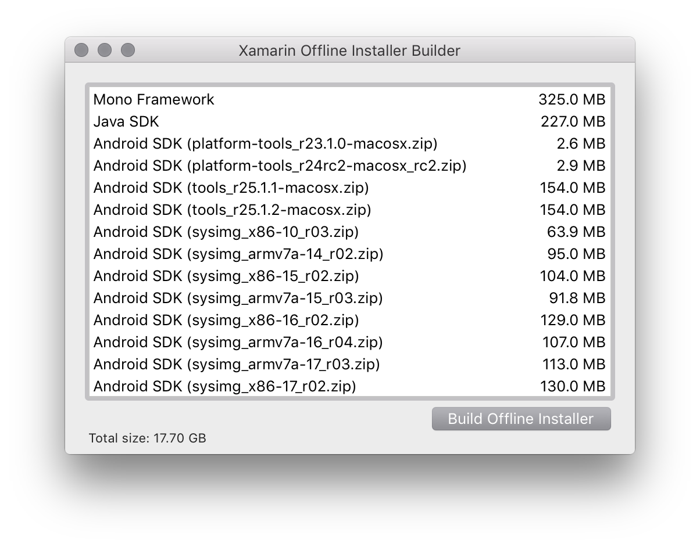

# Create an Offline Installer for Visual Studio for Mac

You can create an offline installer for Visual Studio for Mac using any connected Mac machine.

For basic offline installs, do the following:

1. Download the Visual Studio for Mac DMG from [here](https://www.visualstudio.com/vs/visual-studio-mac/)

2. Mount the DMG on the Mac by double-clicking on the downloaded file. This should open the mounted file in Finder:

  

3. Open Terminal

4. Type `open` into Terminal:

    

5. To make things easy, drag the `.app` icon to the Terminal window. This adds the location of the `.app` to the Terminal without the need to manually escape spaces or type out the location of the mounted DMG:

  

6. Add the offline-build argument to Terminal by appending `--args --offline-build` to the command:

  

  For example:

  ```
  open /Volumes/Visual\ Studio\ Installer/Install\ Visual\ Studio.app --args --offline-build
  ```

7. Press **Return** to enter the command. This will launch an offline installer builder that you can use to create an offline package:

  

8. Select **Build Offline Installer** to save the location of the offline installer and start building it.

  