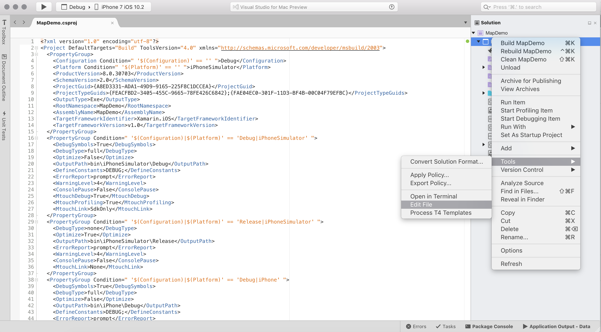

# Customizing the Build System

MSbuild is a build engine developed by Microsoft, that allows for the building of primarily .NET applications. The Mono framework also has it's own implementation of Microsoft's Build Engine (MSBuild), called **xbuild**. However, xbuild has been phased out, in favor of using MSBuild on all operating systems.

**MSbuild** is primarily used for as the build system for projects in Visual Studio for Mac. 

MSBuild works by taking a set of inputs, such as source files, and transforms them to outputs, such as executables, and achieves this output by invoking tools such as the compiler. 


## MSBuild file

MSBuild uses an XML file, called a project file, that defines the *Items* that are part of your project (such as image resources), and the *Properties* required to build your project. This project file will always have a file extension ending in `proj`, such as `.csproj` for C# projects. 

### Viewing the MSBuild File
You can locate this file, by right-clicking on your project name, and selecting **Reveal in Finder**. This will display all the files and folders related to your project, including the `.csproj` file, as illustrated below:


You can also display the `.csproj` in a new tab in Visual Studio for Mac, by right-clicking on your project name and browsing to **Tools > Edit File**:



### Composition of MSBuild file

All MSBuilds files contain a mandatory root `Project` element, as displayed below:

```
<?xml version="1.0" encoding="utf-8"?>
<Project ToolsVersion="14.0" xmlns="http://schemas.microsoft.com/developer/msbuild/2003">
</Project>
```

Typically, the project will also import a `.targets` file, which contains many of the rules that describe how to process and build the various files. This will usually appear towards the bottom of your `proj` file, and for C# projects will look something similar to the following:

```
<Import Project="$(MSBuildBinPath)\Microsoft.CSharp.targets" />
```

The targets file is another MSBuild file. This file contains MSBuild code that is reusable by multiple projects. For example, the `Microsoft.CSharp.targets` file, which is found in a directory represented by the `MSBuildBinPath` property (or variable), contains the logic for building C# assemblies from C# source files.

### Items and Properties

There are two fundamental data types in MSBuild: *items* and *properties*, which are explained in more detail below.

#### Properties

Properties are key/value pairs, which are used to store settings that affect compilation, such as compiler options.

They are set using a PropertyGroup, and can contain any number of PropertiesGroups, which can contain any number of properties. 

For example, the PropertyGroup for a simple console application might look like the following:

```
<PropertyGroup>
		<Configuration Condition=" '$(Configuration)' == '' ">Debug</Configuration>
		<Platform Condition=" '$(Platform)' == '' ">x86</Platform>
		<ProjectGuid>{E248730E-1393-43CC-9183-FFA42F63BE81}</ProjectGuid>
		<OutputType>Exe</OutputType>
		<RootNamespace>refactoring</RootNamespace>
		<AssemblyName>refactoring</AssemblyName>
		<TargetFrameworkVersion>v4.5</TargetFrameworkVersion>
	</PropertyGroup>
```

Properties can be referred to from expressions using the `$()` syntax. For example, `$(Foo)` will be evaluated as the value of the `Foo` property. If the property has not been set, it will evaluate as an empty string, without any error.

#### Items

Items are a way of dealing with inputs into the build system as lists or sets, and typically represent files. Each item has an item *type*, an item *spec*, and optional arbitrary *metadata*. Note that MSBuild doesn’t operate on individual items, it takes on all the items of a given type–called an item *set*

Items are created by declaring an `ItemGroup`. There can be any number of ItemGroups, which can contain any number of items. 

For example the code snippet below creates the iOS Launch Screens. These are of type `BundleResource` with the spec as the path to the image:

```
 <ItemGroup>
    <BundleResource Include="Resources\Default-568h%402x.png" />
    <BundleResource Include="Resources\Default%402x.png" />
    <BundleResource Include="Resources\Default.png" />
    <BundleResource Include="Resources\Default-Portrait.png" />
    <BundleResource Include="Resources\Default-Portrait%402x.png" />
    <BundleResource Include="Resources\Default-Landscape%402x.png" />
  </ItemGroup>
 ```
 
 Item sets can be referred to from expressions using the `@()` syntax. For example, `@(BundleResource)` will be evaluated as the BundleResource item set, i.e. all of the BundleResource items. If there are no items of this type, it will be empty, without any error.

## Resources for learning MSBuild

The following resources can be used to learn about MSBuild in more detail:

* [MSDN – Overview](https://msdn.microsoft.com/en-us/library/dd393574.aspx)
* [MSDN – Concepts](https://msdn.microsoft.com/en-us/library/dd637714.aspx)


