# Customizing the IDE

 [!INCLUDE [Visual Studio for Mac](~/includes/applies-to-version/vs-mac-only.md)]

Visual Studio for Mac can be customized, allowing users to develop apps in an environment that meets their needs for both efficiency and aesthetics. This article explores the variety of ways that Visual Studio for Mac can be adapted to suit your needs.

## Dark theme

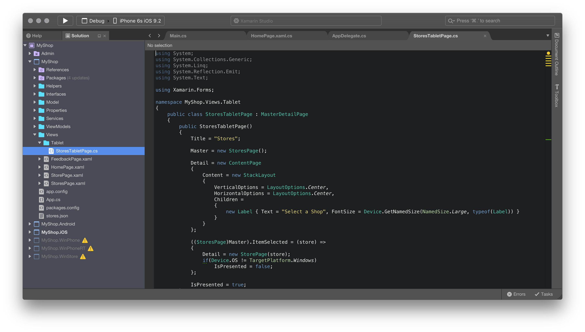

You can switch themes in Visual Studio for Mac by browsing to **Visual Studio > Preferences > Environment > Visual Style** and selecting your desired theme from the **User Interface Theme** drop-down, as illustrated in the following image:

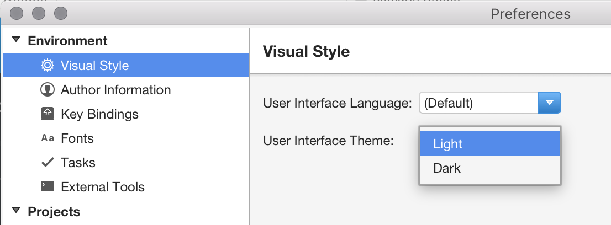

## Localization

Visual Studio for Mac is localized in the following 14 languages, enabling it to be accessible to more developers:

* Chinese - China
* Chinese - Taiwan
* Czech
* French
* German
* English
* Italian
* Japanese
* Korean
* Polish
* Portuguese - Brazil
* Russian
* Spanish
* Turkish

To change the language displayed by Visual Studio for Mac, browse to  **Visual Studio > Preferences > Environment > Visual Style** and select your desired language from the **User Interface Language** drop-down, as illustrated in the following image:

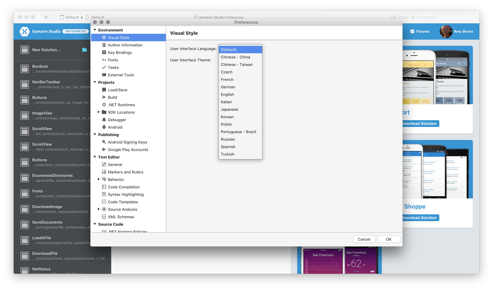

## Author information

The author information panel lets you add relevant information about yourself such as your name, email address, the copyright owner for your work, your company, and trademark:

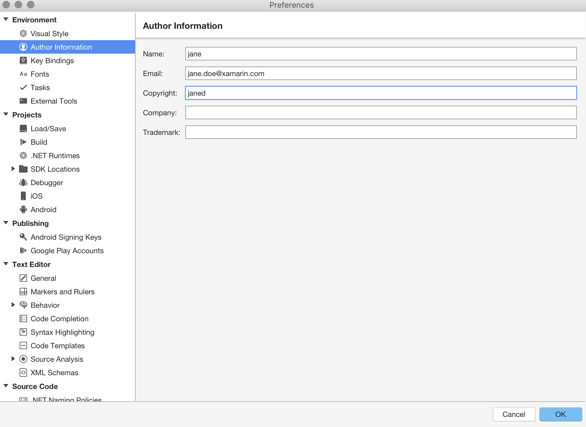

This information is used to populate standard file headers, such as a license, that you might add to new files:

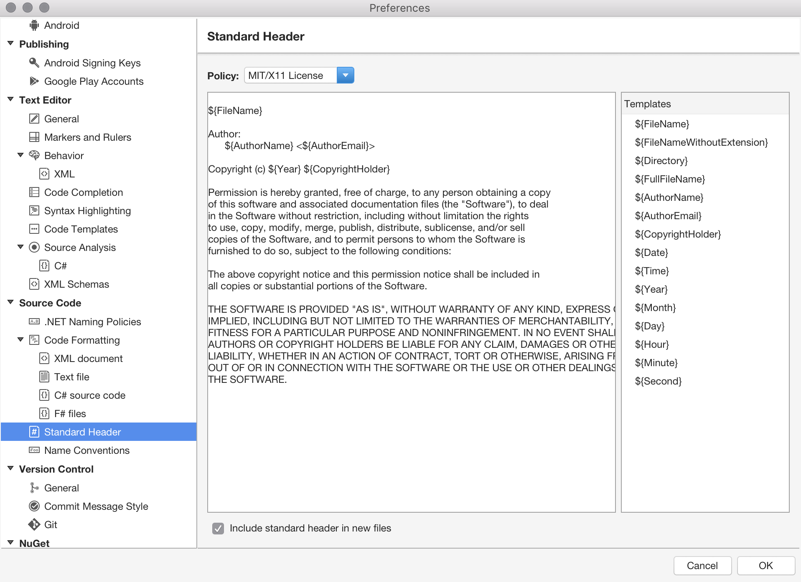

Populated **Name** and **Email** fields will be used in any commit that is made through Version Control in Visual Studio for Mac. If you haven't populated these fields, Visual Studio for Mac will prompt you to do so when you try to use Version Control.

## Key bindings

Key bindings, or keyboard shortcuts, allow you to adapt your development environment so that you can move more efficiently throughout Visual Studio for Mac. It provides familiar key bindings for many popular IDEs, such as Visual Studio (on Windows), ReSharper, Visual Studio Code, and Xcode.

Key bindings can be set by browsing to **Visual Studio > Preferences > Environment > Key Bindings**, as illustrated by the following image:

From here you can search for key binding combinations, view conflicting bindings, add new bindings, and edit the existing bindings.

These bindings can also be set during the initial setup of Visual Studio for Mac, via the **Keyboard Selection** screen:

## Workspace layout

Visual Studio for Mac's workspace consists of a main document area (normally the editor, designer surface, or options file), surrounded by complementary *tool windows* that contain useful information for accessing and managing application files, testing, and debugging.

 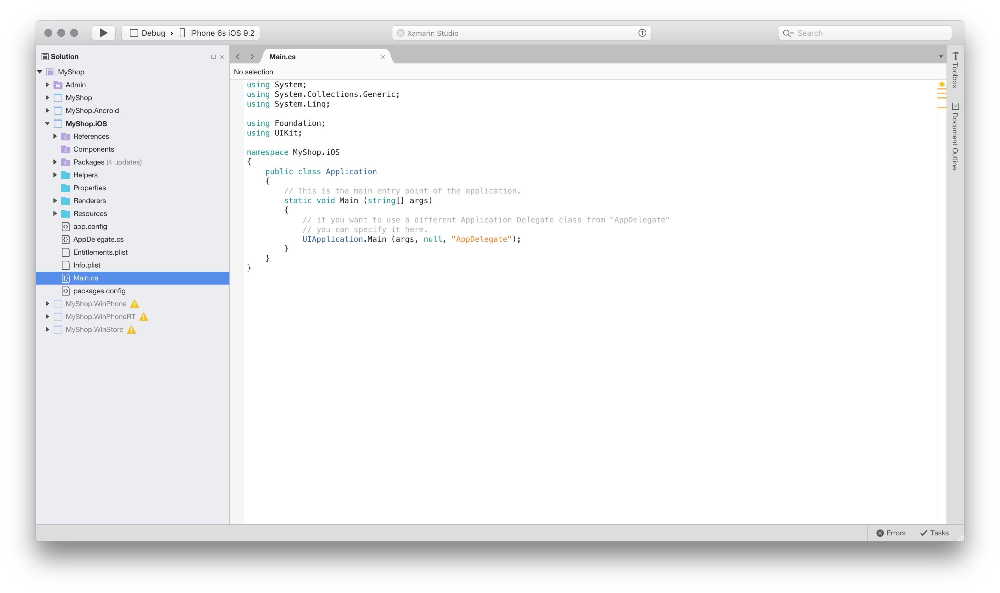

### Viewing and arranging tool windows

When you open any new solution or file in Visual Studio for Mac, you should notice some *tool windows* in the workspace, including the Solution Window, Document Outline, and Errors:

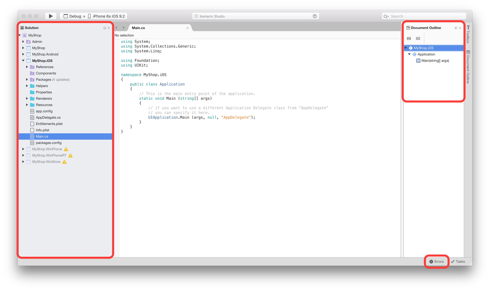

Visual Studio for Mac provides tool windows containing additional information, tools, and navigation aids, all of which can be accessed by browsing the **View** menu item and selecting a tool window to add it:

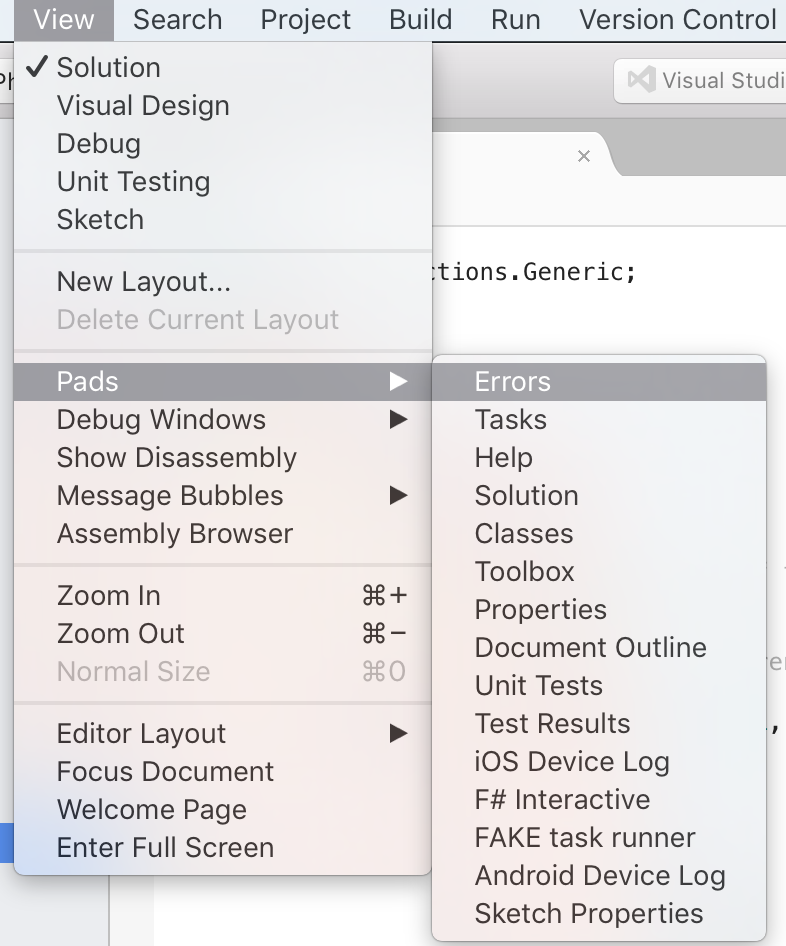

Tool Windows may also be opened automatically by different commands, such as the **Find in Files** (Shift + Cmd + F) command, which opens a detached window of search results.

Tool Windows can be moved and arranged throughout your workflow in whatever way is most useful to you. For example, they can be docked on any side of the document editor, next to another tool window, above or below another window, or as a set of tabbed windows enabling you to quickly switch between them.

For frequently used tool windows, you can also completely detach them from the Visual Studio for Mac window and into their own new window.

Tool Windows can be pinned and closed by the controls in the top-right corner of each window:

:::image type="content" source="media/customizing-the-ide-image5a.png" alt-text="Using controls to pin or close tool windows":::

Pinned windows are docked to the sides of the workspace and remain open for quicker access when you need them. Unpinned windows are docked, but not shown until you hover over the tab for the window with a mouse or focus with the keyboard. They can be hidden when the mouse and keyboard focus leaves them.

### Organizing layouts

The tool windows that are displayed at any time are dependent on the current context. For example, when using the visual designer, the toolbox and property grid windows are most important. When debugging, it's useful to have the debugger windows for viewing the stack and locals.

The state of the open tool windows is represented by a *layout*. You can switch the layouts manually through the View menu, as illustrated in the following image. It's also switched automatically when you carry out an action, such as debugging, or opening a Storyboard:

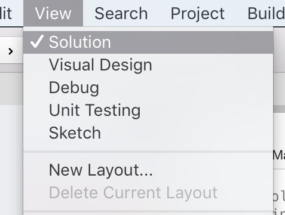

It's possible to create a new layout by using the **View > Layout > Save Current Layout...** menu item. This command will add your current layout to the menu so that you can select it at any time:

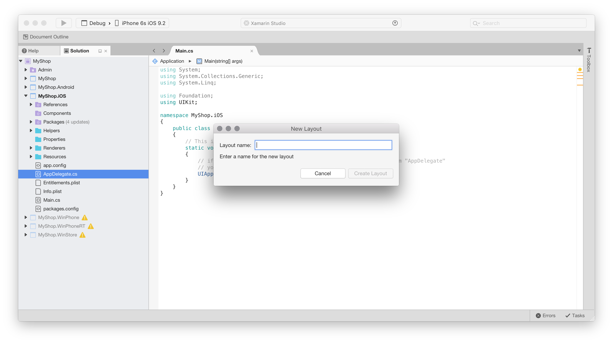

### Side-by-side editing support

Visual Studio for Mac allows you to open text editors side by side, or to have an editor as a detached floating window.

Two-column mode can be enabled through the View menu item by selecting **View > Editor Columns > 2 columns**, or by dragging an editor tab to one of the edges of the editor area:

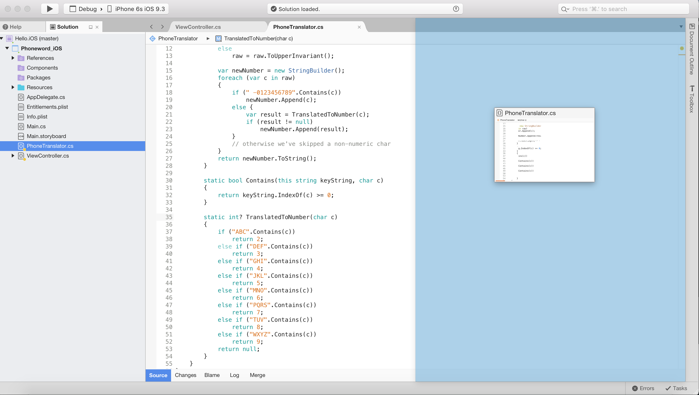

Editor tabs can be dragged out of the document area to create a floating editor window. This floating window also supports side-by-side editors, and can contain several editor tabs:

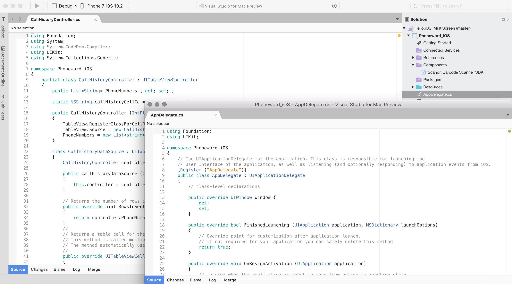

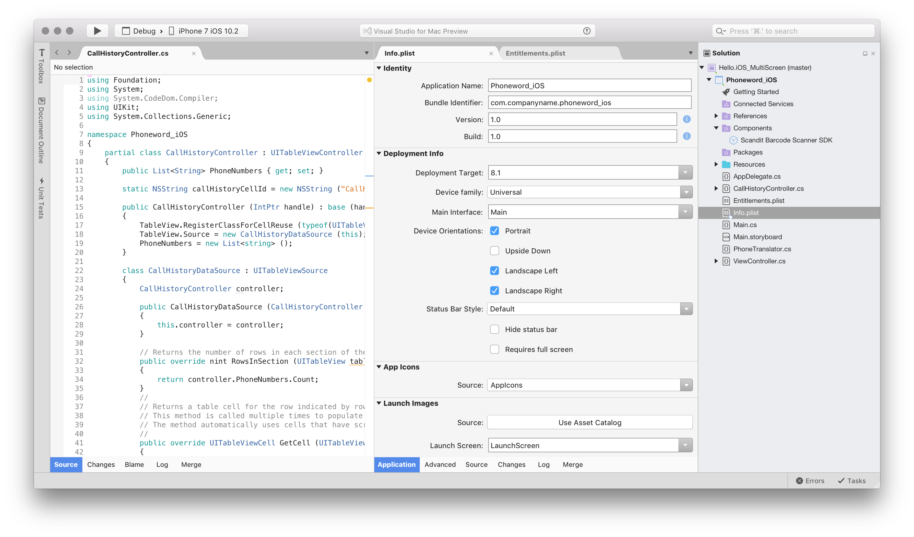

To revert to a single open editor, select **View > Editor Columns > 1 column**.

## Related Video

> []

## See also

- [Personalize the Visual Studio IDE (on Windows)](/visualstudio/ide/personalizing-the-visual-studio-ide)
