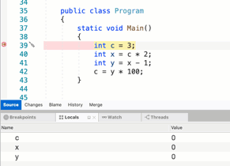

# Debugging with Visual Studio for Mac

 [!INCLUDE [Visual Studio for Mac](~/includes/applies-to-version/vs-mac-only.md)]

Visual Studio for Mac has debuggers with support for .NET Core, .NET Framework, Unity, and Xamarin applications.

Visual Studio for Mac uses the [*Mono Soft Debugger*](https://www.mono-project.com/docs/advanced/runtime/docs/soft-debugger/), which is implemented into the Mono runtime, allowing Visual Studio for Mac to debug managed code across all platforms.

## The Debugger

Visual Studio for Mac uses the Mono Soft Debugger to debug managed (C# or F#) code in all Xamarin applications. The Mono Soft debugger is different from regular debuggers in that it's a cooperative debugger that is built into the Mono runtime; the generated code and Mono runtime cooperate with the IDE to provide a debugging experience. The Mono runtime exposes the debugging functionality through a wire protocol, which you can read more about [in the Mono documentation](https://www.mono-project.com/docs/advanced/runtime/docs/soft-debugger-wire-format/).

Hard debuggers, such as [LLDB]( http://lldb.llvm.org/index.html) or [GDB]( https://www.gnu.org/software/gdb/), control a program without the knowledge or cooperation from the debugged program. It can still be useful when debugging Xamarin applications if you need to debug native iOS or Android code.

For .NET Core and ASP.NET Core applications, Visual Studio for Mac uses the .NET Core debugger. This debugger is also a cooperative debugger and works with the .NET runtime.

## Using the debugger

To start debugging any application, always ensure that the configuration is set to  **Debug**. The debug configuration provides a helpful set of tools to support debugging, such as breakpoints, using data visualizers, and viewing the call stack:

## Setting a breakpoint

To set a breakpoint in your IDE, click on the margin area of your editor, next to the line number of the code where you wish to break:

You can view all the breakpoints that have been set in your code by going to the  **Breakpoints Window**:

## Start debugging

To start debugging, select the target browser, device, or simulator/emulator:

Then deploy your application by pressing the  **Play** button, or  **Cmd + return**. When you hit a breakpoint, the code will be highlighted yellow:

Debugging tools, such as the one used to inspect the values of objects, can be used at this point to get more information about what is happening in your code:

## Conditional breakpoints

You can also set rules dictating the circumstances under which a breakpoint should occur. This is known as adding a *conditional breakpoint*. To set a conditional breakpoint, access the  **Breakpoint Properties** window, which can be done in two ways:

* To add a new conditional breakpoint, right-click on the editor margin, to the left of the line number for the code you wish to set a breakpoint on, and select New Breakpoint:

 

* To add a condition to an existing breakpoint, right-click on the breakpoint and select  **Breakpoint Properties**, or, in the  **Breakpoints Window**, select the Edit Breakpoint button illustrated below:

 

You can then enter the condition under which you want the breakpoint to occur:

 

## Stepping through code

When a breakpoint has been reached, the Debug tools enable you to get control over the program's execution. Visual Studio for Mac will display four buttons, allowing you to run and step through the code. In Visual Studio for Mac, they'll look like:

 

Here are the four buttons:

* **Play** - This will begin executing the code, until the next breakpoint.
* **Step Over** - This will execute the next line of code. If the next line is a function call, Step Over will execute the function, and will stop at the next line of code *after* the function.
* **Step Into** - This will also execute the next line of code. If the next line is a function call, Step Into will stop at the first line of the function, allowing you to continue line-by-line debugging of the function. If the next line isn't a function, it will behave the same as Step Over.
* **Step Out** - This will return to the line where the current function was called.

## Change which statement is executed next

While the debugger is paused, an arrow in the margin shows which line of code will be executed next. You can select and drag the arrow to a different line of code to change which statement will be executed. You can achieve the same thing by also right-clicking on a line of code and selecting **Set Next Statement** from the context menu.

> [!CAUTION]
> Changing the current line of execution can cause unexpected behavior in an application. There are also some conditions where changing the next statement to execute is not possible. For example, dragging the arrow from one method to another method will not work. In these unsupported cases, Visual Studio for Mac will display a dialog to let you know it was not possible to change the current line of execution. 

## Debugging Mono's class libraries

Xamarin products ship with the source code for Mono's class libraries, and you can use this to single step from the debugger to inspect how things are working under the hood.

Since this feature consumes more memory during debugging, it's turned off by default.

To enable this feature, browse to  **Visual Studio for Mac > Preferences > Debugger** and ensure that the "**Step into external code**" option is **selected**, as illustrated below:

## See also

- [Debugging in Visual Studio (on Windows)](/visualstudio/debugger/)
