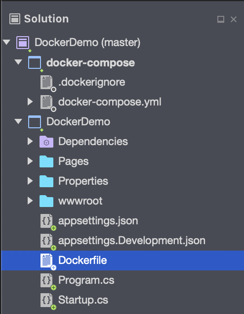
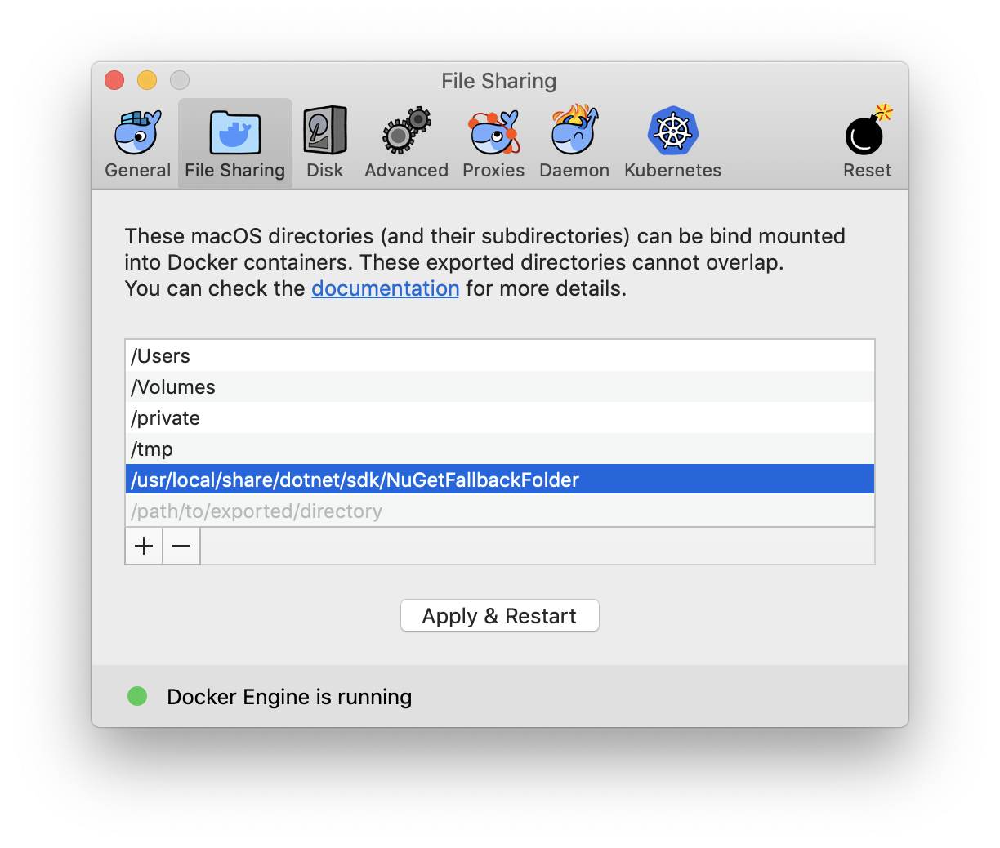
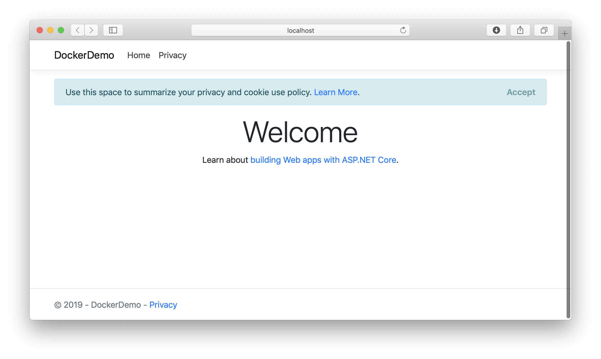
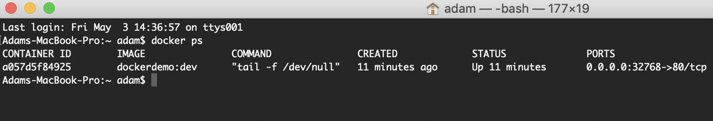

# Get started with Docker in Visual Studio for Mac

With Visual Studio for Mac, you can easily build, debug, and run containerized ASP.NET Core apps and publish them to Azure.

## Prerequisites

* [Docker Desktop](https://hub.docker.com/editions/community/docker-ce-desktop-mac)
* [Visual Studio for Mac 2019](https://visualstudio.microsoft.com/vs/mac)

## Installation and Setup

For Docker installation, review and follow the information at [Install Docker Desktop for Mac](https://docs.docker.com/docker-for-mac/install/).

## Creating an ASP.NET Core Web Application and Adding Docker Support

1. Create a new solution by going to **File > New Solution**.
1. Under **.NET Core > App** choose the **Web Application** template:

1. Select the target framework. In this example we will use .NET Core 2.2:

1. Enter the project details, such as name (_DockerDemo_ in this example). The created project contains all the basics you need to build and run an ASP.NET Core web site.
1. In the Solution Window, right click the DockerDemo project and select **Add > Add Docker Support**:


Visual Studio for Mac will automatically add a new project to your solution called **docker-compose** and add a **Dockerfile** to your existing project.



## Dockerfile Overview

A Dockerfile is the recipe for creating a final Docker image. Refer to [Dockerfile reference](https://docs.docker.com/engine/reference/builder/) for an understanding of the commands within it.

```
FROM mcr.microsoft.com/dotnet/core/aspnet:2.2-stretch-slim AS base
WORKDIR /app
EXPOSE 80
EXPOSE 443

FROM mcr.microsoft.com/dotnet/core/sdk:2.2-stretch AS build
WORKDIR /src
COPY DockerDemo/DockerDemo.csproj DockerDemo/
RUN dotnet restore "DockerDemo/DockerDemo.csproj"
COPY . .
WORKDIR "/src/DockerDemo"
RUN dotnet build "DockerDemo.csproj" -c Release -o /app/build

FROM build AS publish
RUN dotnet publish "DockerDemo.csproj" -c Release -o /app/publish

FROM base AS final
WORKDIR /app
COPY --from=publish /app/publish .
ENTRYPOINT ["dotnet", "DockerDemo.dll"]
```

The preceding *Dockerfile* is based on the [microsoft/aspnetcore](https://hub.docker.com/r/microsoft/aspnetcore/) image, and includes instructions for modifying the base image by building your project and adding it to the container.

> [!NOTE]
> The default Dockerfile created by Visual Studio for Mac exposes Port 80 for HTTP traffic. To enable HTTPS traffic, add `Expose 443` to the Dockerfile.

## Debugging

Select the `docker-compose` project as the Startup Project and start debugging (**Run > Start Debugging**). This will build, deploy and launch the ASP.NET project in a container.

> [!TIP]
> On the first run after installing Docker Desktop, you may receive the following error when trying to debug: `Cannot start service dockerdemo: Mounts denied`
>
> Add `/usr/local/share/dotnet/sdk/NuGetFallbackFolder` to the File Sharing tab in Docker Desktop:
>
> 

When the build is completed, the application will be launched in Safari:



Note that the container will be listening on a port, `http://localhost:32768` for example, and this port may vary.

To see the list of running containers, use the `docker ps` command in Terminal.

Note the port relay in the screenshot below (under **PORTS**). This shows that the container is listening on the port we saw in Safari above and relaying requests to the internal webserver on port 80 (as defined in the Dockerfile). From the application's perspective, it is listening on port 80:


