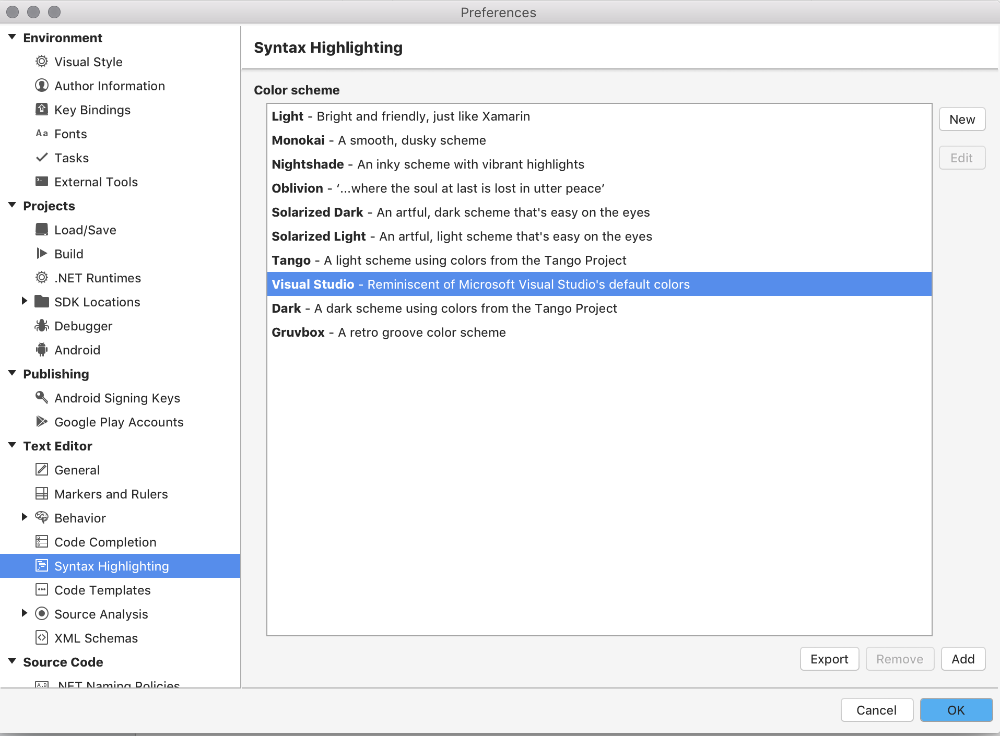
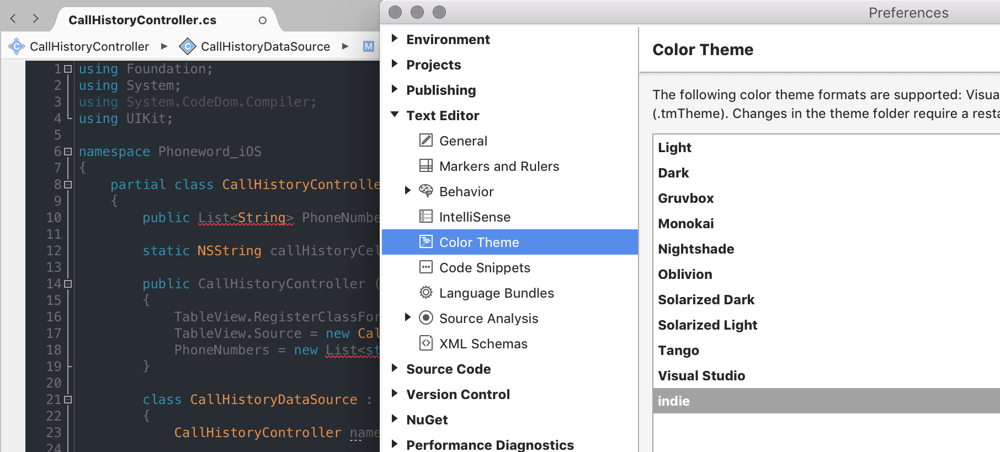

# Editor themes

Editor themes can be changed to any of the 10 color schemes provided by default in Visual Studio for Mac via the **Visual Studio > Preferences > Text Editor > Color Themes** menu options:

## Adding new themes

New color themes can be added, provided they are in one of the supported formats:

* Visual Studio (`.vssettings`)
* Xamarin Studio (`.json`)
* TextMate (`.tmTheme`)

Once you have found or created a new theme and downloaded it to your local machine, add it by doing the following steps:

1. Select the **Add** button on the Color Themes Option dialog:
    
2. Browse for the theme on your local machine and press **Open**.
3. The theme is added to the bottom of the pre-installed list of themes. To preview the theme, select it:
    
4. To apply the theme, press the **Okay** button.
