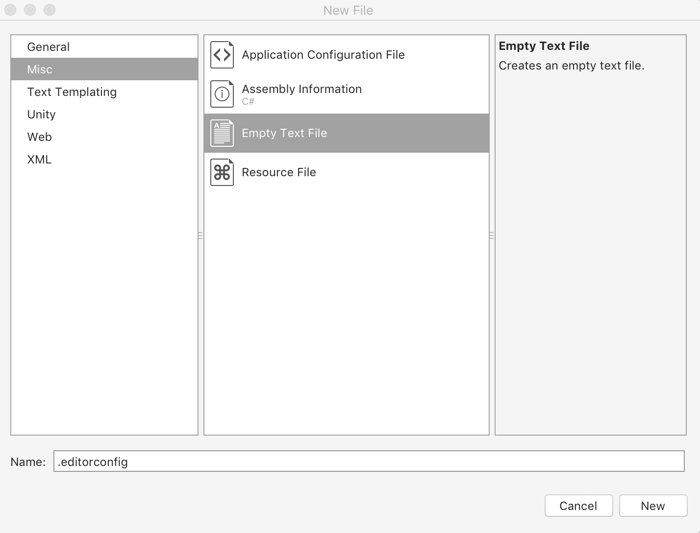
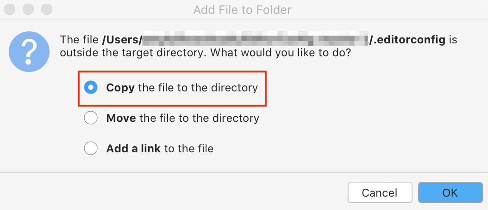
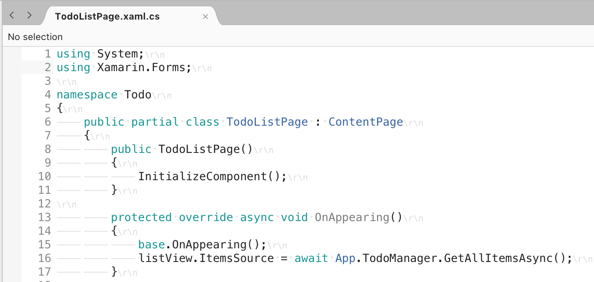

# Creating and editing a custom EditorConfig file

In Visual Studio for Mac, you can add an [EditorConfig](http://editorconfig.org/) file to your project or codebase to enforce consistent coding styles for everyone that works in the codebase. The settings declared in the EditorConfig file take precedence over global Visual Studio text editor settings. Using EditorConfig within your project or codebase allows you to set your coding style, preferences, and warnings for your project. This makes it easier for all Visual Studio for Mac users to adhere to the coding practices of a project.

[EditorConfig](http://editorconfig.org/) files are supported on many IDEs and code editors, including Visual Studio 2017. 

## Supported settings

The editor in Visual Studio supports the core set of [EditorConfig properties](http://editorconfig.org/#supported-properties):

- `indent_style`
- `indent_size`
- `tab_width`
- `end_of_line`
- `charset`
- `trim_trailing_whitespace`
- `insert_final_newline`
- `root`

EditorConfig also supports [Code style formatting](https://docs.microsoft.com/visualstudio/ide/editorconfig-code-style-settings-reference) in C#.

## Add an EditorConfig file to a project

### Adding a new EditorConfig file

1. Open your project in Visual Studio for Mac. Select the project node that you wish to add files to.

2. With the project node selected, go to **File > New File…** in the menu bar to open the **New File** dialog.

3. Choose **Misc > Empty Text File** and give it the **Name** `.editorconfig`. Press **New** to create the file and open it in the editor:

    

4. Edit the file. For example:

    ```EditorConfig
    # This file is the top-most EditorConfig file
    root = true

    # All Files
    [*]
    indent_style = space
    indent_size = 8
    insert_final_newline = false
    trim_trailing_whitespace = false

    [*.cs]
    csharp_new_line_before_open_brace = none
    ```

4. Adding the file does not automatically update your settings. To reflect the settings from the `.editorconfig` file, select the project node and choose **Edit > Format > Format Document** from the menu bar:

    

### Adding an existing EditorConfig file

If you're working with a project or solution that already contains an `.editorconfig` file, there is nothing that you need to do to apply the settings. Any new lines of code are formatted according to the EditorConfig settings. You should note that while Visual Studio for Mac will respect `.editorconfig` files at the solution level, they might not appear in the solution pad due to the fact the files beginning with `.` are hidden files in macOS.

You may want to reuse an existing `.editorconfig` file in your project. To add an existing file, you first need to display hidden files in Finder by entering the following command in **Terminal**:

```bash
$ defaults write com.apple.Finder AppleShowAllFiles true
$ killall Finder
```

Once the `.editorconfig` file is visible, drag it to your project node. When you're presented with the following dialog, select the **Copy the file to the directory** option and select **OK**:



To reflect the settings from the `.editorconfig` file, select the project node and choose **Edit > Format > Format Document** from the menu bar.

## Editing an EditorConfig file

EditorConfig files use a straightforward file layout to specify settings, which is explained below using a previous example:


```EditorConfig
# This file is the top-most EditorConfig file
root = true

# All Files
[*]
indent_style = space
indent_size = 4
insert_final_newline = false
trim_trailing_whitespace = false

[*.cs]
csharp_new_line_before_open_brace = none
```

Setting `root` to `true` will flag this file as the top-most file of the codebase and any higher `.editorconfig` files in the project will be ignored, as explained in the [Override EditorConfig Settings](#override-editorconfig-settings) section.

Each section is denoted by square (**[ ]**) braces and specifies information on the types of files the following properties should pertain to.

In the example above, some settings are applied to all files in the project and others are added only to C# files. The screenshots below show before and after the `.editorconfig` settings have been applied:

**Before**:



**After**:


For more information on available EditorConfig settings, see the [.NET coding convention settings for EditorConfig](https://docs.microsoft.com/visualstudio/ide/editorconfig-code-style-settings-reference) article and the [Supported Properties](http://editorconfig.org/#supported-properties) section on the official documentation.

## Override EditorConfig Settings

It's possible to have more than one `.editorconfig` file in each solution. Visual Studio for Mac reads `.editorconfig` files from top to bottom in the solution, adding and overriding settings as it goes. This means that the settings in the `.editorconfig` _closest_ to the file you're editing will take precedence. 

If you want to ensure that _no_ settings from any higher-level `.editorconfig` files are applied to this part of the codebase, add the `root=true` property to the top of the lower-level `.editorconfig` file:

```EditorConfig
# top-most EditorConfig file
root = true
```