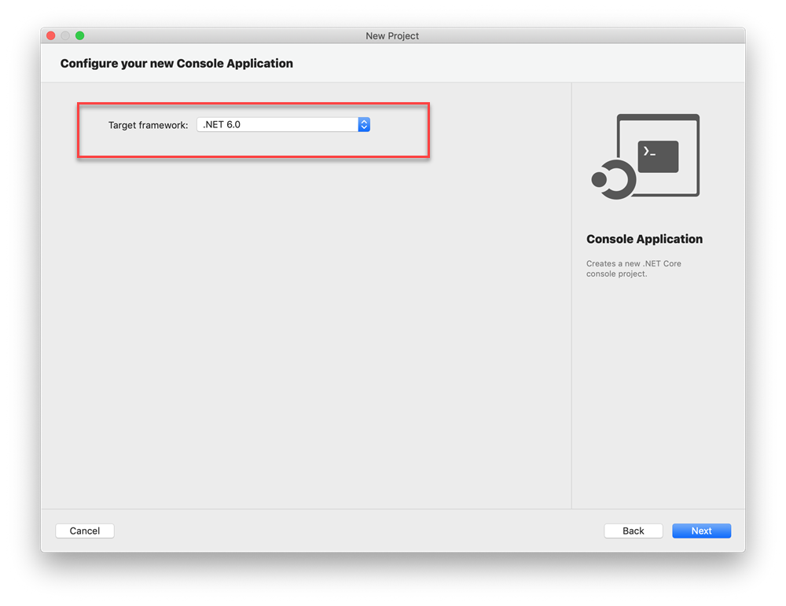
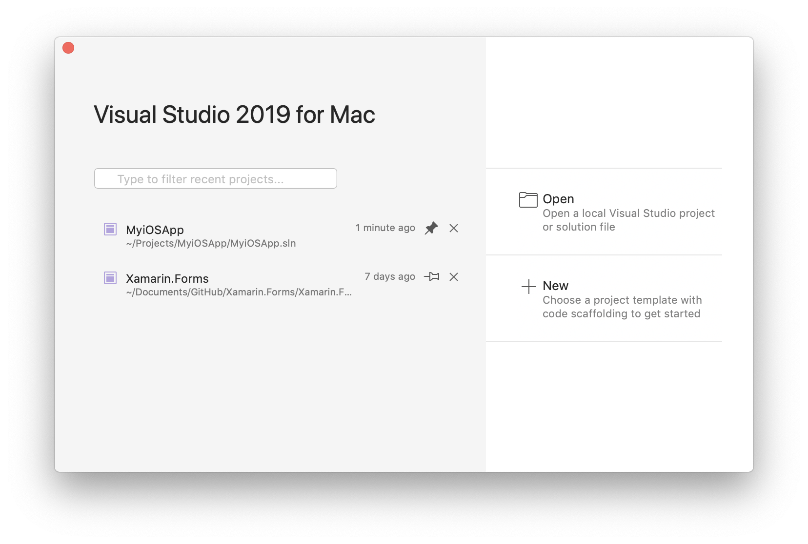
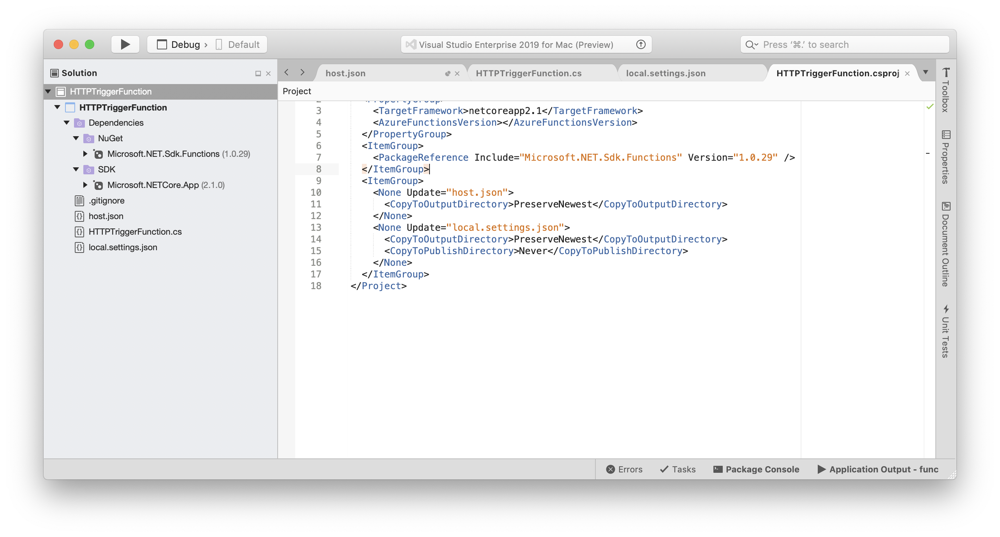
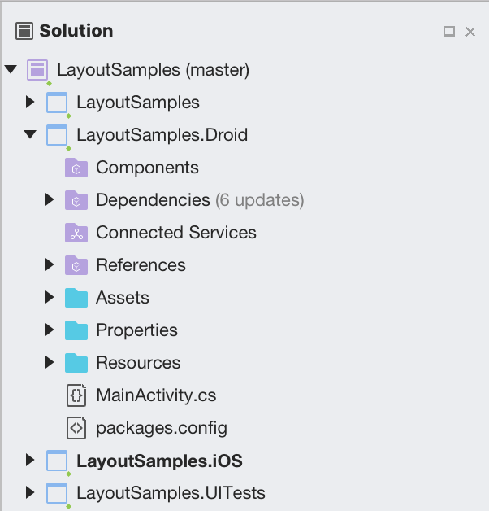
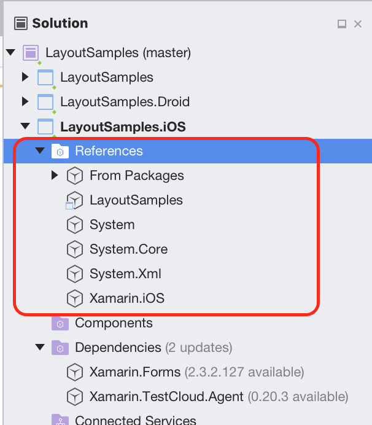
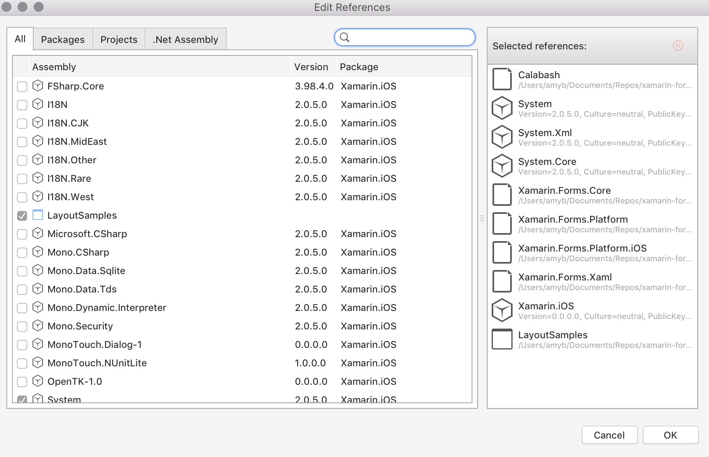
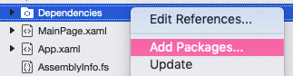
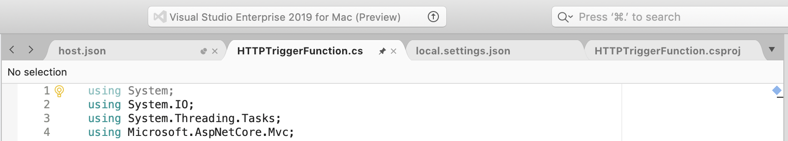
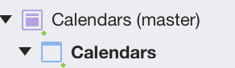

# Visual Studio for Mac IDE tour

 [!INCLUDE [Visual Studio for Mac](~/includes/applies-to-version/vs-mac-only.md)]

::: moniker range="vsmac-2022"

In this introduction to the Visual Studio for Mac _integrated development environment_ (IDE), we'll take a tour of some of the windows, menus, and other UI features.

Visual Studio for Mac is a .NET _integrated development environment_ on the Mac that can be used to edit, debug, and build code and then publish an app. In addition to a code editor and debugger, Visual Studio for Mac includes compilers, code completion tools, graphical designers, and source control features to ease the software development process.

If you haven't already installed Visual Studio, go to the Visual Studio downloads page to install it for free.

## Start window

The first thing you'll see after you open Visual Studio for Mac is the _start window_. It shows a list of recent projects and options to open an existing project or create a new one.

If this is the first time you're using Visual Studio, your recent projects list will be empty.

## Create a project

To continue exploring features, let's create a new project.

1. On the start window, select **New** to create a new project.

   

1. **Choose a template for your new project** window opens and shows several project templates. It also shows a list of your recently used project templates if you select **Recent**. A template contains the basic files and settings required for a given project type. 

   Select **Console Application** from **App** in the **Web and Console** section, and then select **Continue**.

   

1. On the **Configure your new Console Application** window, ensure **.NET 6.0** appears in the **Target framework** dropdown, and then select **Next**.

   

1. On the **Configure your new Console Application** window, add a **Project name**, **Solution name**, and **Location**, and then choose **Create**.

   

1. The project is created. Select the code file *Program.cs* in the **Solution** window, which is on the left-hand side of Visual Studio for Mac.

   

The file Program.cs opens in the **Editor** window. The Editor shows the contents of files and is where you'll do most of your coding work.

## Solution window

**Solution** shows you a graphical representation of the hierarchy of files and folders in your project, solution, or code folder. You can browse the hierarchy and select a file to open it in the Editor.

## Menus

The menu bar along the top of Visual Studio for Mac groups commands into categories. For example, the **Project** menu contains commands related to the project you're working in. On the **Tools** menu, you can customize how Visual Studio behaves by selecting **Preferences**.

## Errors window

The **Errors** window shows you errors, warnings, and messages about the current state of your code. If there are errors (like a missing brace or semicolon) in your file or anywhere in your project, they're listed here.

To open the **Errors** window, choose the **View** menu, and then select **Errors**.

## Build Output window

The **Build Output** window shows you output messages from building your project.

Let's build the project to see some build output. From the **Build** menu, choose **Build Solution**. The **Build Output window automatically obtains focus and shows a successful build message.

## Run your Console Application

Let's run the Console Application by selecting the play icon. You'll see the output in the **Terminal**.

## Send feedback
If you run into problems while using Visual Studio for Mac, or if you have suggestions for how to improve the product, you can let us know. To do so, select the **Report a Problem** or **Provide a Suggestion** from the **Help** menu.

## Learn more

We've looked at just a few features of Visual Studio to get acquainted with the user interface. 
Explore further:

- [Source Editor](./source-editor.md) in Visual Studio for Mac
- [Refactoring](./refactoring.md)
- [Data visualizations](./data-visualizations.md) while debugging
- [Version Control](./version-control.md)

::: moniker-end

::: moniker range="vsmac-2019"

Visual Studio for Mac is a .NET _integrated development environment_ on the Mac. It can be used to edit, debug, and build code and then publish an app. In addition to a code editor and debugger, Visual Studio for Mac includes compilers, code completion tools, graphical designers, and source control features to ease the software development process.

Visual Studio for Mac supports many of the same file types as its Windows counterpart, such as `.csproj`, `.fsproj`, or `.sln` files, and supports features such as EditorConfig, meaning that you can use the IDE that works best for you.
Creating, opening, and developing an app is a familiar experience for anyone who has previously used Visual Studio on Windows. Also, Visual Studio for Mac employs many of the powerful tools that make its Windows counterpart such a powerful IDE. The Roslyn Compiler Platform is used for refactoring and IntelliSense. Its project system and build engine use MSBuild, and its source editor uses the same foundation as Visual Studio on Windows. It uses the same debugger engines for Xamarin and .NET Core apps, and the same designers for Xamarin.iOS and Xamarin.Android.

## What can I do in Visual Studio for Mac

Visual Studio for Mac supports the following types of development:

- ASP.NET Core web applications with C#, F#, and support for Razor pages, JavaScript, and TypeScript
- .NET Core console applications with C# or F#
- Cross-platform Unity games and applications with C#
- Android, iOS, tvOS, and watchOS applications in Xamarin with C# or F# and XAML
- Cocoa desktop apps in C# or F#

This article explores different sections of Visual Studio for Mac, providing a look at some of the features that make it a powerful tool for creating these applications.

## IDE tour

Visual Studio for Mac is organized into several sections for managing application files and settings, creating application code, and debugging.

## Getting started

When you start Visual Studio 2019 for Mac for the first time, new users will see a sign-in window. Sign in with your Microsoft account to activate a paid license (if you have one) or link to Azure subscriptions. You can press **I'll do this later** and sign in later via the **Visual Studio > Sign in** menu item:

You'll then be given the option to customize the IDE by selecting your preferred keyboard shortcuts: Visual Studio for Mac, Visual Studio, Visual Studio Code, or Xcode:

After this initial setup experience, you'll see the _start window_ whenever you open Visual Studio 2019 for Mac. It shows a list of recent projects and buttons to open an existing project or create a new one:

## Solutions and projects

The following image shows Visual Studio for Mac with an application loaded:

The following sections provide an overview of the major areas in Visual Studio for Mac.

## Solution Window

The Solution Window organizes the project(s) in a solution:

The Solution Window is where files for the source code, resources, user interface, and dependencies are organized into platform-specific Projects.

For more information on using Projects and Solutions in Visual Studio for Mac, see the [Projects and Solutions](./projects-and-solutions.md) article.

## Assembly references

Assembly references for each project are available under the References folder:

More references are added using the **Edit References** dialog, which is shown by double-clicking on the References folder, or by selecting **Edit References** on its context menu actions:

For more information on using References in Visual Studio for Mac, see the [Managing References in a Project](./managing-references-in-a-project.md) article.

## Dependencies / packages

All external dependencies used in your app are stored in the Dependencies or Packages folder, depending on whether you are in a .NET Core or Xamarin.iOS/Xamarin.Android project. These are provided in the form of a NuGet.

NuGet is the most popular package manager for .NET development. With Visual Studio's NuGet support, you can easily search for and add packages to your project to application.

To add a dependency to your application, right-click on the Dependencies / Packages folder, and select **Add Packages**:

Information on using a NuGet package in an application can be found in the [Including a NuGet project in your project](./nuget-walkthrough.md) article.

## Source Editor

Regardless of if you're writing in C#, XAML, or JavaScript, the code editor shares the same core components with Visual Studio on Windows, with an entirely native user interface.

Source Editor brings some of the following features:

* Native macOS (Cocoa-based) user interface (tooltips, editor surface, margin adornments, text rendering, IntelliSense)
* IntelliSense type filtering and "show import items"
* Support for native text inputs
* RTL/BiDi language support
* Roslyn 3
* Multi-caret support
* Word wrap
* Updated IntelliSense UI
* Improved find/replace
* Snippet support 
* Format selection
* Inline lightbulbs

For more information on using the Source Editor in Visual Studio for Mac, see the [Source Editor](./source-editor.md) documentation.

To keep tabs visible always, you can take advantage of pinning them. This ensures that every time you launch a project, the tab you need will always appear. To pin a tab, hover over the tab and select the _pin_ icon:

## Refactoring

Visual Studio for Mac provides two useful ways to refactor your code: Context Actions, and Source Analysis. You can read more about them in the [Refactoring](./refactoring.md) article.

## Debugging

Visual Studio for Mac has debuggers that support .NET Core, .NET Framework, Unity, and Xamarin projects. Visual Studio for Mac uses the .NET Core debugger and the Mono Soft Debugger, allowing the IDE to debug managed code across all platforms. For more information on debugging, visit the [Debugging](./debugging.md) article.

The debugger contains rich visualizers for special types such as strings, colors, URLs, sizes, coordinates, and bézier curves.

For more information on the debugger's data visualizations, visit the [Data Visualizations](./data-visualizations.md) article.

## Version control

Visual Studio for Mac integrates with Git and Subversion source control systems. Projects under source control are denoted with the branch listed next to the Solution name:

Files with uncommitted changes have an annotation on their icons in the Solution Window, as shown in the following image:

For more information on using version control in Visual Studio, see the [Version Control](./version-control.md) article.

::: moniker-end

## Next steps

- [Install Visual Studio for Mac](installation.md)
- [Review the available workloads](workloads.md)

## Related Video

> [!VIDEO https://learn.microsoft.com/shows/Visual-Studio-Toolbox/Visual-Studio-for-Mac-Overview/player]

## See also

- [Visual Studio IDE (on Windows)](/visualstudio/ide/visual-studio-ide)
