# Visual Studio for Mac IDE tour

 [!INCLUDE [Visual Studio for Mac](~/includes/applies-to-version/vs-mac-only.md)]

::: moniker range="vsmac-2022"

In this introduction to the Visual Studio for Mac _integrated development environment_ (IDE), we'll take a tour of some of the windows, menus, and other UI features.

Visual Studio for Mac is a .NET _integrated development environment_ on the Mac that can be used to edit, debug, and build code and then publish an app. In addition to a code editor and debugger, Visual Studio for Mac includes compilers, code completion tools, graphical designers, and source control features to ease the software development process.

If you haven't already installed Visual Studio, go to the Visual Studio downloads page to install it for free.

## Start window

The first thing you'll see after you open Visual Studio for Mac is the _start window_. It shows a list of recent projects and options to open an existing project or create a new one.

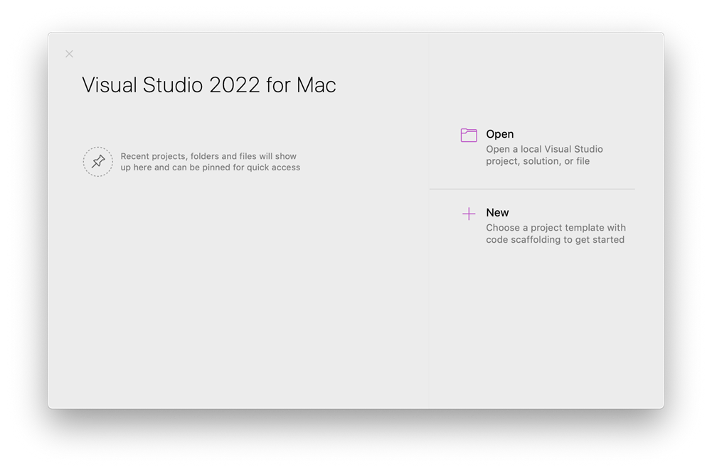

If this is the first time you're using Visual Studio, your recent projects list will be empty.

## Create a project

To continue exploring features, let's create a new project.

1. On the start window, select **New** to create a new project.

   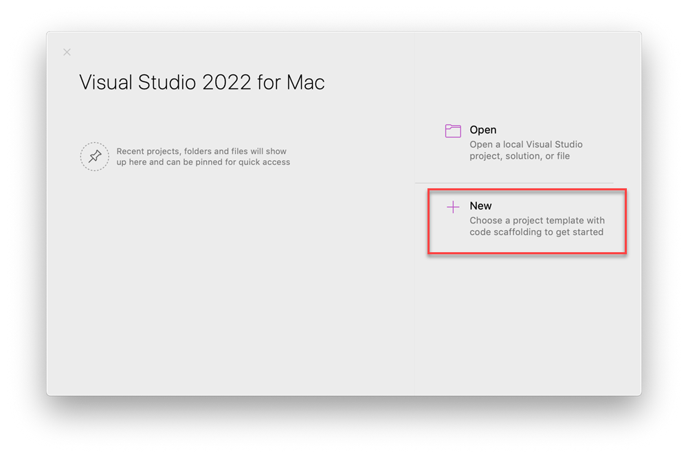

1. **Choose a template for your new project** window opens and shows several project templates. It also shows a list of your recently used project templates if you select **Recent**. A template contains the basic files and settings required for a given project type. 

   Select **Console Application** from **App** in the **Web and Console** section, and then select **Continue**.

   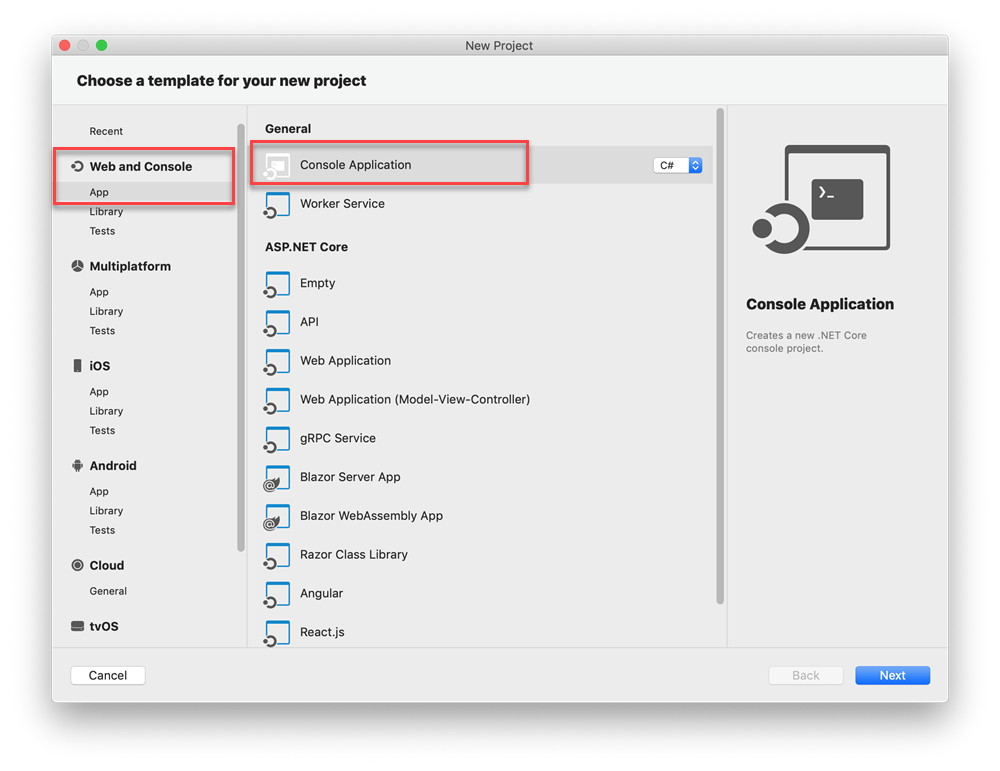

1. On the **Configure your new Console Application** window, ensure **.NET 7.0** appears in the **Target framework** dropdown, and then select **Next**.

   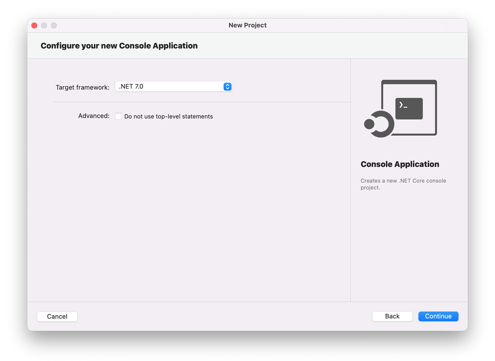

1. On the **Configure your new Console Application** window, add a **Project name**, **Solution name**, and **Location**, and then choose **Create**.

   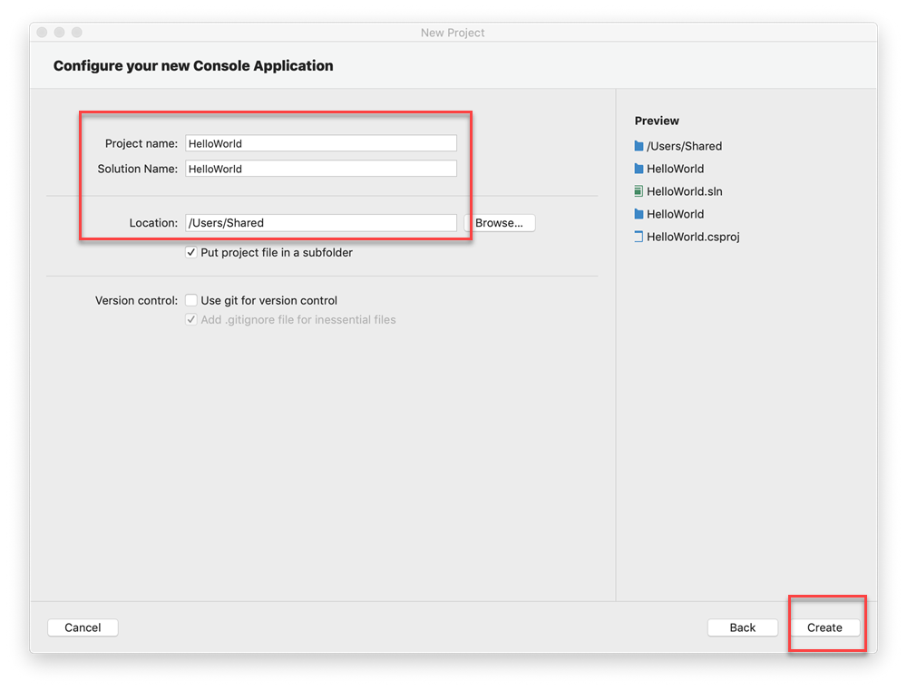

1. The project is created. Select the code file *Program.cs* in the **Solution** window, which is on the left-hand side of Visual Studio for Mac.

   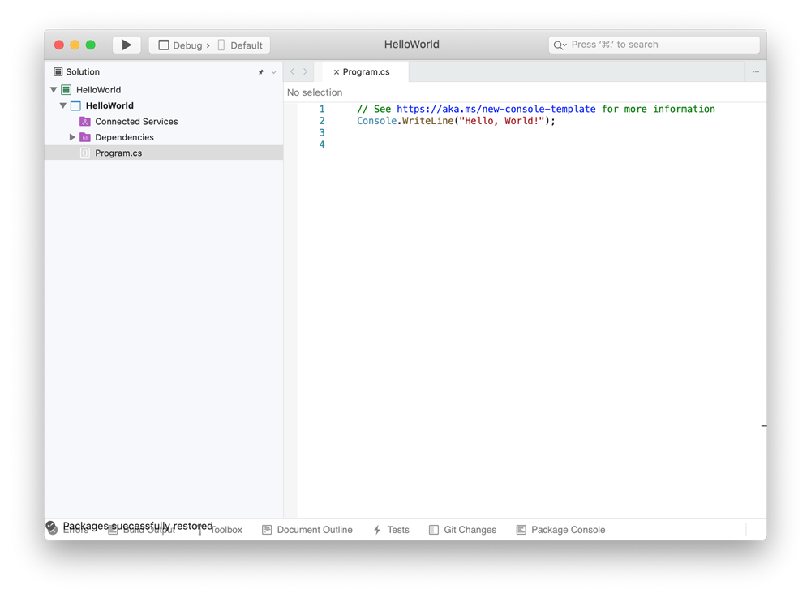

The file Program.cs opens in the **Editor** window. The Editor shows the contents of files and is where you'll do most of your coding work.

## Solution window

**Solution** shows you a graphical representation of the hierarchy of files and folders in your project, solution, or code folder. You can browse the hierarchy and select a file to open it in the Editor.

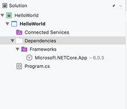

## Menus

The menu bar along the top of Visual Studio for Mac groups commands into categories. For example, the **Project** menu contains commands related to the project you're working in. On the **Tools** menu, you can customize how Visual Studio behaves by selecting **Preferences**.

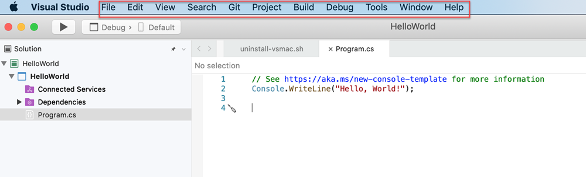

## Errors window

The **Errors** window shows you errors, warnings, and messages about the current state of your code. If there are errors (like a missing brace or semicolon) in your file or anywhere in your project, they're listed here.

To open the **Errors** window, choose the **View** menu, and then select **Errors**.

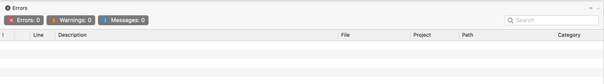

## Build Output window

The **Build Output** window shows you output messages from building your project.

Let's build the project to see some build output. From the **Build** menu, choose **Build Solution**. The **Build Output** window automatically obtains focus and shows a successful build message.

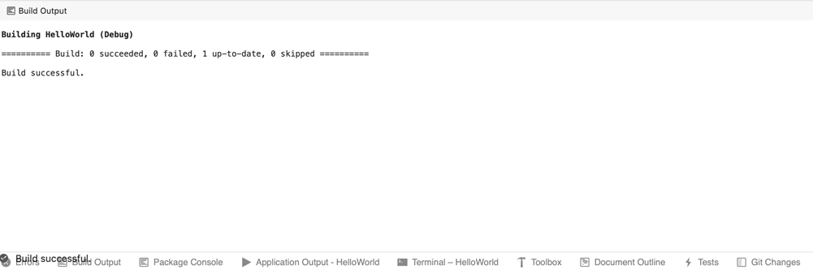

## Run your Console Application

Let's run the Console Application by selecting the play icon. You'll see the output in the **Terminal**.

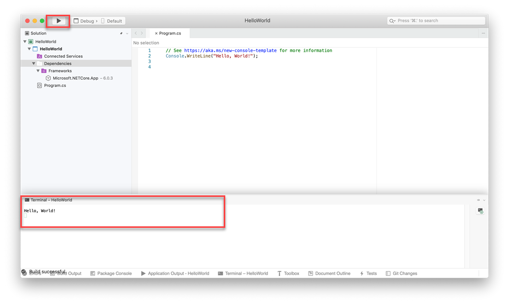

## Send feedback
If you run into problems while using Visual Studio for Mac, or if you have suggestions for how to improve the product, you can let us know. To do so, select the **Report a Problem** or **Provide a Suggestion** from the **Help** menu.

## Learn more

We've looked at just a few features of Visual Studio to get acquainted with the user interface. 
Explore further:

- [Source Editor](./source-editor.md) in Visual Studio for Mac
- [Refactoring](./refactoring.md)
- [Data visualizations](./data-visualizations.md) while debugging
- [Version Control](./version-control.md)

::: moniker-end

## Next steps

- [Install Visual Studio for Mac](installation.md)
- [Review the available workloads](workloads.md)

## Related Video

> [!VIDEO https://learn.microsoft.com/shows/Visual-Studio-Toolbox/Visual-Studio-for-Mac-Overview/player]

## See also

- [Visual Studio IDE (on Windows)](/visualstudio/ide/visual-studio-ide)
