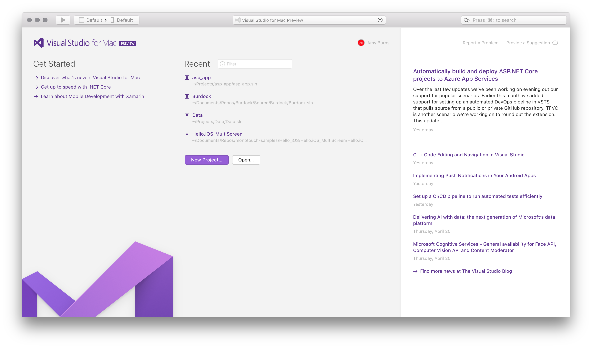

# Visual Studio for Mac Tour

Visual Studio for Mac evolves Xamarin's mobile-centric IDE, Xamarin Studio, into a mobile-first, cloud-first development environmment on the Mac. This developer-focused tool allows you to leverage the power of .NET to create applications for all platforms required by your users.

The UX of Visual Studio for Mac is similar to its Windows counterpart, but with a native macOS feel. Creating, opening, and developing app will be a familiar experience for anyone who has previously used Visual Studio on Windows. In addition, Visual Studio for Mac employs many of the powerful tools that makes its Windows counterpart such a powerful IDE. The Roslyn Compiler Platform is used for refactoring and IntelliSense. Its project system and build engine use MSBuild; and its source editor supports TextMate bundles. It uses the same debugger engines for Xamarin and .NET Core apps, and the same designers for Xamarin.iOS and Xamarin.Android.

This article explores various sections of Visual Studio for Mac, providing a look at some of the features that make it a powerful tool for creating cross platform applications.

## IDE Tour

Visual Studio for Mac is organized into several sections for managing application files and settings, creating application code, and debugging.

## Welcome Screen

When launched, Visual Studio for Mac displays a *Welcome Screen* as shown below:

The Welcome Screen contains the following sections:

he Welcome screen contains the following sections:

- **Toolbar** – Provides quick access to search bar. When a solution is loaded, this is used to set app configurations, debugging, and displaying errors.
- **Getting Started** – Provides quick access to a number of useful topics for developers Getting Started with Visual Studio for Mac.
- **Recent Solutions** – Provides quick access to recently opened solutions, as well as convenient buttons to open or create projects.
- **Developer News** – News feed to stay up to date on the latest Microsoft Developer information.

## Solutions and Projects

The image below shows Visual Studio for Mac with an application loaded:

The following sections provide an overview of the major areas in Visual Studio for Mac.

## Solution Pad

The Solution Pad organizes the project(s) in a solution, as shown below:

This is where files for the source code, resources, user interface, and dependencies are organized into platform-specific Projects.

For more information on using Projects and Solutions in the Visual Studio for Mac, refer to the [Projects and Solutions](../projects-and-solutions.md) guide.

## Assembly References
 
Assembly references for each project are available under the References folder, shown below:

Additional references can be added via the the **Edit References** dialog, which is displayed by double-clicking on the References folder, or by selecting **Edit References** on its context menu actions:
 

For more information on using References in the Visual Studio for Mac, refer to the [Managing References in a Project](../managing-references-in-a-project.md) guide.

## Dependencies / Packages

All external dependencies used in your app are stored in the Dependencies or Packages folder, depending on if you are in a .Net Core or Xamarin.iOS/Xamarin.Android project. These are usually provided in the form of a NuGet or Component.

NuGet is the most popular package manager for .NET development. With Visual Studio's NuGet support you can easily search for and add packages to your project to application.

To add a dependency to your application, right click on the Dependencies / Packages folder, and select **Add Packages**:

Information on using a NuGet package in an application can be found in the [Including a NuGet in your project](../nuget-walkthrough.md) guide.

## Refactoring

Visual Studio for Mac provides two useful ways to refactor your code: Context Actions, and Source Analysis. You can read more about them in the [Refactoring](../refactoring.md) guide.

## Debugging

Visual Studio for Mac has a native debugger allowing debugging support for Xamarin.iOS, Xamarin.Mac and Xamarin.Android applications. Visual Studio for Mac uses the Mono Soft Debugger, which is implemented into the Mono runtime allowing the IDE to debug managed code across all platforms. For additional information on debugging, visit the [Debugging](../debugging.md) guide.

The debugger contains rich visualizers for special types such as strings, colors, URLs as well as the sizes, co-ordinates and bézier curves.

For more information on the debugger's data visualizations visit the [Data Visualizations](../data_visualizations.md) guide.

## Version Control

Visual Studio for Mac integrates with Git and Subversion source control systems. Projects under source control are denoted with the branch listed next to the Solution name: 

Files with uncommitted changed have an annotation on their icons in the Solution Pane, as shown below:

For more information on using version control in Visual Studio, refer to the [Version Control](../version-control.md) guide.