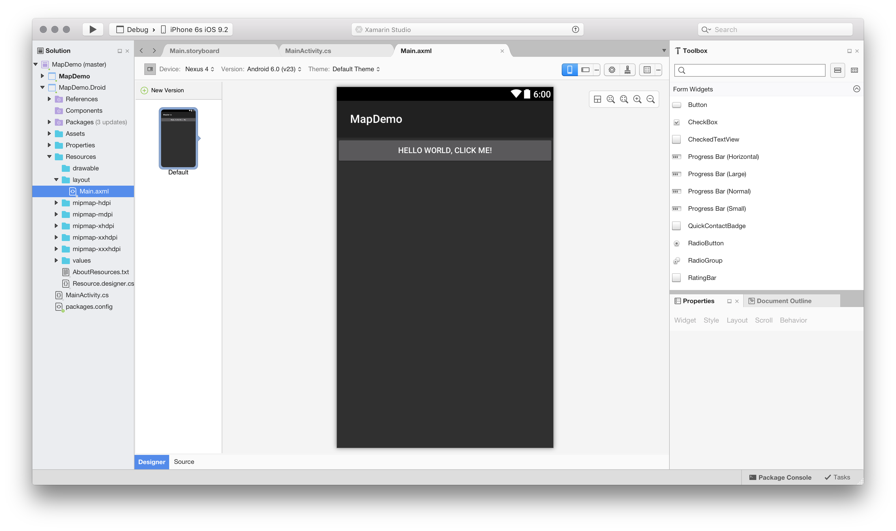
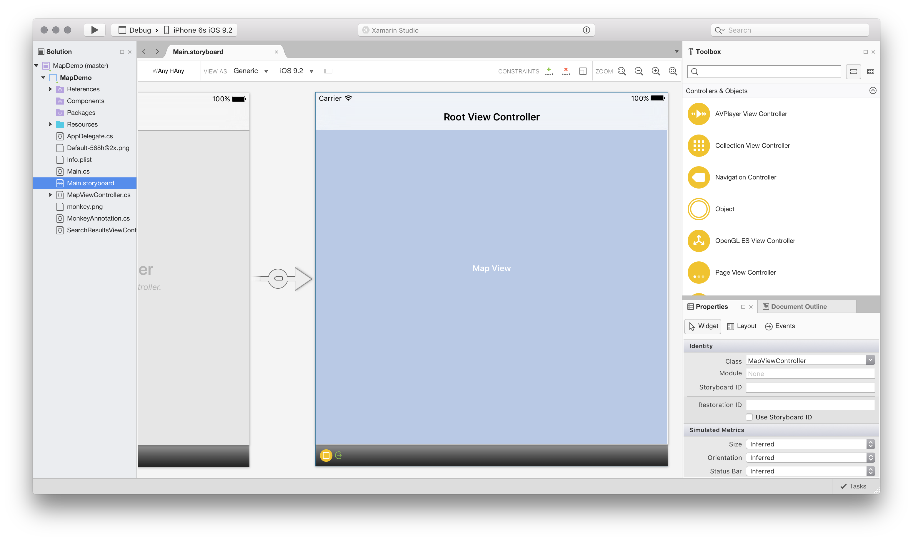
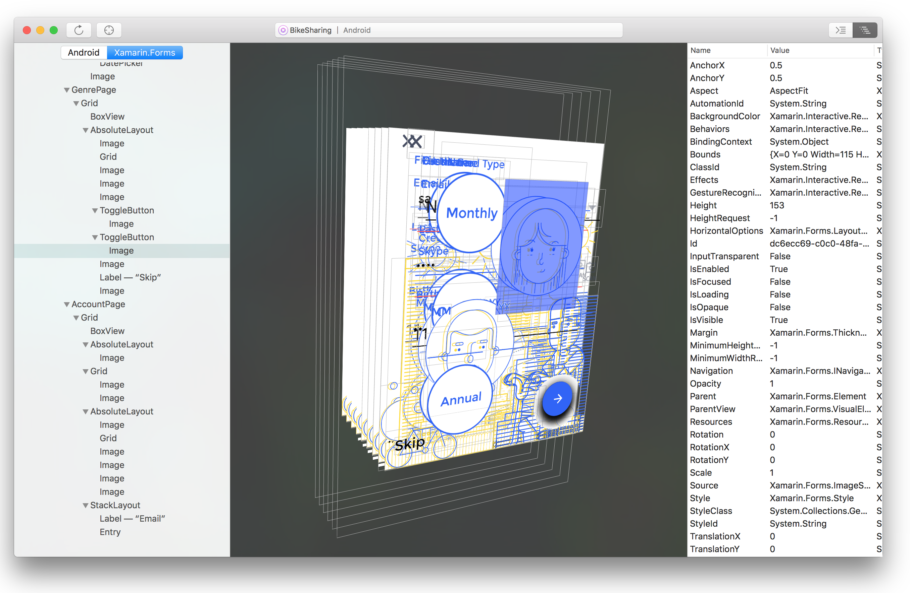

# Introducing Visual Studio for Mac

Visual Studio for Mac is a modern, sophisticated IDE with many features for creating mobile, desktop, and web applications. It supports following development:

* Mobile with .NET: Android, iOS, tvOS, watchOS
* Mac desktop apps
* .NET Core applications
* ASP.NET Core Web applications
* Cross-platform Unity games

It includes features such as a rich editor, debugging, native platform integration with iOS, Mac and Android, and integrated source controls.

This article surveys various sections of Visual Studio for Mac, providing a look at some of the features that make it a powerful tool for creating cross-platform applications.

## Installation

Follow the steps in the [Installation](installation.md) guide to download and Install Visual Studio for Mac.

## Language support

Visual Studio for Mac supports development in C# and F#, by default.

### C#

C# is the most commonly used language for creating cross-platform applications in Visual Studio for Mac. The IDE has full support for all C# 7 features.

### F#

F# is a strongly-typed functional programming language designed to run on .NET. It is available as a programming language to Visual Studio for Mac users on Android, Mac, and iOS. For more information on using F# and to view samples created in the language, visit the [F#](https://developer.xamarin.com/guides/cross-platform/fsharp/) guides.

## Platform support

## .NET Core

[.NET Core](https://www.microsoft.com/net/core#macos) is a platform for creating applications that run on Windows, Linux, and Mac. Visual Studio for Mac has support for loading, creating, running, and debugging .NET Core projects.

To run .NET Core projects, the .NET Core SDK should be downloaded and installed.

.NET Core support includes:

* C# and F# IntelliSense.
* .NET Core project templates for console, library, and web applications.
* Full debugging support, including breakpoints, call stack, watch window, etc.
* NuGet PackageReferences and MSBuild-based restore.
* Integrated unit testing support for running and debugging tests with the Visual Studio Test Platform that is included with the  .NET Core SDK.
* Migration from the old project.json format.

To get started, check out the ASP.NET Core web apps [hands-on lab](https://github.com/Microsoft/vs4mac-labs/tree/master/Web/Getting-Started).

## Xamarin

First-class support for [Xamarin](https://developer.xamarin.com/) allows you to develop rich native experiences for Android, macOS, iOS, tvOS, and watchOS. Xamarin.Forms cross-platform applications help you share XAML-based UI code between Android, iOS, and macOS without limiting access to native functionality.

To get started, check out the Mobile apps [hands-on lab](https://github.com/Microsoft/vs4mac-labs/tree/master/Mobile/Getting-Started).

### Android

Visual Studio has its own integrated Android SDK manager.

For Android applications, Visual Studio for Mac includes its own designer, which works with Android `.axml` files to
visually construct user interfaces. Visual Studio for Mac will open these files in its Android designer, as illustrated in the following image:

For more information on the Android designer, see the [Designer Overview](https://developer.xamarin.com/Android/Guides/User_Interface/Designer_Overview) document.

### iOS

The iOS Designer is fully integrated with Visual Studio for Mac and enables visual editing of .xib and Storyboard files to create iOS, tvOS, and WatchOS UIs and transitions. The entire user interface can be built using drag-and-drop functionality between the Toolbox and Design Surface, while using an intuitive approach to handling events. The iOS Designer also supports [custom controls](https://developer.xamarin.com/guides/ios/user_interface/designer/ios_designable_controls_overview/) with the added benefit of design-time rendering.

For more information on using the iOS Designer, see the [Designer](https://developer.xamarin.com/guides/ios/user_interface/designer) documents.

### Mac

Xamarin provides native Mac API bindings allowing you to create beautiful Mac applications.

For more information on writing Mac applications with Visual Studio for Mac, refer to the [Xamarin.Mac](https://developer.xamarin.com/guides/#mac) documentation.

## Gaming

Visual Studio for Mac provides support for cross-platform games development with Unity 5.6.1.

To get started, check out the Unity [hands-on lab](https://github.com/Microsoft/vs4mac-labs/tree/master/Unity/Getting-Started).

## Enterprise features

> [!Note]
> These products can only be used with a Visual Studio Enterprise subscription.

### Profiler

The Xamarin Profiler has three instruments available for profiling. The [Introduction to the Xamarin Profiler](https://developer.xamarin.com/guides/cross-platform/deployment,_testing,_and_metrics/xamarin-profiler/) guide explores what these instruments measure and how they analyze your application, and clarifies the meaning of the data presented on each screen.

### Inspector

The Xamarin Inspector provides an interactive C# console with tools to users. It can be used as a debugging or diagnostics aid when inspecting live applications, as a teaching tool, as a documentation tool or an experimentation tool.

It consists of a standalone application that provides a rich C# console that can target various programming platforms (Android, iOS, Mac, and Windows) as well as integrating into the debugging workflow of your IDE.

For more information, see the [Xamarin Inspector](https://developer.xamarin.com/guides/cross-platform/inspector/) guide.

## Next steps

* **Get the tour** - To get an overview of many of the major features in Visual Studio for Mac, see the Visual Studio for Mac [IDE Tour](ide-tour.md).
* **Set up** - To learn about how to download and install Visual Studio, see the [Installation](installation.md) guide.
* **Xamarin Tutorials** - To learn more about how to develop code with Xamarin, go to the Xamarin [Developer Center](https://developer.xamarin.com).
* **Videos** - To learn more about other features and aspects of Visual Studio for Mac, check out videos on the [Xamarin University](https://university.xamarin.com) website.
* **Hands-on Labs** - To get started working with the various workloads included in Visual Studio for Mac, check out the [hands-on labs](https://github.com/Microsoft/vs4mac-labs).