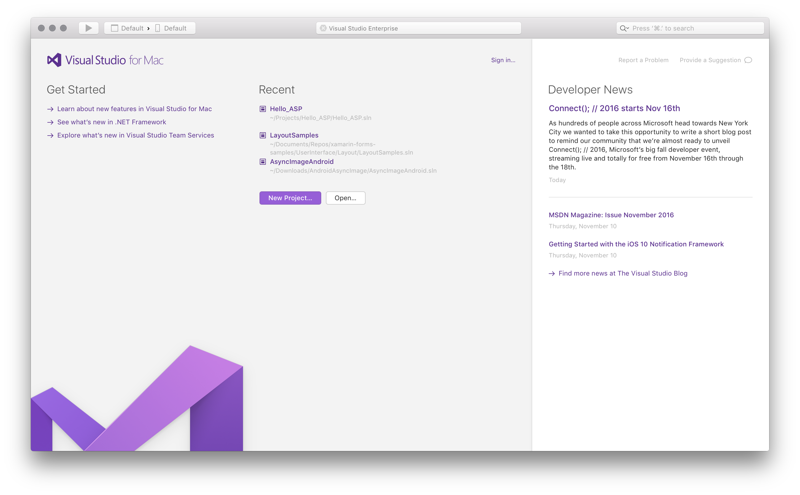
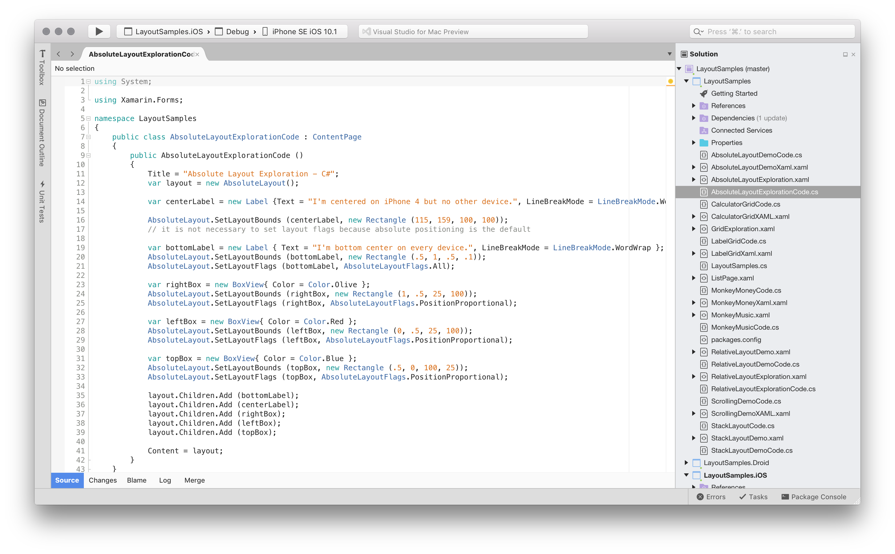
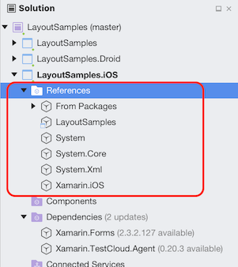

# Introducing Visual Studio for Mac

## Overview

The preview version of Visual Studio for Mac evolves Xamarin's mobile-centric IDE, Xamarin Studio, into a mobile-first, cloud-first development on the Mac. This developer-focused tool allows you to leverage the power of .NET to create applications for all platforms required by your users.

The UX of Visual Studio for Mac is similar to its Windows counterpart, but with a native macOS feel. Creating, opening, and developing app will be a familiar experience for anyone who has previously used Visual Studio on Windows. In addition, Visual Studio for Mac employs many of the powerful tools that makes its Windows counterpart such a powerful IDE. For example the Roslyn Compiler Platform is used for refactoring and IntelliSense. Its project system and build engine use MSBuild; and its source editor supports TextMate bundles. It uses the same debugger engines for Xamarin and .NET Core apps, and the same designers for Xamarin.iOS and Xamarin.Android.

This article explores various sections of Visual Studio, providing a look at some of the features that make it a powerful tool for creating applications.

## Requirements

Visual Studio for Mac is currently available on macOS 10.11 and above. For Xamarin development there are additional requirements listed on the [Xamarin System Requirements](https://developer.xamarin.com/guides/cross-platform/getting_started/requirements/#macOS_Requirements) page.

Visual Studio for Mac allows for development of the following platforms:

* Xamarin.iOS (including WatchOS, and tvOS)
* Xamarin.Android
* Xamarin.Forms (iOS and Android only)
* Xamarin.Mac
* ASP.NET Core

## Installing .NET Core

Visual Studio for Mac includes support for .NET Core – a lightweight runtime allowing for cross-platform development across Windows, macOS, and Linux. .NET Core needs to be installed when using Visual Studio for Mac. To install it, do the following:

1. Before you start installing .NET Core, ensure that you have updated all macOS updates to the latest version. You can check this by going to the App Store application, and selecting the **Updates** tab.
2. Follow the steps listed on the [].NET Core site](https://www.microsoft.com/net/core#macos). Make sure to complete all four steps successfully to ensure that .NET Core is installed successfully.

## Tour

Visual Studio for Mac shares lots of the same features as Xamarin Studio such as C# and F# language support and iOS and Android Visual Designers. All documentation for written Xamarin Studio is still relevant. Visual Studio for Mac provides

## Welcome Screen

When launched, Visual Studio for Mac displays a Welcome Screen, as illustrated below:

The Welcome screen contains the following sections:

* **Toolbar** – Provides quick access to search bar. When a solution is loaded, this is used to set app configurations, debugging, and displaying errors.
* **Getting Started** – Provides quick access to a number of useful topics for developers Getting Started with Visual Studio for Mac.
* **Recent Solutions** – Provides quick access to recently opened solutions, as well as convenient buttons to open or create projects.
* **Developer News** – News feed to stay up to date on the latest Microsoft Developer information.

## Solutions and Projects

The image below shows Visual Studio for Mac with an application loaded:

[

The following sections provide an overview of the major areas in Visual Studio for Mac.

### Solution Pane

The Solution Pane organizes the project(s) in a solution, as shown below:

[

This is where files for the source code, resources, user interface, and dependencies are organized into platform-specific Projects.

For more information on using Projects, Solutions, and Configurations in the IDE, refer to the [Projects, Solutions, and Configurations](https://developer.xamarin.com/guides/cross-platform/xamarin-studio/projects-and-solutions/) guide.

### Assembly References

Assembly references for each project are available under the References folder, shown below:

Additional references can be added via the the **Edit References** dialog, which can be displayed by double-clicking on the **References** folder, or by select **Edit References** on its context menu actions:

### Dependencies

All external dependencies used in your app are stored in the Dependencies folder. These are usually provided in the form of a NuGet or Component.

NuGet is the most popular package manager for .NET development. With Visual Studio's NuGet support you can easily search for and add packages to your project to application.

To a dependencies your application, right click on the dependencies folder, and select **Add Packages**:

Information on using a NuGet package in an application can be found in the [Including a NuGet in your project](/guides/cross-platform/xamarin-studio/nuget_walkthrough/) guide.

## Refactoring

Visual Studio for Mac provides two useful ways to refactor your code: Context Actions, and Source Analysis. You can read more about them in the [Refactoring](https://developer.xamarin.com/guides/cross-platform/xamarin-studio/refactoring/) guide.

## Debugging

Visual Studio for Mac has a native debugger allowing debugging support for Xamarin.iOS, Xamarin.Mac and Xamarin.Android applications. Visual Studio for Mac uses the Mono Soft Debugger, which is implemented into the Mono runtime allowing the IDE to debug managed code across all platforms. For additional information on debugging, visit the [Debugging with Xamarin](https://developer.xamarin.com/guides/cross-platform/xamarin-studio/debugging_with_xamarin/) guide.

The debugger contains rich visualizers for special types such as strings, colors, URLs as well as the sizes, co-ordinates and bézier curves.

For more information on the debugger's data visualizations visit the [Data Visualizations](https://developer.xamarin.com/guides/cross-platform/xamarin-studio/debugging_with_xamarin/data_visualizations/) guide.

## Version Control

Visual Studio integrates with Git and Subversion source control systems. Projects under source control are denoted with the branch listed next to the Solution name:

Files with uncomitted changed have an annotation on their icons in the Solution Pane, as shown below:

For more information on using version control in Visual Studio, refer to the [Version Control](https://developer.xamarin.com/guides/cross-platform/xamarin-studio/version-control/) guide.
