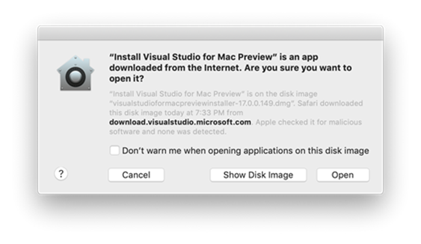
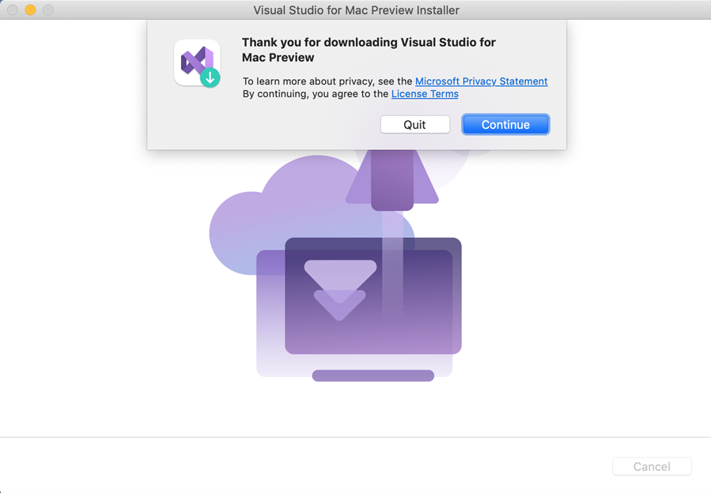
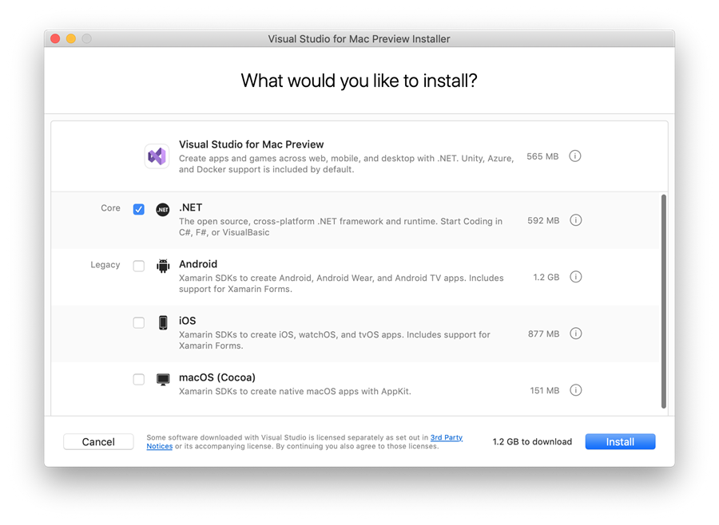
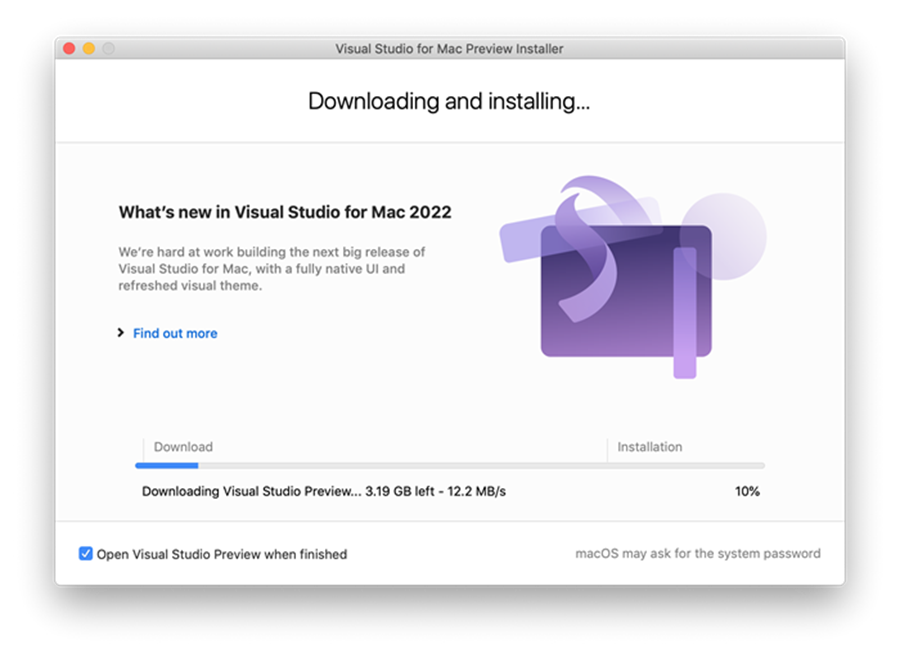
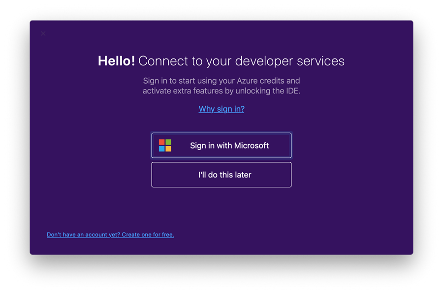
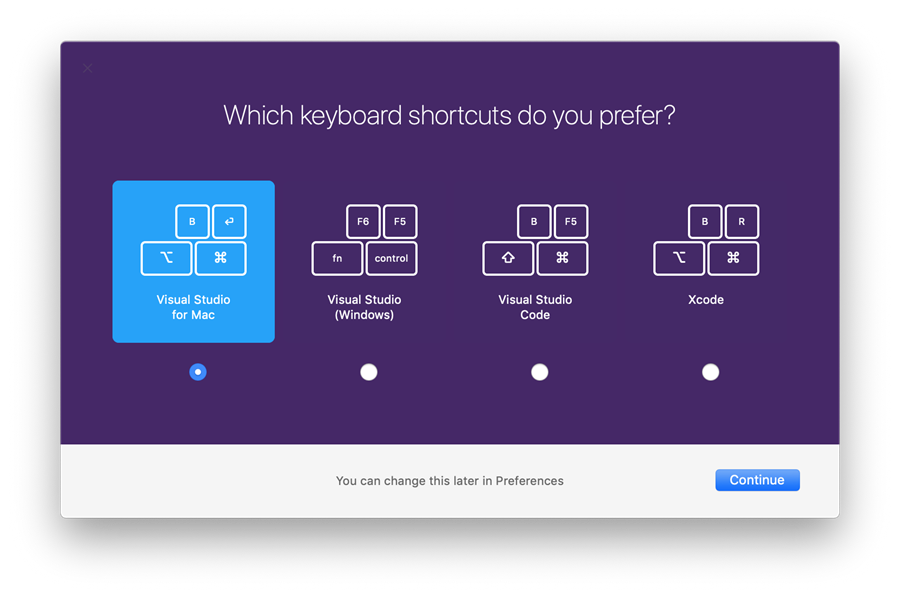
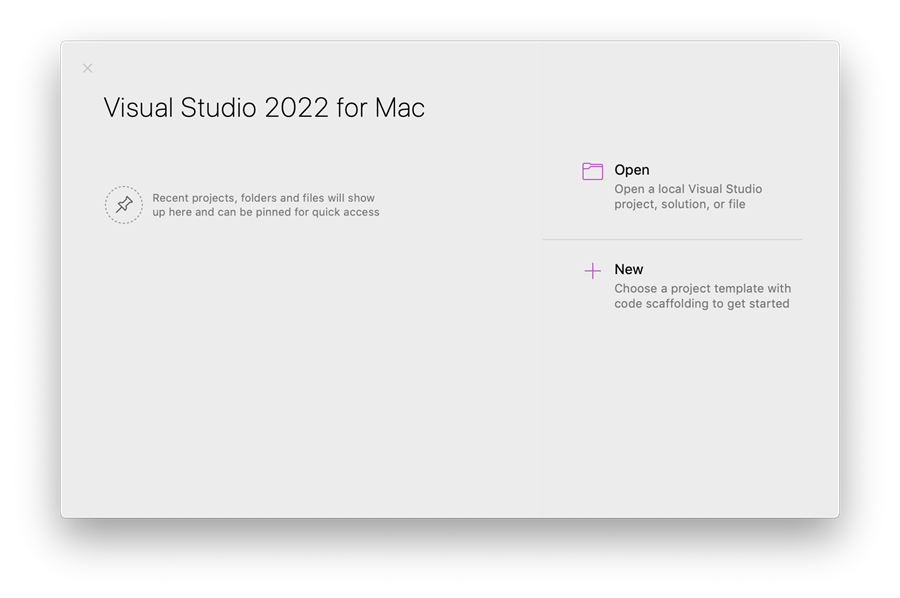

# Install Visual Studio for Mac

 [!INCLUDE [Visual Studio for Mac](~/includes/applies-to-version/vs-mac-only.md)]

To start developing native, cross-platform .NET apps on macOS, install Visual Studio for Mac following the steps below.

::: moniker range="vsmac-2019"

 > [!div class="button"]
 > [Download Visual Studio for Mac](https://visualstudio.microsoft.com/vs/mac/)

Learn more about the changes in the [release notes](/visualstudio/releasenotes/vs2019-mac-relnotes).

::: moniker-end

::: moniker range="vsmac-2022"

 > [!div class="button"]
 > [Download Visual Studio for Mac](https://visualstudio.microsoft.com/vs/mac/)

Learn more about the changes in the [release notes](/visualstudio/releases/2022/mac-release-notes).

::: moniker-end

## Prerequisites

::: moniker range="vsmac-2019"

- A Mac with macOS High Sierra 10.13 or above.

::: moniker-end

::: moniker range="vsmac-2022"

- See [Visual Studio 2022 for Mac System Requirements](/visualstudio/releases/2022/mac-system-requirements) for supported operating systems, hardware, supported languages, and additional requirements and guidance.

::: moniker-end

To build Xamarin apps for iOS or macOS, you'll also need:

- A Mac that is compatible with the latest version of Xcode. See Apple's [minimum requirements documentation](https://developer.apple.com/support/xcode/)
- The latest version of [Xcode](https://developer.apple.com/xcode). It may be possible to [use an older version of Xcode](/xamarin/ios/troubleshooting/questions/old-version-xcode) if your Mac isn't compatible with the latest version.
- An Apple ID. If you don't have an Apple ID already, you can create a new one at https://appleid.apple.com. It's necessary to have an Apple ID for installing and signing into Xcode.

## Installation instructions

::: moniker range="vsmac-2019"

1. Download the installer from the [Visual Studio for Mac download page](https://visualstudio.microsoft.com/vs/mac/).
2. Once the download is complete, select the **VisualStudioforMacInstaller.dmg** to mount the installer, then run it by double-clicking the arrow logo:

    

3. You may be presented with a warning about the application being downloaded from the Internet. Select **Open**.
4. Wait while the installer checks your system:

    

5. An alert will appear asking you to acknowledge the privacy and license terms. Follow the links to read them, then press **Continue** if you agree:

    

6. The list of available workloads is displayed. Select the components you wish to use:

    

   If you don't wish to install all platforms, use the guide below to help you decide which platforms to install:

   |Type of App  |Target  |Selection  |Notes  |
   |---------|---------|---------|---------|
   |**Apps Using Xamarin**| Xamarin.Forms|Select **Android** and **iOS** platforms |You'll need to install [**Xcode**](https://developer.apple.com/xcode/) |
   ||iOS only|Select **iOS** platform|You'll need to install [**Xcode**](https://developer.apple.com/xcode/)|
   ||Android only|Select **Android** platform|You should also select the relevant dependencies|
   ||Mac only|Select **macOS (Cocoa)** platform|You'll need to install [**Xcode**](https://developer.apple.com/xcode/)|
   |**.NET Core applications**|         |Select **.NET Core** platform.|         |
   |**ASP.NET Core Web Applications**|         |Select **.NET Core** platform.|         |
   |**Azure Functions**|         |Select **.NET Core** platform.|         |
   |**Cross-platform Unity Game Development**|         |No more platforms need to be installed beyond Visual Studio for Mac.| For more information on installing the Unity extension, see the [Unity setup guide](./setup-vsmac-tools-unity.md).|

7. After you've made your selections, press the **Install** button.
8. The installer will display progress as it downloads and installs Visual Studio for Mac and the selected workloads. You'll be prompted to enter your password to grant the privileges necessary for installation.

    

9. Once installed, Visual Studio for Mac prompts you to personalize your installation by signing in and selecting the key bindings that you'd like to use:

    

    

::: moniker-end

::: moniker range="vsmac-2022"

1. Download the installer from the [Visual Studio for Mac download page](https://visualstudio.microsoft.com/vs/mac/).
1. Once the download is complete, click the **VisualStudioForMacInstaller_<build_number>.dmg** to mount the installer, then run it by double-clicking the arrow logo:

    

1. You may be presented with a warning about the application being downloaded from the Internet. Select **Open**.

    

1. An alert will appear asking you to acknowledge the privacy and license terms. Follow the links to read them, then select **Continue** if you agree:

    

1. The list of available workloads is displayed. Select the components you wish to use:

    

   If you do not wish to install all platforms, use the guide below to help you decide which platforms to install:

   |Type of App  |Target  |Selection  |Notes  |
   |---------|---------|---------|---------|
   |**Apps Using Xamarin**| Xamarin.Forms|Select **Android** and **iOS** platforms |You will need to install [**Xcode**](https://developer.apple.com/xcode/) |
   ||iOS only|Select **iOS** platform|You will need to install [**Xcode**](https://developer.apple.com/xcode/)|
   ||Android only|Select **Android** platform|Note that you should also select the relevant dependencies|
   ||Mac only|Select **macOS (Cocoa)** platform|You will need to install [**Xcode**](https://developer.apple.com/xcode/)|
   |**.NET Core applications**|         |Select **.NET Core** platform.|         |
   |**ASP.NET Core Web Applications**|         |Select **.NET Core** platform.|         |
   |**Azure Functions**|         |Select **.NET Core** platform.|         |
   |**Cross-platform Unity Game Development**|         |No additional platforms need to be installed beyond Visual Studio for Mac.| Refer to the [Unity setup guide](./setup-vsmac-tools-unity.md) for more information on installing the Unity extension.|

1. After you've made your selections, select the **Install** button.
1. The installer will display progress as it downloads and installs Visual Studio for Mac and the selected workloads. You'll be prompted to enter your password to grant the privileges necessary for installation.

    

1. Once installed, Visual Studio for Mac will prompt you to personalize your installation by signing in and selecting the key bindings that you'd like to use:

    

    

1. Visual Studio for Mac will launch, and you can open a project or create a new one.

    

::: moniker-end

If you have network trouble while installing in a corporate environment, review the [installing behind a firewall or proxy](#install-visual-studio-for-mac-behind-a-firewall-or-proxy-server) instructions.

> [!NOTE]
> If you chose not to install a platform or tool during the original installation (by unselecting it in step #6), you must run the installer again if you wish to add the components later.

## Install Visual Studio for Mac behind a firewall or proxy server

To install Visual Studio for Mac behind a firewall, certain endpoints must be made accessible in order to allow downloads of the required tools and updates for your software.

Configure your network to allow access to the following locations:

- [Visual Studio endpoints](./install-behind-a-firewall-or-proxy-server.md)

## Next steps

Installing Visual Studio for Mac allows you to start writing code for your apps. The following guides are provided to guide you through the next steps of writing and deploying your projects.

### iOS

- [Hello, iOS](/xamarin/ios/get-started/hello-ios/)
- [Device Provisioning](/xamarin/ios/get-started/installation/device-provisioning/) (To run your application on device)

### Android

- [Hello, Android](/xamarin/android/get-started/hello-android/)
- [Using the Xamarin Android SDK Manager](/xamarin/android/get-started/installation/android-sdk?tabs=macos)
- [Android SDK Emulator](/xamarin/android/get-started/installation/android-emulator/)
- [Set Up Device for Development](/xamarin/android/get-started/installation/set-up-device-for-development)

### Xamarin.Forms

Build native cross-platform applications with Xamarin.Forms:

- [Xamarin.Forms Quickstarts](/xamarin/get-started/quickstarts/)

### .NET Core apps, ASP.NET Core web apps, Unity game development

For other Workloads, refer to the [Workloads](workloads.md) page.

## Related Video

> [!VIDEO https://learn.microsoft.com/shows/Visual-Studio-Toolbox/Visual-Studio-for-Mac-Acquisition/player]
