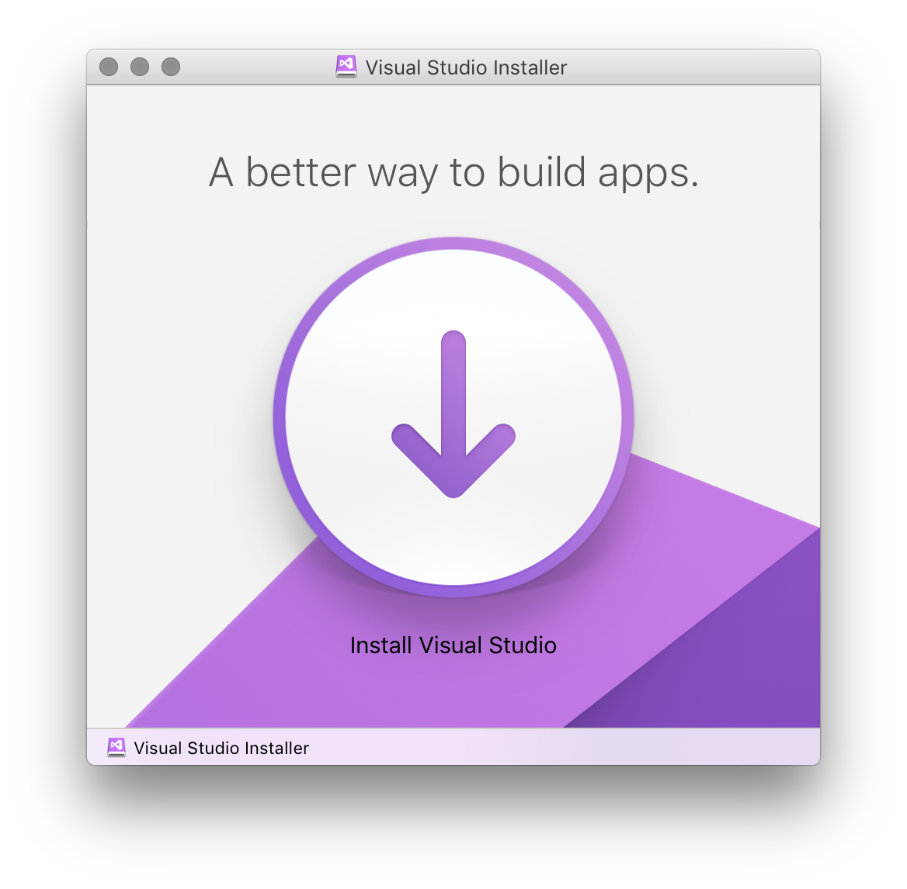
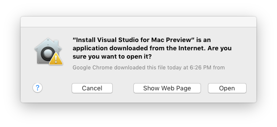
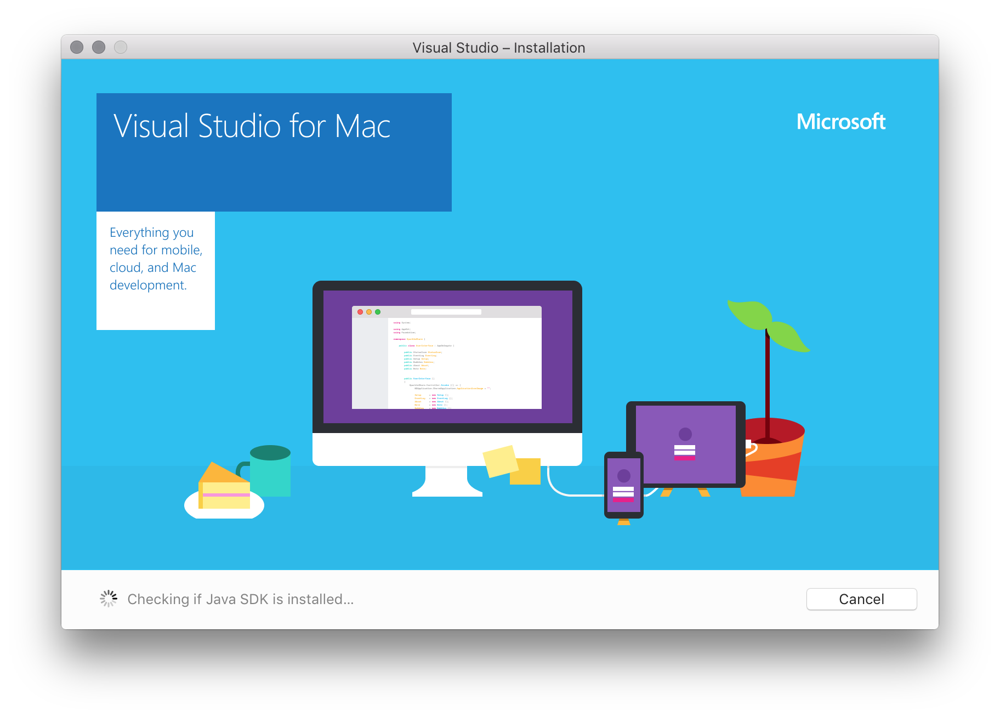
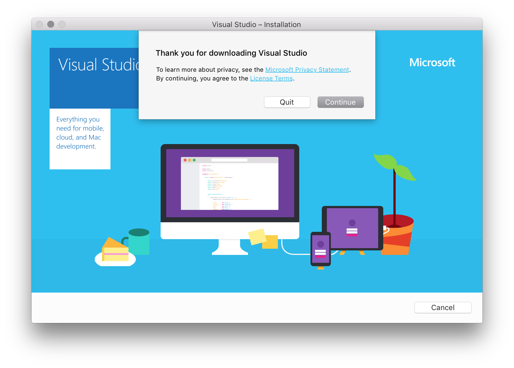
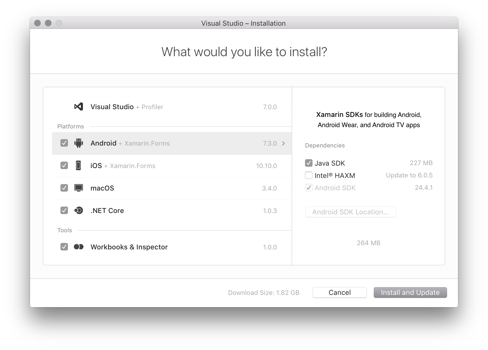

# Setup and Install Visual Studio for Mac

## Setup

To start developing native, cross-platform apps when you download Visual Studio for Mac there are a couple of things that you must install and set up in preparation.

For working with iOS in Visual Studio you need the following pieces:

* a Mac with macOS Sierra 10.12 or above
* Xcode 8.3 or above. The latest stable version is usually recommended.
* An Apple ID. If you don't have an Apple ID already you can create a new one at https://appleid.apple.com. It's necessary to have an Apple ID for installing and signing into Xcode.

## Install

1. Download Visual Studio for Mac from [https://www.visualstudio.com/](https://www.visualstudio.com/)

2. Once the installer package is downloaded, click the **VisualStudioInstaller.dmg** file to mount the installer and then run it by double-clicking the logo, as illustrated by the following image:

  

3. You might be prompted with an alert dialog similar to the following image. In this case, click **Open**:

  

4. The installer inspects your system to verify which components need to be installed or updated:

  

5. You'll then be presented with an alert dialog asking you to acknowledge the Privacy and License terms. Press the **Continue** button to acknowledge the terms:

  

6. The installer presents a list of required components that are missing and that need to be downloaded and installed. Select the products you wish to download here:

  

  This installation screen displays the version and size of each individual component. You can click each component to display a list of dependencies for that component (for Android), see additional packages that it downloads (for .NET Core), or view any additional applications required (for iOS and macOS):

  

7. Once you are happy with your selection, select the **Install and Update** button to start the installation process.

8. The installer starts the download and install process of the selected items:

  

  

  

9. You might be prompted to elevate the permissions necessary for individual components that are needed to complete installation. Enter your administrator credentials here to continue the installation process:

  

10. Once the installation is successful, you can start developing apps in Visual Studio by pressing **Start**:

  

> [!NOTE]
If you chose not install a platform or tool during the original installation (by unselecting it in step #6), you must run the [installer](https://www.visualstudio.com/vs/) again if you wish to add the components later.

## Manual Installation

If your installation fails or any single component of your installation fails, you may be able to resolve the issue through manual installation. To view the required components and download each one, take the following steps:

1. On the second screen on the Visual Studio Installer, go to the menu bar and select **View Manual Installation Instructions**:

    

2. Follow the instructions to download and install the components manually:

  

## Install Visual Studio for Mac behind a firewall or proxy server

To install Visual Studio for Mac behind a firewall, certain endpoints must be made accessible in order to allow downloads of the required tools and updates for your software.

Configure your network to allow access to the following locations:

* [Visual Studio endpoints](https://docs.microsoft.com/visualstudio/install/install-visual-studio-behind-a-firewall-or-proxy-server)