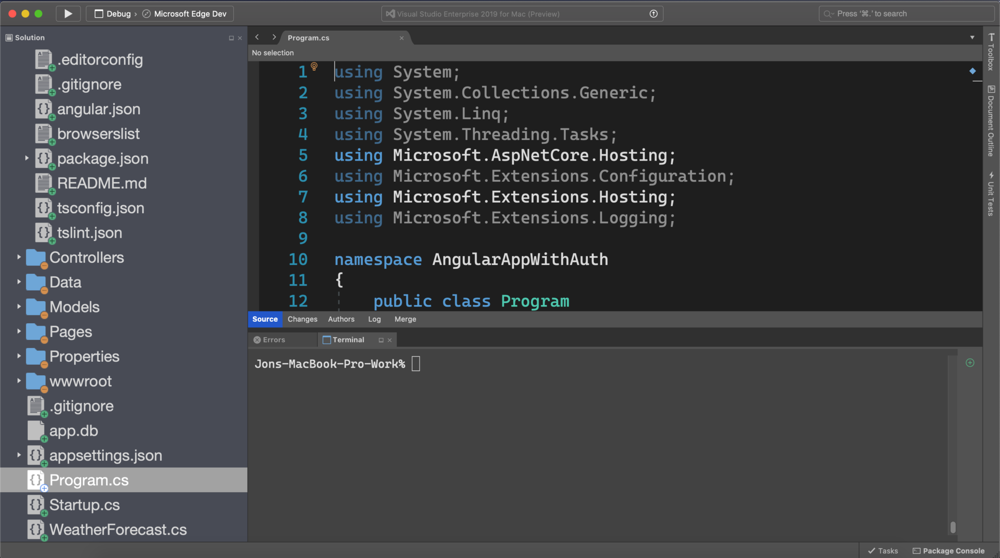
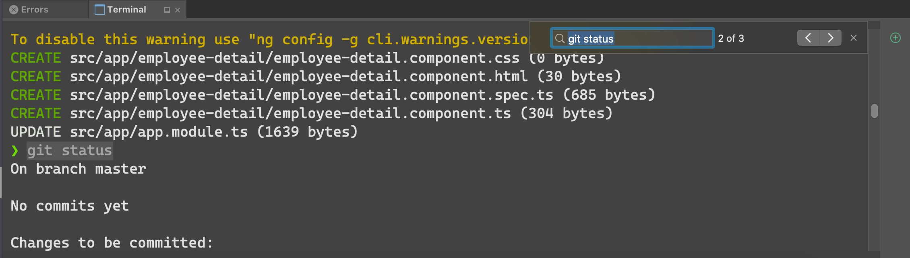
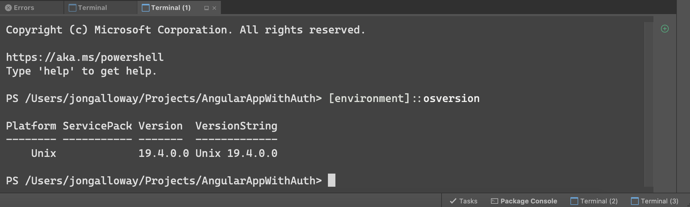
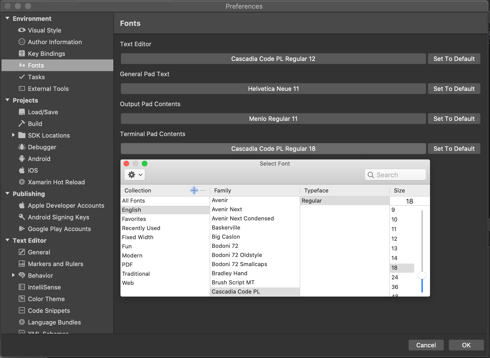

# Integrated Terminal

 [!INCLUDE [Visual Studio for Mac](~/includes/applies-to-version/vs-mac-only.md)]

You can open an integrated terminal window in Visual Studio for Mac, starting at the root of your solution. The terminal can be useful for different kinds of situations – running front-end tasks (for example: npm, ng, or vue), managing containers, running advanced git commands, executing Entity Framework commands, viewing dotnet CLI output, adding NuGet packages, and more. 

To open the **Terminal**:
- Use the **Ctrl + `** keyboard shortcut with the backtick character to show or hide the Terminal window.
- Use the **View** > **Terminal** menu command.
- Use the **terminal** command from the **search** bar.

::: moniker range="vsmac-2019"

::: moniker-end

::: moniker range="vsmac-2022"

:::image type="content" source="media/vsmac-2022/integrated-terminal-intro.png" alt-text="Screenshot showing the Visual Studio for Mac integrated terminal immediately after being launched.":::

::: moniker-end

By default, when the Terminal is launched it will:
- Set the working directory to the path of the current solution.
- Load the default system shell.

## Search
You can search the content of the Terminal window by using the **Search > Find...** menu.

## Terminal keyboard shortcuts
|Commands|Keyboard shortcuts|
|-|-|
|Show/Hide the Terminal window|**Ctrl+ `**|
|Create new Terminal instance|**Ctrl+'**|
|Scroll page up|**PageUp**|
|Scroll page down|**PageDown**|
|Cycle through previously used commands|**↑**, **↓**|
|Increase font size|**⌘+**|
|Decrease font size|**⌘-**|

## Multiple instances
Multiple instances of the Terminal may be running at any time. You can create a new instance by using the **Ctrl+'** keyboard shortcut. You can switch between instances by clicking on the tab for each instance, or using the **Ctrl+tab** shortcut to use the window picker dialog.

 

## Customizing the terminal window

### Configuring the terminal font

You can change the font **Family**, **Typeface** and **Size** used for the **Terminal Window Contents** from **Preferences...** > **Environment** > **Fonts**. By default, the font will be the same as that for the **Output Window Contents**, using Menlo Regular 11. You can set it to any font, independent of your **Text Editor** font.

::: moniker range="vsmac-2019"

::: moniker-end

::: moniker range="vsmac-2022"

:::image type="content" source="media/vsmac-2022/integrated-terminal-customize-font.png" alt-text="Screenshot showing customizing the font settings for the integrated terminal.":::

::: moniker-end

### Reusing system terminal customizations

The integrated terminal uses the same defaults and configuration as your macOS system terminal. That means that your terminal customizations (zsh, oh-my-zsh, etc.) also work in the integrated terminal.
