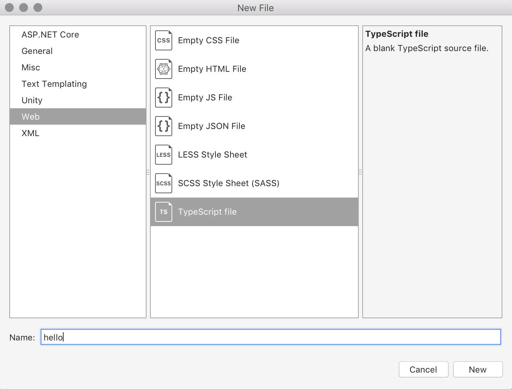

# Javascript support

Visual Studio for Mac provides support for Javascript and Typescript through syntax highlighting, code formatting, and IntelliSense. 

For more information on writing JavaScript, see to the [Writing Javascript Code](https://docs.microsoft.com/scripting/javascript/writing-javascript-code) guides.

## Adding a JavaScript file

JavaScript files are most often added to ASP.NET Core projects through the **New File** dialog. To add a javascript file, right-click on your project and go to **Add > New File**: 

From the New File dialog, select **Web > Empty JS file** or **Web > Typescript file**. Give it a name and then choose **New**:

## Intellisense

Visual Studio for Mac uses the [Javascript Language Service](https://docs.microsoft.com/en-us/visualstudio/ide/javascript-intellisense) to provide Intellisense, allowing you to have intelligent code completion, parameter info, and member lists when writing code.

Javascript intellisense in Visual Studio for Mac can be based on type inference, JSDoc, or Typescript declaration.

- **Type inference** – The type of an object is figured out by the surrounding code context. For more information, see Visual Studio's section on [IntelliSense based on type inference](https://docs.microsoft.com/visualstudio/ide/javascript-intellisense#intellisense-based-on-type-inference).
- **JSDoc** – There are times when type inference doesn't provide the correct type information. In these cases, the type information can be provided explicitly by [JSDoc](http://usejsdoc.org/about-getting-started.html) annotations. For more information, see Visual Studio's section on [Intellisense based on JSDoc](https://docs.microsoft.com/visualstudio/ide/javascript-intellisense#intellisense-based-on-jsdoc)
- **TypeScript declaration files** – `.d.ts` files are used to provide values for Javascript Intellisense. Types declared in that file can be used as types on JSDoc comments. For more information, see Visual Studio's section on [IntelliSense based on TypeScript declaration files](https://docs.microsoft.com/visualstudio/ide/javascript-intellisense#intellisense-based-on-typescript-declaration-files)
    