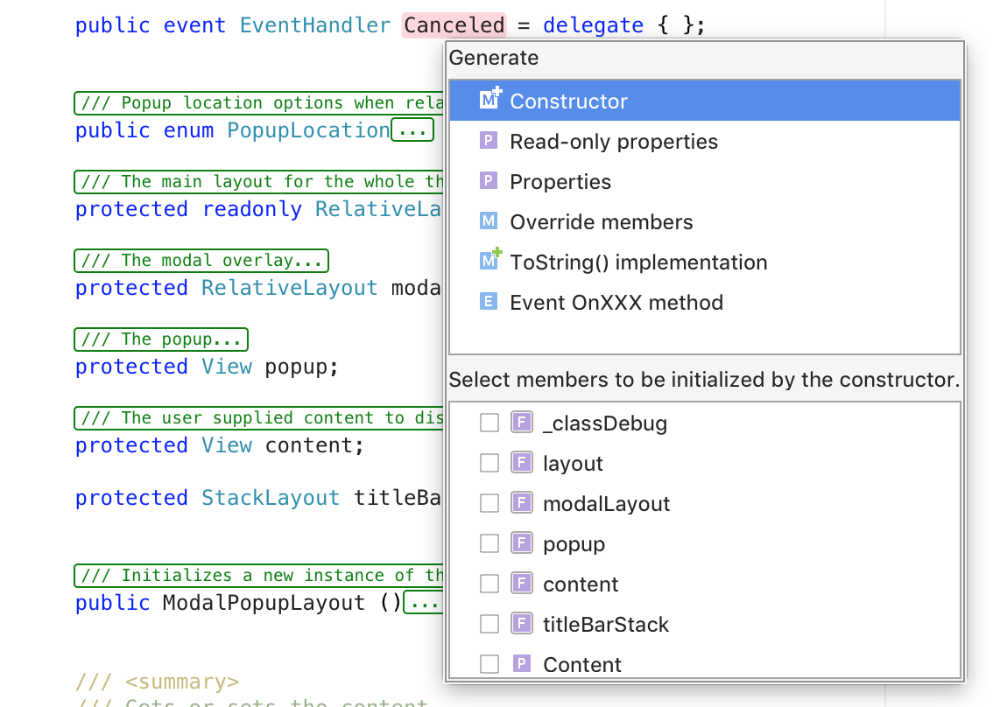
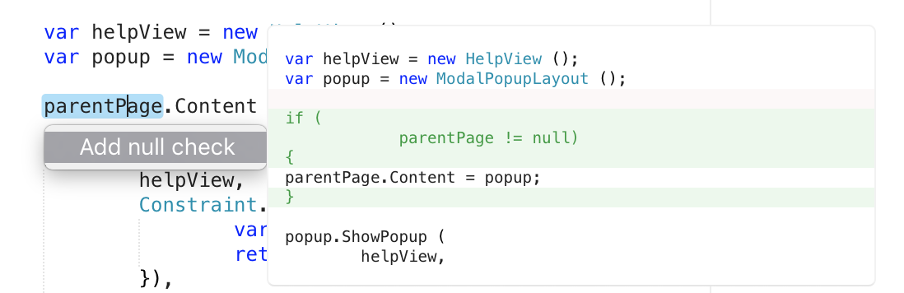

# Common keyboard shortcuts in Visual Studio for Mac

## Show code generation window

This contextually generates code:

 `⌘ + 1`

## Search Files, Symbols, and Commands

`control + .` 

## Autocomplete 

`control + /` 

## Quick fixes and actions

Displays [refactoring](~/refactoring.md) context actions:

`option + enter`

## Find in files

`⌘ + shift + F`

## File Switcher

Allows quick switching between files:

`control + tab`

## Move lines around in Editor

`alt + up/down` 

Use the **alt + up** command to move the current line or current selected lines up, and use the **alt + down** command to move the lines down. If the language add-in supports it, the lines will be re-indented to match the context when they move in and out of scope.

## Word navigation

Moves the caret to the next or previous word:

`option + left/right`

## Line navigation

Moves the caret to the beginning or end of the line:

`⌘ + left/right`

## Expands the Selection

Expands word, sub-expressions, statement, and line member selection in a logical way:

`alt + shift + up` to select
`alt + shift + down` to de-select