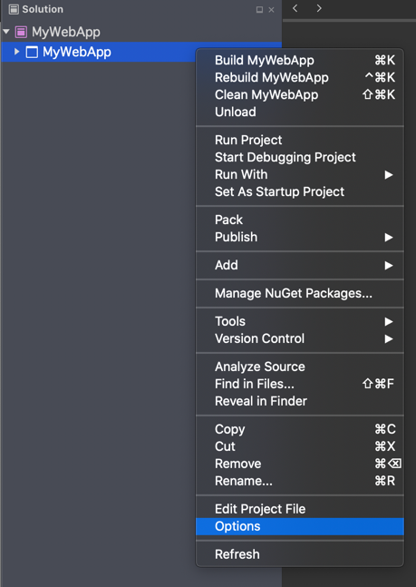

# launchSettings.json

When you're developing ASP.NET Core projects, you can configure how your project should be started in development scenarios by customizing the contents of the launchSettings.json file. In Visual Studio for Mac, you can update this file by using the project options UI or by directly editing it. This file is the same configuration file that you can use when running Visual Studio on Windows or from the command line through `dotnet`. This file is stored in your project under the Properties folder.

For more detailed info, see [Use multiple environments in ASP.NET Core](/aspnet/core/fundamentals/environments). In this article, we'll cover how to update this file in Visual Studio for Mac.

## Update the start configuration by using Visual Studio for Mac

You can directly edit the launchSettings.json file in Visual Studio for Mac, or you can use project options to edit it. To get to the project options, right-click your project and select **Options**.

Select **Run** > **Configurations** > **Default**.

Primarily, you'll configure two things here:

 - Environment variables
 - App URL for the project

## Configure environment variables

You can use the grid to specify values for environment variables. These environment variables will be set when you start your application in Visual Studio for Mac. When you're developing ASP.NET Core applications, you should be aware of the special `ASPNETCORE_ENVIRONMENT` environment variable. To learn more, see [Use multiple environments in ASP.NET Core](/aspnet/core/fundamentals/environments).

## Configure the start URL

To configure the URL that the application will be started with, go to the **ASP.NET Core** tab.

Here you can specify the URL that the application will listen on when it's started.