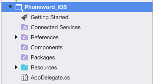

# Managing References in a Project

Visual Studio for Mac provides two means of adding additional references to your project:

These are:

* References
* NuGet packages (Added via the Packages folder)

In addition, Web References and native references can also be added to any project.

## Assembly references

Each framework within Xamarin ships with over a dozen assemblies. Not all of these assembly packages are referenced in your project by default.

To edit packages that are referenced in your project, use the **Edit References** dialog, which can be displayed by double-clicking on the References folder, or by selecting **Edit References** on its context menu actions:

For information on the assemblies available for each Xamarin framework, refer to the [Available Assemblies](https://developer.xamarin.com/guides/cross-platform/advanced/available-assemblies/) guide.

## NuGet

NuGet is the most popular package manager for .NET development. Visual Studio for Mac's NuGet support allows you to search for packages to add to your project.

To do this, right-click on the **Package** folder in the Solution Window, and select Add Packages.

More information on using a NuGet Package is provided in the [Including a NuGet package in your Project](nuget-walkthrough.md) walkthrough.

## See also

- [Manage references (Visual Studio on Windows)](/visualstudio/ide/managing-references-in-a-project)
- [Adding references using NuGet versus an extension SDK (Visual Studio on Windows)](/visualstudio/extensibility/nuget-versus-sdk-references)
