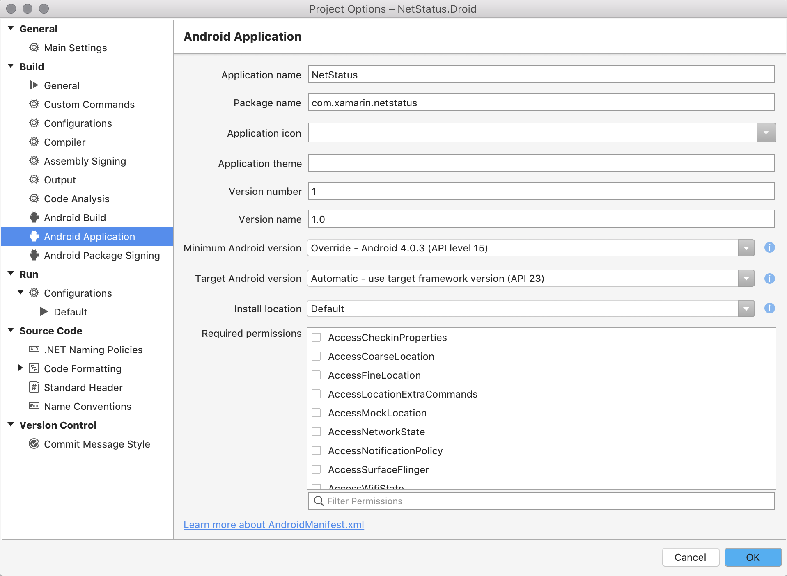
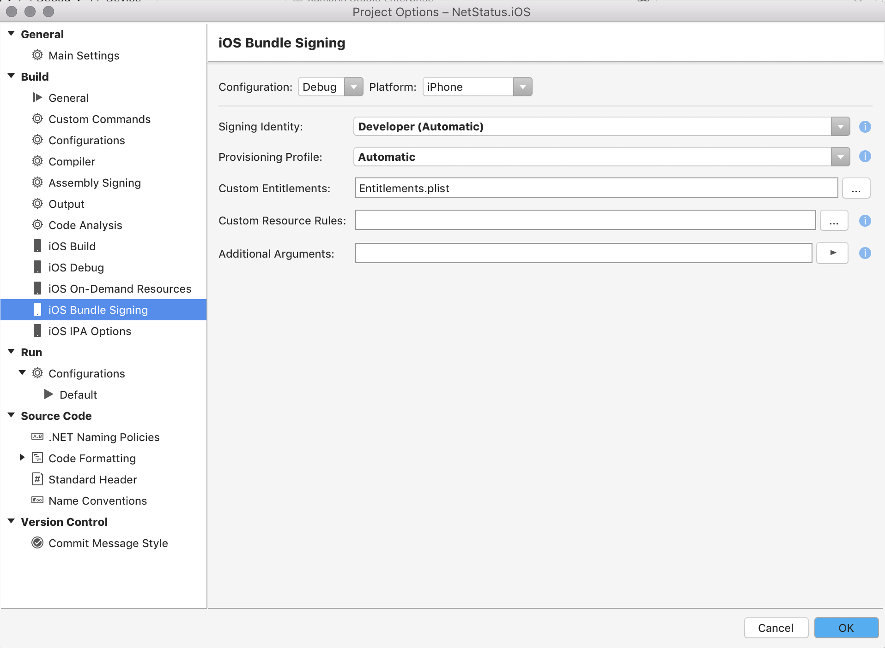
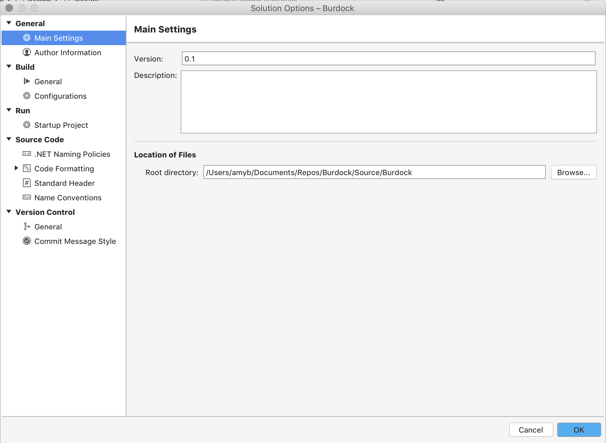

# Managing Project and Solution Properties

## Project options 

Project options are specific to each project and affect how the project is written, built, and run. This contrasts with Visual Studio for Mac Preferences, which set user-specific options, and with Solution options, which set options for the entire solution. Project options are stored in the project (.csproj) file, so that other developers can build and run the project correctly. This allows many developers to work on the same document without compromising the formatting of the file.

Project options in Visual Studio for Mac can be launched by double-clicking on the project name, or by right-clicking to open the context menu, and selecting **Options**:

 

Editable options include those to build, run, and set source code and version control options.

Project options are organized into five different categories which have the following capabilities:

* **General** - Project information such as Name, Description, and Default Namespace can be set here, along with the Location of the project.
* **Build** - This allows developers to set or change PCL profiles for Portable Class Libraries. It also allows for custom commands, configurations, compiler options to be set. The output path and assembly name can also be set here.
* **Run** - This allows you to create custom run configurations on a per-project basis.
* **Source Code** - This allows you to control the formatting of many different file types and naming conventions. You can also set the naming policies and default header styles here.
* **Version Control** - This allows you to edit the style of the commit message when using Version Control with your project.

Each project can also contain specific project options, depending on the platform. For example, a Xamarin.Android project, like the one illustrated below, will have options relating to the Android build - such as linker options; and the Application - such as permissions:

 

Xamarin.iOS will contain options related to bundle signing - such as the required provisioning profile to use; and relating to the IPA packaging options:

 

## Solution Options 

Solution options are like Project options, but cover the scope of the entire Solutions. They provide a way to set author information, build settings, code formatting styles, and version control, and they allow for a way to assign the startup project in the Solution.  The Solution Options dialog can be accessed from the **Project > Solution Options** menu item, from the **Options** context menu item on the Solution in the Solution pad, or by double-clicking on the Solution in the Solution Pad:

 
