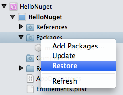
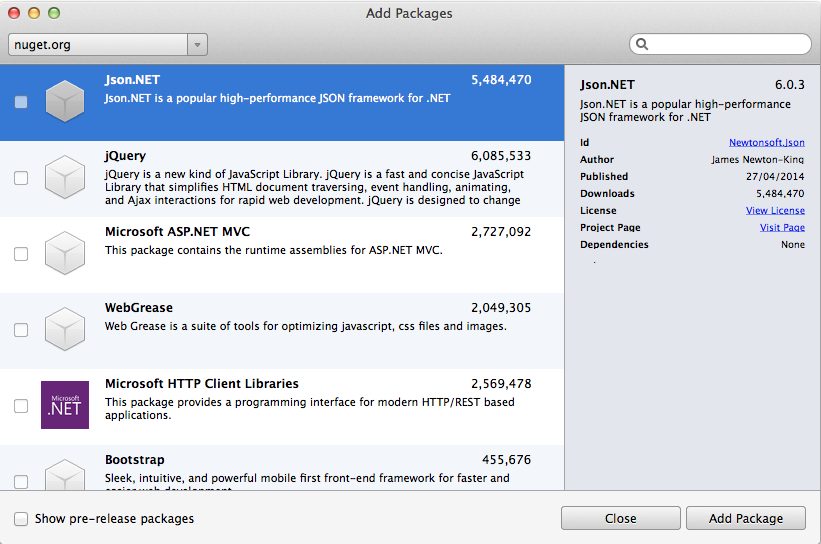
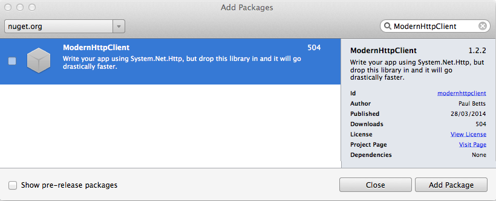
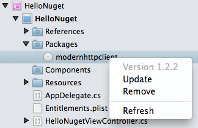
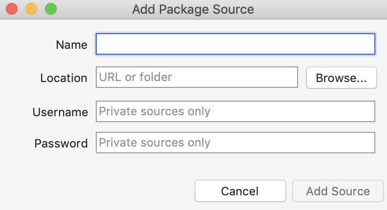
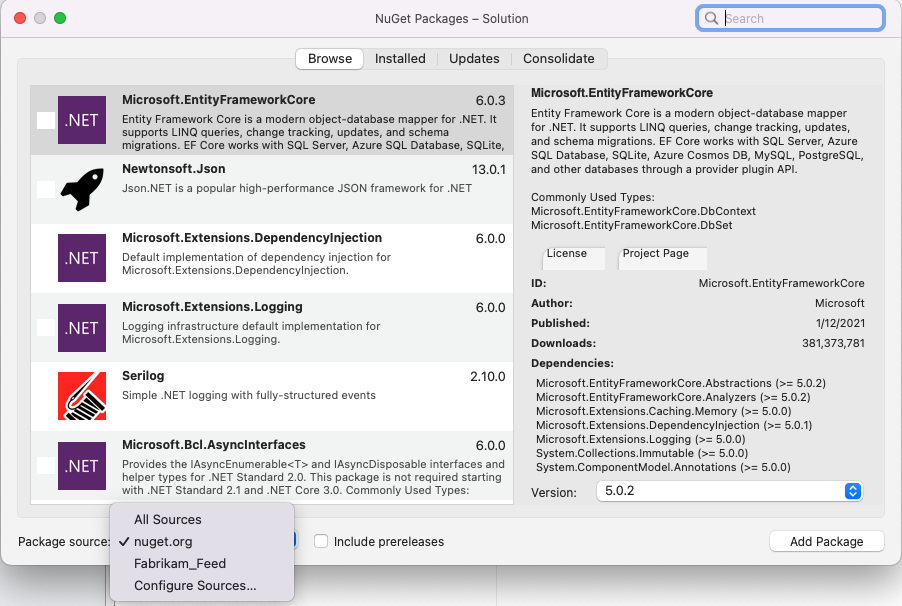
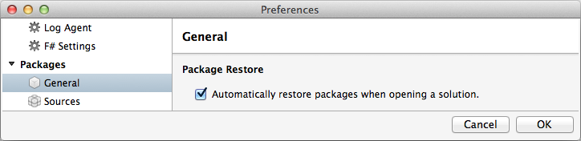

# Install and manage NuGet packages in Visual Studio for Mac

The NuGet Package Manager UI in Visual Studio for Mac allows you to easily install, uninstall, and update NuGet packages in projects and solutions. You can search for and add packages to your .NET Core, ASP.NET Core, and Xamarin projects.

This article describes how to include a NuGet package in a project and demonstrates the tool chain that makes the process seamless.

For an intro to using NuGet in Visual Studio for Mac, see [Quickstart: Install and use a package in Visual Studio for Mac](/nuget/quickstart/install-and-use-a-package-in-visual-studio-mac)

## Find and Install a Package

1. With a project open in Visual Studio for Mac, right-click on the **Dependencies** folder (**Packages** folder if using a Xamarin project) in the **Solution Pad** and select **Add Packages**.

    

2. This launches the **Add Packages** window. Ensure that the Source drop-down in the top left corner of the dialog is set to `nuget.org`.

    

3. Use the search box in the top-right corner to find a specific package, for example `azure mobile`. When you have found a package that you wish to use, select it and click the **Add Package** button to begin installation.

    

4. Once the package has been downloaded, it will be added to your project. The solution will change depending on the type of project you're editing:

    **Xamarin Projects**
    * The **References** node will contain a list of all the assemblies that are part of a NuGet package.
    * The **Packages** node displays each NuGet package that you have downloaded. You can update or remove a package from this list.
    
    **.NET Core Projects**

    The **Dependencies > NuGet** node displays each NuGet package that you have downloaded. You can update or remove a package from this list.

## Using NuGet Packages

Once the NuGet package has been added and the project references updated, you can program against the APIs as you would with any project reference.

Ensure that you add any required `using` directives to the top of your file:

```csharp
using Newtonsoft.Json;
```

<a name="Package_Updates" class="injected"></a>

## Updating Packages

Package updates can be done either all at once, by right-clicking on the **Dependencies** node (or **Packages** node for Xamarin projects), or individually on each component.

Right-click on **Dependencies** to access the context menu:


* **Manage NuGet Packages** - Opens the window to add more packages to the project.
* **Update** - Checks the source server for each package and downloads any newer versions.
* **Restore** - Downloads any missing packages (without updating existing packages to newer versions).

Update and Restore options are also available at the Solution level, and affect all the projects in the solution.

From the solution pad, you can view what version of a package is currently installed and right-click on the package to update.



You will also see a notification next to the package name when a new version of a package is available, so you can decide if you may want to update it.


In the menu shown, you have two options:

* **Update** - Checks the source server and downloads a newer version (if it exists).
* **Remove** - Removes the package from this project and removes the relevant assemblies from the project's References.

## Adding Package Sources

Packages available for installation are initially retrieved from nuget.org. However, you can add other package locations to Visual Studio for Mac. This can be useful for testing your own NuGet packages under development, or to use a private NuGet server inside your company or organization.

In Visual Studio for Mac, navigate to **Visual Studio > Preferences > NuGet > Sources** to view and edit the list of package sources. Note that sources can be a remote server (specified by a URL) or a local directory.


Click **Add** to set-up a new source. Enter a friendly name and the URL (or file path) to the package source. If the source is a secure web server, enter the username and password as well, otherwise leave these entries blank:



Different sources can then be selected when searching for packages:



## Version Control

The NuGet documentation discusses [using NuGet without committing packages to source control](/nuget/consume-packages/packages-and-source-control). If you prefer not to store binaries and unused information in source control, you can configure Visual Studio for Mac to automatically restore packages from the server. This means that when a developer retrieves the project from source control for the first time, Visual Studio for Mac will automatically download and install the required packages.



Refer to your particular source control documentation for details on how to exclude the `packages` directory from being tracked.

## Related Video

> [!Video https://channel9.msdn.com/Shows/Visual-Studio-Toolbox/Visual-Studio-for-Mac-Using-NuGet/player]

## See also

* [Install and use a package in Visual Studio (on Windows)](/nuget/quickstart/install-and-use-a-package-in-visual-studio)
