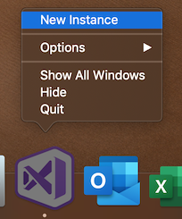
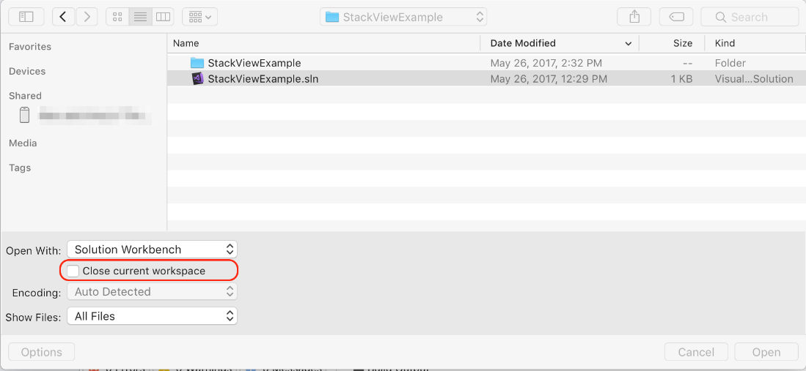

# Open multiple solutions or instances of Visual Studio for Mac

By default, all applications on a Mac, including Visual Studio for Mac, are _single-instance_ apps. This means that if the application you want to use is already open (illustrated by a dot under the icon in the dock), selecting the icon again opens the running instance, rather than a new one. If you require additional instances of the application, you can prompt the system to open it for you, as described in the [next section](#open-a-second-instance-of-visual-studio-for-mac).

In addition, when you open a solution, the default behavior is to open the solution in a new workspace and close the current workspace (if necessary). You can override this default behavior by keeping the current workspace open, as described in the [Open a second solution](#open-a-second-solution-inside-a-single-instance) section.

## Open a second instance of Visual Studio for Mac

To open a second instance of the integrated development environment (IDE), right-click on the Visual Studio icon in your dock or **Applications** folder, and select **New Instance**.

## Open a second solution inside a single instance

To open a second solution alongside your first solution, use the following steps:

1. With your first solution already open, select **File** > **Open**.
2. Browse the file system to find the existing solution.
3. Select the **.sln** file, and select **Options**:

    

4. Clear the **Close current workspace** box:

    

5. Select **Open** to open the second solution in the Solution Pad.

Alternatively, if you've recently opened the solution, you can use the following steps:

1. Go to **File** > **Recent Solutions**.

    

1. Hold down the **Ctrl** key and select the solution. This combination opens the second solution in the Solution Pad.

## Related Video

> [!Video https://channel9.msdn.com/Shows/Visual-Studio-Toolbox/Visual-Studio-for-Mac-Work-With-Multiple-Solutions/player]
