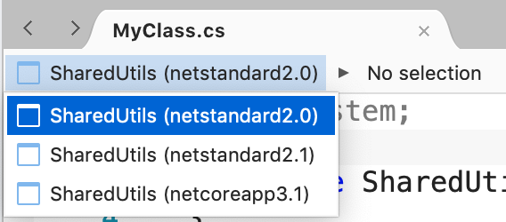
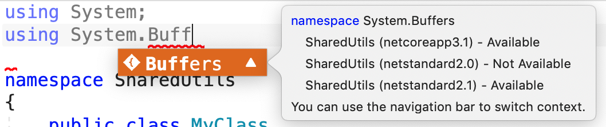

# Projects with multiple target frameworks

 [!INCLUDE [Visual Studio for Mac](~/includes/applies-to-version/vs-mac-only.md)]
In Visual Studio for Mac, you can configure a Xamarin or .NET Core project to run on any one of several versions of the .NET Framework, and on any one of several system platforms. For example, you could target a project to run on both .NET Framework 4.6 and .NET Core 3.1. 

For more information about target frameworks, see [Target frameworks](/dotnet/standard/frameworks).

> [!NOTE] 
> This topic applies to Visual Studio for Mac. For Visual Studio on Windows, see [Framework targeting overview](/visualstudio/ide/visual-studio-multi-targeting-overview).

## Targeting multiple frameworks

Target frameworks are specified in your project file, which you can edit by right-clicking on your project and choosing the **Tools > Edit File** command. When a single target framework is specified, use the TargetFramework element. The following console app project file demonstrates how to target .NET Core 3.0:

```XML
<Project Sdk="Microsoft.NET.Sdk">

  <PropertyGroup>
    <OutputType>Exe</OutputType>
    <TargetFramework>netcoreapp3.0</TargetFramework>
  </PropertyGroup>

</Project>
```

Use the plural TargetFrameworks element with multiple target frameworks:

```XML
<Project Sdk="Microsoft.NET.Sdk">

  <PropertyGroup>
    <TargetFrameworks>netstandard1.4;net40;net45</TargetFrameworks>
  </PropertyGroup>
```

Learn more about how to [target multiple frameworks](/dotnet/standard/frameworks#how-to-specify-target-frameworks).

## Working with code in a multi-target project
When you're editing a C# file in a project with multiple target frameworks, you can specify which target framework you want to use to guide your editor experience (for example, showing warnings if you use an API not supported by that framework). You can change the target framework by using the **Target Framework** selector in the top left corner of the editor window.



Sometimes you need to call different APIs depending on the platform your application is targeting. To do this, you can write conditional code to compile code for a specific platform:

```C#
public class MyClass
{
    static void Main()
    {
#if NET40
        Console.WriteLine("Target framework: .NET Framework 4.0");
#elif NET45  
        Console.WriteLine("Target framework: .NET Framework 4.5");
#else
        Console.WriteLine("Target framework: .NET Standard 1.4");
#endif
    }
}
```

When writing code, you will see warnings in IntelliSense auto-completion suggestions, letting you know if specific APIs are missing for any of the target frameworks your application supports.



## See also

- [Framework targeting overview (Windows)](/visualstudio/ide/visual-studio-multi-targeting-overview)
- [Target frameworks in SDK-style projects](/dotnet/standard/frameworks#how-to-specify-target-frameworks)
