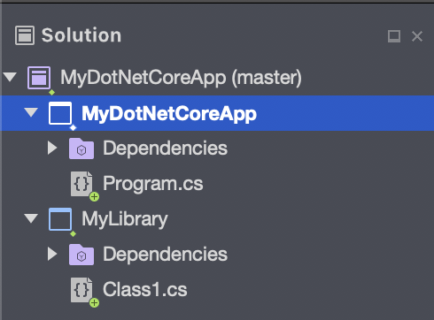

# Projects and Solutions in Visual Studio for Mac

This article provides an overview of the *project* and *solution* concepts in Visual Studio for Mac.

> [!NOTE] 
> This topic applies to Visual Studio for Mac. For Visual Studio on Windows, see [Projects and solutions in Visual Studio](/visualstudio/ide/solutions-and-projects-in-visual-studio).

## Projects

When creating a new application, website, etc. in Visual Studio for Mac, you start with a project. The project contains all the files required (source code, images, data files, etc.) that are needed to compile the executable, library, or website.

A project is defined by a file (e.g., `.csproj` for C# projects) which contains xml that defines the file and folder hierarchy, paths to files and project-specific settings, such as build settings.

When a project is loaded by Visual Studio for Mac, the Solution Window uses the project file to display the files and folders in your project. During compilation, MSBuild reads the settings from the project file to create the executable.

## Solutions

A *solution* is a container that groups together one or more related projects. Solutions are described by a text file (extension `.sln`) with its own unique format; it is not intended to be edited by hand.

## Managing Projects in the Solution Window

Once a project has been created or loaded, you can use the Solution Window to view and manage the project or solution and the files contained within. The following illustration shows the Solution Window with a .NET Core solution that contains two projects:

You can manage the properties of both projects and solutions by either double-clicking on the project or solution name, or by right-clicking and choosing **Options**.

More information on these options is provided in the [Managing Solutions and Project Properties](managing-solutions-and-project-properties.md) article.

## See also

- [Solutions and projects in Visual Studio (Windows)](/visualstudio/ide/solutions-and-projects-in-visual-studio)
