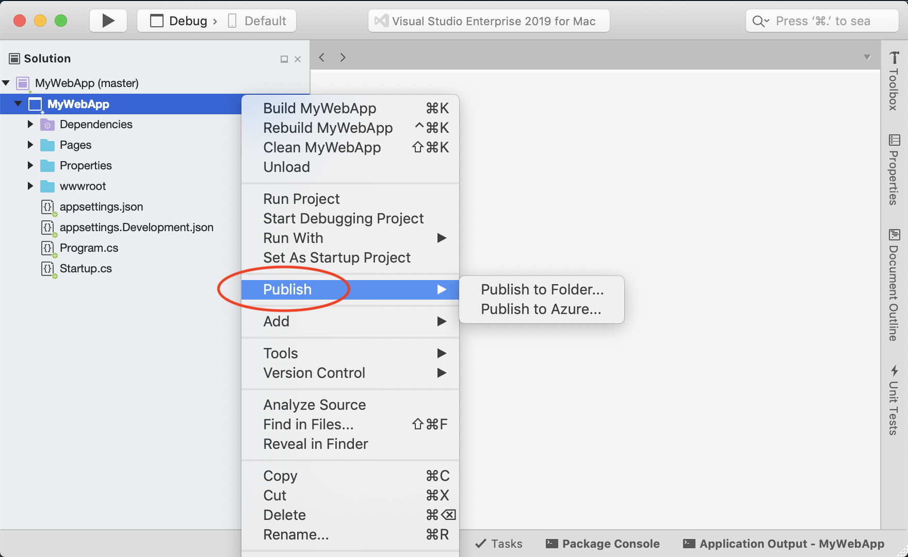
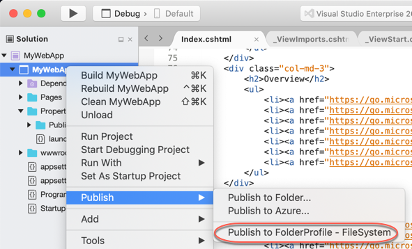

# Publish to a folder using Visual Studio for Mac

You can use the Publish tool to publish .NET Core Console or ASP.NET Core apps to a folder.

## Prerequisites

- [Visual Studio 2019 for Mac](https://visualstudio.microsoft.com/downloads/?utm_medium=microsoft&utm_source=docs.microsoft.com&utm_campaign=inline+link&utm_content=download+vs4mac2019) installed with .NET Core enabled.
- A .NET Core console or ASP.NET Core project. If you don’t already have a project, you can [create a new one](./create-new-projects.md).

## Publish to Folder

Using Visual Studio for Mac you can publish your .NET Core projects to a folder using the Publish tool. After publishing to a folder you can transfer the files to a different environment. To publish to a folder follow these steps.

 1. In the Solution Window, right-click the project and choose **Publish**.

    

 2. If you have previously published this project, you'll see the publish profile in the menu. Select that publish profile to start the publish process.

 3. To publish this project to a folder for the first time, select **Publish to Folder**

    

 4. The **Publish to Folder** dialog appears. On this dialog you can customize the folder where the project will be published. You can use the **Browse** button to do this, or paste in a path.

 5. After clicking **Publish** a few things happen. First a publish profile is created. A publish profile is an MSBuild file that is imported into the project during the publish process. It contains the properties that are used during the publish process. These files are stored in the `Properties/PublishProfiles` and have the extension `.pubxml`. Next, the publish process is started. You can monitor the progress by watching the status bar in Visual Studio for Mac.

    

 6. Once publish completes successfully a Finder window will open to the publish folder. Now that a publish profile has been created, it will be displayed in the Publish context menu.

    

 7. To publish the project again with the same settings you can click on the profile in the publish context menu.

## Customize Publish Options

To change the name of the publish profile (which is displayed in the publish context menu), rename the publish profile file. Make sure to not change the extension of the file (`.pubxml`).

To change the publish folder path, open the publish profile and edit the `publishUrl` value.

To change the build configuration that is used, change the `LastUsedBuildConfiguration` property in the publish profile.

## See also
 - [dotnet publish](/dotnet/core/tools/dotnet-publish)
 - [Publish a Web app to a web site using Visual Studio](/visualstudio/deployment/quickstart-deploy-to-a-web-site?view=vs-2019&preserve-view=true)
 - [Publish an ASP.NET Core app to IIS](/aspnet/core/tutorials/publish-to-iis?view=aspnetcore-5.0&tabs=visual-studio&preserve-view=true)
