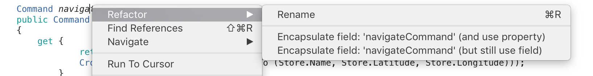
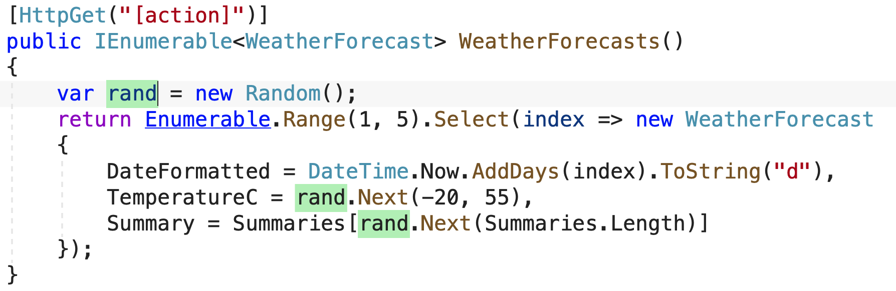
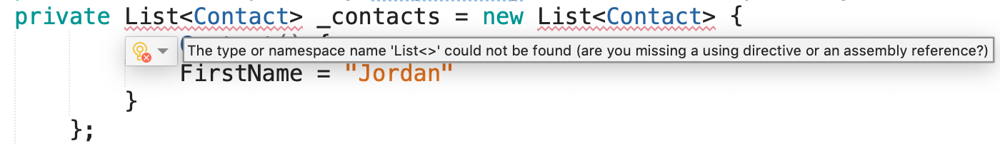
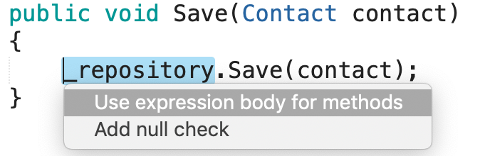
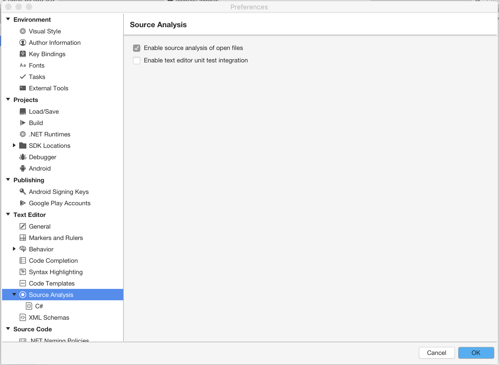
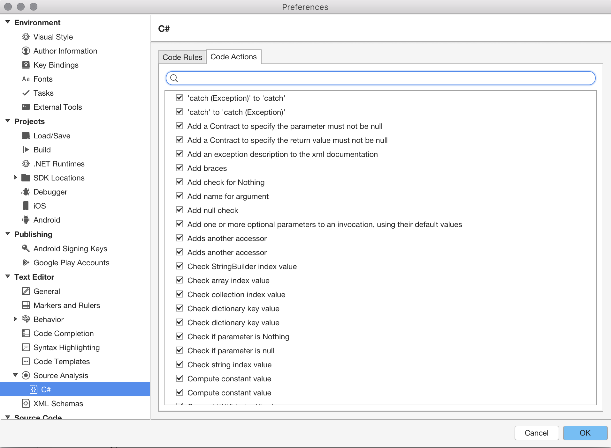
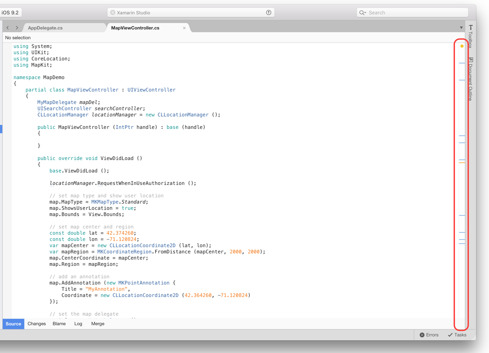
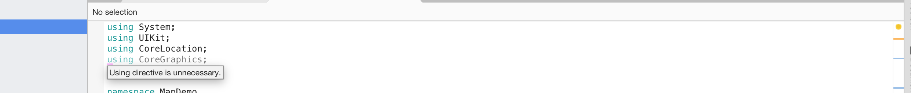

# Refactoring

Refactoring code is a way to rearrange, restructure, and clarify existing code while ensuring that the overall behavior of the code doesn't change.

Refactoring produces a healthier code base, making it more useable, readable, and maintainable for you or any other developer or user that might refer to the code.

Visual Studio for Mac's integration with Roslyn, Microsoft's open-source .NET compiler platform, allows for more refactoring operations.

## Renaming

The *Rename* refactoring command can be used on any code identifier (for example, a class name, property name etc.) to find all occurrences of that identifier and change them. To rename a symbol, right-click on it and choose **Rename...**, or use the **Cmd (⌘) + R** key binding:

This highlights the symbol and any references to it. When you start typing a new name it automatically changes all references in your code, and you can commit your changes by pressing **Enter**:

## Quick actions

Quick Actions let you easily refactor, generate, or otherwise modify code with a single action.

Quick Actions can be used to:

* Apply a code fix for a code analyzer rule violation
* Suppress a code analyzer rule violation
* Apply a refactoring (for example, inline a temporary variable)
* Generate code (for example, introduce a local variable)

Quick Actions can be applied by using the light bulb  or screwdriver  icons, or by pressing **Option (⌥)**+**Enter** when your cursor is on a line of code for which an action is available. You'll see an error light bulb  if there is a red squiggle indicating an error, and Visual Studio has a fix available for that error.

For any language, third parties can provide custom diagnostics and suggestions, for example as part of an SDK, and Visual Studio light bulbs light up based on those rules.

### Quick Action Icons
The icon that appears when a Quick Action is available gives an indication of the type of fix or refactoring that's available. The *screwdriver*  icon indicates just that there are actions available to change the code, but you shouldn't necessarily use them. The *yellow light bulb*  icon indicates there are actions available that you *should* do to improve your code. The *error light bulb*  icon indicates there's an action available that fixes an error in your code.

### To see a light bulb or screwdriver

- If a fix is available, light bulbs spontaneously appear when you hover the mouse at the location of an error.

   

- Light bulbs and screwdrivers appear in the left margin of the editor when you move the caret into a line of code for which a Quick Action is available.

- Press **Option (⌥)**+**Enter** anywhere on a line to see a list of available Quick Actions and refactorings.

Hovering over any of the context actions provides you with a preview of what will be added or removed from your code.

To enable these options, you must select *Enable source analysis of open files* in the options **Visual Studio for Mac > Preferences > Text Editor > Source Analysis**:

There are over 100 possible actions that can be suggested, which are enabled or disabled by browsing to **Visual Studio for Mac > Preferences > Source Analysis > C# > Code Actions** and selecting or unselecting the box next to the action:

### Common quick actions

You can learn more about common quick actions in the [Common Quick Actions](/visualstudio/ide/common-quick-actions) article.

## Source analysis

Source analysis analyzes your code on the fly by underlining potential errors and style violations, and providing auto fixes as context actions.

You can view all results of the source analysis for any file, at any time, by viewing the scroll bar on the right side of the text editor:

If you click on the circle at the top, you can iterate through each suggestion, with the highest severity issues showing first. Hovering over an individual result or line displays the issue, which can be fixed through context actions:

## Related Video

> [!Video https://channel9.msdn.com/Shows/Visual-Studio-Toolbox/Visual-Studio-for-Mac-Refactoring-Code/player]

## See also

- [Quick Actions (Visual Studio on Windows)](/visualstudio/ide/quick-actions)
- [Refactor code (Visual Studio on Windows)](/visualstudio/ide/refactoring-in-visual-studio)