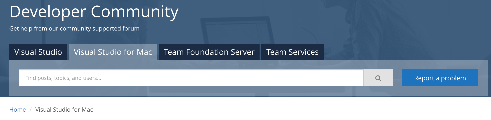
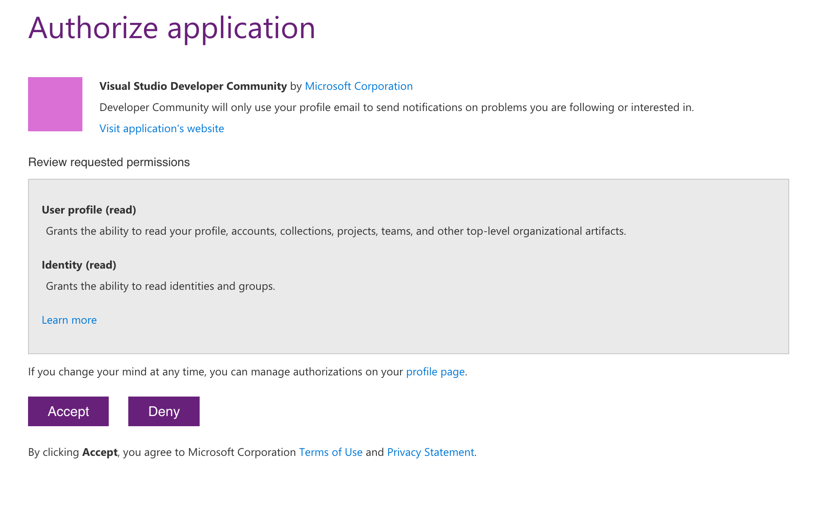
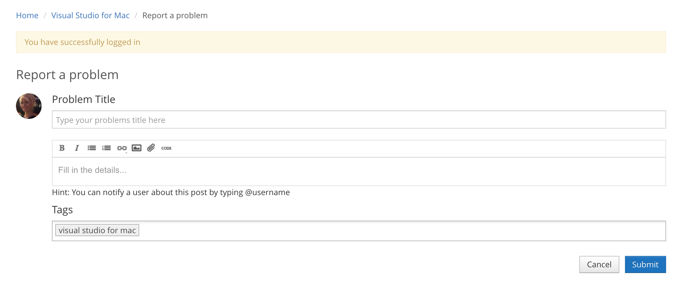

# Report a problem or suggestions for Visual Studio for Mac

 [!INCLUDE [Visual Studio for Mac](~/includes/applies-to-version/vs-mac-only.md)]

If you experience a problem with Visual Studio for Mac, we want to know about it. Here's how to report the problem to [Developer Community](https://aka.ms/feedback/report?space=41) so that we can diagnose and fix it.

## How to report a problem

To report a problem for Visual Studio for Mac, the best option is to initiate the report from Visual Studio for Mac. Reporting through Visual Studio for Mac allows for diagnostic information to be automatically included in the report. If you can't use Visual Studio for Mac (due to a crash, for example), you can report the issue directly on the [Developer Community](https://aka.ms/feedback/report?space=41) site.

To report a problem with Visual Studio for Mac, select **Help > Report a Problem** from the menu bar:

1. If you are not signed in, select **Sign In**; it's on the right-hand side of the tool, as shown in the following screenshot. Follow the instructions on-screen to sign in.

    

    When you sign in, you can report a problem that you're experiencing. You can also vote or comment on any other problem that you see posted.

1. Once signed in, you will be able to see your reported problems and solutions in the **Followed problems and solutions** screen

    

1. Visual Studio for Mac provides an interface to search for your problem and see if others have reported it. If someone has reported it, you can click on the title and "up-vote" it to let us know.
   > [!NOTE]
   > To search, enter your search terms into the search box and either click Enter or press the Search icon.

   

1. If you don’t find the problem you encountered, choose **Report a New Problem** at the side of the screen.

1. Create a descriptive title for the problem that helps us route it to the correct Visual Studio for Mac team.

1. Give us any additional details, and if possible, provide us with the steps to reproduce the problem.

   

1. Select **Next** to move to the **Include Attachments** tab. Here, you can capture your current screen to send it to Microsoft. To attach log files, click on the  icon, or to attach additional screenshots and other files, click on the  icon.

   

1. Select **Submit** to send your report, along with any images and log files.

   For information about what data is collected, see [Data we collect](/visualstudio/ide/developer-community-privacy#data-we-collect).

## Search for solutions or provide feedback

If you don't want to, or can't, use Visual Studio for Mac to report a problem, there's a chance that the problem has already been reported and a solution posted on the [Visual Studio Developer Community](https://aka.ms/feedback/report?space=41/) page.

If you don't have a problem to report but want to suggest a feature, there's a place for that, too. For more information, see the [Suggest a feature](https://aka.ms/feedback/suggest?space=41) page.

## See also

- [Report a problem with Visual Studio (on Windows)](/visualstudio/ide/how-to-report-a-problem-with-visual-studio-2017)
