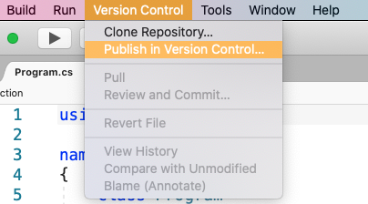

# Set up a Git repository

 [!INCLUDE [Visual Studio for Mac](~/includes/applies-to-version/vs-mac-only.md)]

Git is a distributed version control system that allows teams to work on the same documents simultaneously. This means there is a single server that contains all the files, but whenever a repository is checked out from this central source, the entire repository is cloned locally to your machine.

There are many remote hosts that allow you to work with Git for version control, however the most common host is GitHub. The following example uses a GitHub host, but you can use any Git host for version control in Visual Studio for Mac.

If you wish to use GitHub, make sure that you have an account created and configured before following the steps in this article.

## Creating a remote repo on GitHub

The following example uses a GitHub host, but you can use any Git host for version control in Visual Studio for Mac.

To set up a Git repository, execute the following steps:

1. Create a new Git repo at github.com:

    

2. Set Repo Name, description, and privacy. Do **not** initialize Repo. Set .gitignore and license to None:

    

3. The next page gives you an option to display and copy either the HTTPS or SSH address to the repo you have created:

    

   You'll need the HTTPS address to point Visual Studio for Mac to this repo.

::: moniker range="vsmac-2019"
## Publishing an existing project

If you have an existing project that _is not_ already in version control, use the following steps to set it up in Git:

> [!TIP]
> Use a .gitignore file to control which folders and files are tracked and published with Git. You may want to exclude build directories, binaries, or generated files. Learn more in the [GitHub docs on ignoring files](https://docs.github.com/en/free-pro-team@latest/github/using-git/ignoring-files).

1. Select the Solution name from the Solution Window in Visual Studio for Mac.

2. In the Menu bar, select **Version Control > Publish in Version Control** to display the **Clone Repository** dialog:

    

    If this menu item appears greyed out in the menu, make sure you have selected the Solution name.

3. Choose the **Select from Registered** tab and press the **Add** button:

    

4. Enter the name of the repository as you would like it to display locally, and paste in the URL from step #3. Your Repository Configuration dialog should look similar to the following. Press OK:

    

    It is also possible to use SSH to connect to Git.

5. To attempt to publish the app to Git, select the repository, and ensure that both **Module Name** and **Message** text fields are completed:

    

6. Click **Okay**, and then **Publish** from the alert dialog.

7. In the **Git Credentials** window, enter your GitHub username and password. 

> [!NOTE]
> If your account has two-factor authentication (2FA) enabled, you will need to create an Access Token, which is used in place of a password. If you have not created an access token, follow the steps in the Git [Access Token](https://help.github.com/articles/creating-an-access-token-for-command-line-use/) documentation.

8. Enter the username and Personal Access Token, and press **Okay**:

    

9. After a few seconds, the Solution should be published with its initial commit. Confirm it has been published by browsing the Version Control menu item, which should now be populated with many options:

    

10. Once you start to make additional changes, first use the **Version Control > Review and Commit** menu to open status view. After you've selected and committed changes, select **Push** to push the changes to the remote repository. This will allow all appropriate users to view it on github.com:

    

## Publishing a new project

The new project dialog can be used to create a new project with a local git repository. To enable it, select the **Use git for version control** checkbox, as illustrated in the following screenshot. This will initialize your repo and add an optional .gitignore file:

Follow the steps below to push your new local repository to a new GitHub repository:

> [!NOTE]
> If you have not already created a GitHub repository, refer to the [Creating a remote repo on GitHub](#creating-a-remote-repo-on-github) section.

1. Create your first commit by going to **Version Control > Review and Commit** in the Menu Bar.

2. In the Status tab, choose **Commit** in the top left.

3. Write a commit message, for example "First Commit", then click on **Commit**:

    

4. Next, in the Menu Bar go to **Version Control > Manage Branches and Remotes**.

5. Go to the **Remote Sources** tab, then click **Add**.

6. In the **Remote Source** window, add the details of your previously created GitHub repository and click **OK**:

    

7. Close the **Git Repository Configuration** window, then in the Menu Bar go to **Version Control > Push Changes**.

8. In the **Push to Repository** window click on the **Push Changes** button:

    

9. When prompted, enter your GitHub username and password.

> [!NOTE]
> If your account has two-factor authentication (2FA) enabled, you will need to create an Access Token, which is used in place of a password. If you have not created an access token, follow the steps in the Git [Access Token](https://help.github.com/articles/creating-an-access-token-for-command-line-use/) documentation.

Visual Studio for Mac will now push the changes to your remote GitHub repository:

::: moniker-end

## Clone an existing repository
Visual Studio for Mac makes it easy to clone a repository right from the IDE. You can work remotely with the Git provider of your choice, such as GitHub or Azure DevOps.

::: moniker range=">=vsmac-2022"

To clone a repository from GitHub:
1. On the home page of the GitHub repo, click the **Code** button and choose the **Open with Visual Studio** option.
:::image type="content" source="media/set-up-git-repository/version-control-git-14-2022.png" alt-text="Clone menu on GitHub, with cursor over the Open in Visual Studio link.":::
1. When prompted in the browser to open Visual Studio, click the **Open** button.
1. Visual Studio for Mac will launch with the Clone Git Repository dialog open with the URL of the GitHub repo.
1. Choose a target folder path, then click **Clone**.

To clone a repo hosted on a different remote service:

1. Copy the URL of the repo you want to clone.
1. In the Visual Studio for Mac menu bar, select the **Git > Clone Repository...** menu.
1. Paste the URL for the repo into the **URL** field of the **Clone Git Repository** dialog, choose a target folder path, then click **Clone**.

:::image type="content" source="media/set-up-git-repository/version-control-git-clone.png" alt-text="Clone dialog shown in Visual Studio for Mac, with a URL field set to the URL of the Git repo. A Target Folder path includes a file path. Cancel and Clone buttons are shown, with the Clone button set as the default button.":::

After clicking the **Clone** button, Visual Studio for Mac will clone the repository and open the first solution file (.sln) file found.

::: moniker-end

::: moniker range="vsmac-2019"
1. In the Menu bar, select **Version Control > Clone Repository**:

2. This displays the **Connect with Url** tab:

    

3. On the GitHub page of the remote repository, press the **Clone or Download** button and copy the URL provided:

    

4. Replace all the text in the **URL** entry field in the **Connect with Url** tab. This will populate most other fields in this tab for you, as illustrated in the image in step #2.

5. Enter the directory that you want to clone the repo into and press **Clone**.

> [!NOTE]
> You may experience issues if the repo is over 4 GB in size.

## Troubleshooting

If you have issues with initializing your project with an empty remote repository, you can try the following steps:

1. Go to your solution folder.
1. Press **Command + Shift + .** to show the hidden files and folders.
1. If there's a **.git** folder, delete it.
1. If there's a **gitignore** file, delete it.
1. Press **Command + Shift + .** to hide the files and folders.
1. Open your solution in VS for Mac.
1. On the solution Window, select your solution node.
1. Browse to the Version Control menu and choose **Publish in Version Control**.
1. Follow the steps of the above tutorial starting from the step 6.
::: moniker-end
