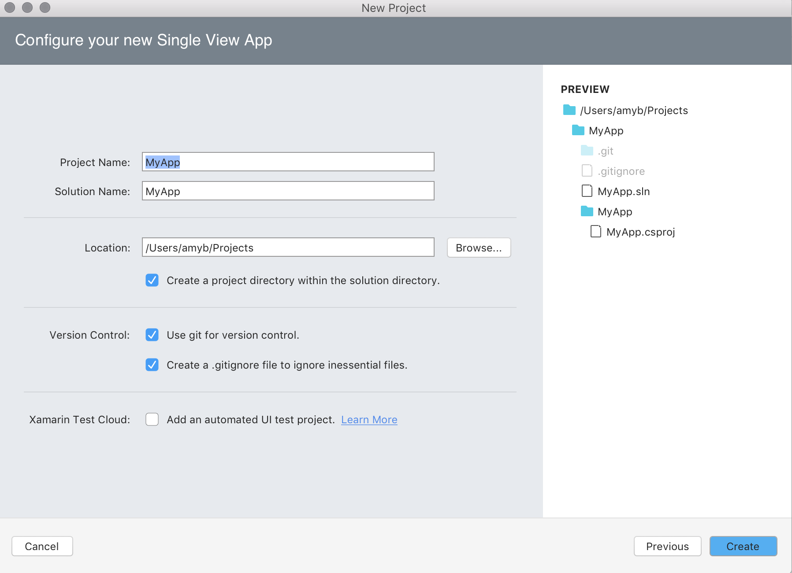

# Setting up a Git repository

Git is a distributed version control system that allows teams to work on the same documents simultaneously. This means there is a single server that contains all the files, but whenever a repository is checked out from this central source, the entire repository is cloned locally to your machine.

There are many remote hosts that allow you to work with Git for version control, however the most common host is GitHub. The following example uses a GitHub host, but you can use any Git host for version control in Visual Studio for Mac.

If you wish to use GitHub, make sure that you have an account created and configured before following the steps in this article. 

## Creating a remote repo on GitHub

The following example uses a GitHub host, but you can use any Git host for version control in Visual Studio for Mac.

To set up a Git repository, execute the following steps:

1. Create a new Git repo at github.com:

    

2. Set Repo Name, description, and privacy. Do **not** initialize Repo. Set .gitignore and license to None:

    

3. The next page gives you an option to display and copy either the HTTPS or SSH address to the repo you have created:

    

  You'll need the HTTPS address to point Visual Studio for Mac to this repo.

## Publishing an existing project

If you have an existing project that _is not_ already in version control, use the following steps to set it up in Git:

4.  Select the Solution name from the Solution Pad in Visual Studio for Mac. 

5. In the Menu bar, select **Version Control > Publish in Version Control…** to display the **Select Repository** dialog:

    

    If this menu item appears greyed out in the menu, make sure you have selected the Solution name.  

6. Choose the **Registered Repositories** tab and press the **Add** button:

    

7. Enter the name of the repository as you would like it to display locally, and paste in the URL from step #3. Your Repository Configuration dialog should look similar to the following. Press OK: 

    

    Note that it is also possible to use SSH to connect to Git.

8. To attempt to publish the app to Git, select the repository,  and ensure that both **Module Name** and **Message** text fields are completed:

    

9. Click **Okay**, and then **Publish** from the alert dialog.

10. If you have not already entered your Git credentials in Visual Studio for Mac preferences, enter them now. First, you need to create an Access Token, which is used in place of a password. If you have not created an access token, follow the steps in the Git [Access Token](https://help.github.com/articles/creating-an-access-token-for-command-line-use/) documentation.

11. Enter the username and Personal Access Token, and press **Okay**:

    

12. After a few seconds, the Solution should be published with its initial commit. Confirm it has been published by browsing the Version Control menu item, which should now be populated with many options: 

    

13. Once you start to make additional changes, select **Push Changes...** to push the changes to the **remote** repository. This will allow all appropriate users to view it on github.com: 

    

## Publishing a new project

The new project dialog can be used to publish a new project using git. To enable it, select the **Use git for version control.** checkbox, as illustrated in the following screenshot. This will initialize your repo and add an optional .gitignore file:

## Checkout an existing repository

It's very likely that you'll have to work with a GitHub repo that exists only on the remote, not on your local machine. Visual Studio for Mac allows you to checkout this repo quickly. Follow the steps below to clone it to your machine:

1. In the Menu bar, select **Version Control > Checkout…**:

2. This displays the **Connect to Repository** tab:

    

3. On the GitHub page of the remote repository, press the **Clone or Download** button and copy the URL provided:

    

4. Replace all the text in the **URL** entry field in the **Connect to Repository** tab. This will populate most other fields in this tab for you, as illustrated in the image in step #2.

5. Enter the directory that you want to clone the repo into and press **Checkout**.

> [!NOTE]
You may experience issues if the repo is over 4GB in size.

## Troubleshooting

If you have issues with initializing your project with an empty remote repository, you can try the following steps:

- Go to your solution folder.
- Press `Command + Shift + . ` To show the hidden files and folders.
- If there's a **.git** folder, delete it.
- If there's a **gitignore** file, delete it.
- Press `Command + Shift + . ` To hide the files and folders.
- Open your solution in VS for Mac.
- On the solution pad, select your solution node.
- Browse to the Version Control menu and choose **Publish in Version Control**.
- Follow the steps of the above tutorial starting from the step 6.