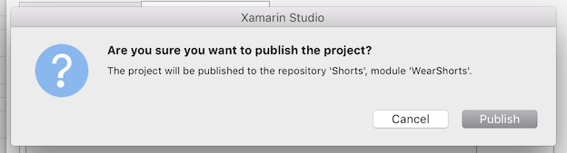

# Setting Up a Git Repository

Git is a distributed version control system that allows teams to work on the same documents simultaneously. This means that there is a single server that contains all the files, but whenever a repository is checked out from this central source, the entire repository is cloned locally to your machine.

To set up a Git repository, execute the following steps:

1. Create a new Git repo at github.com:

    

2. Set Repo Name, description, and privacy. Do **not** initialize Repo. Set .gitignore and license to None:

    

3. The next place will give you an option to display and copy either the HTTPS or SSH address to the repo you have just created:

    
  You will need the HTTPS address to point Visual Studio for Mac to this repo.

4. Return to your open Project in Visual Studio for Mac. 

5. In the Menu bar, select **Version Control > Checkout**:

    

6. This will display the **Select Repository** dialog. Choose the **Registered Repositories** tab, and press the **Add** button:

    

7. Enter the name of the repository as you would like it to display locally, and paste in the URL from step #3. Your Repository Configuration dialog should look similar to the following, press OK: 

    

8. To attempt to publish the app to Git, select the repository just created,  and ensure that both **Module Name** and **Message** text fields are completed:

    

9. Click **Okay**, and then **Publish** from the alert dialog: 

    

10. If you have not already entered your Git credentials in Visual Studio for Mac preferences, enter them now. First, you need to create an Access Token, which is used in place of a password. Follow the steps in the Git [Access Token](https://help.github.com/articles/creating-an-access-token-for-command-line-use/) documentation to do this.

11. Enter the username and Personal Access Token, and press **Okay**:

    

12. After a few seconds, the Solution should be published. Confirm this by browsing the Version Control menu item, which should now be populated with many options: 

    

13. Finally, select **Push Changes…** to push the changes to the **remote** repository. This will allow all appropriate users to view it on github.com: 

    