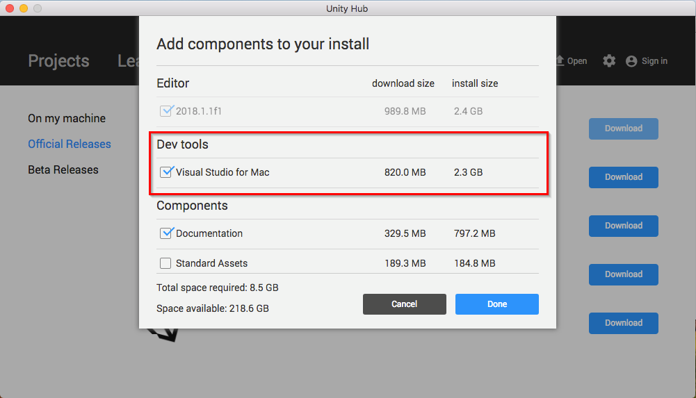
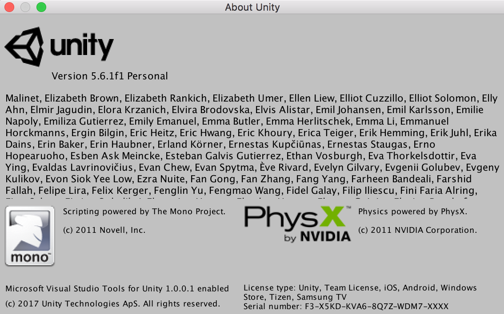
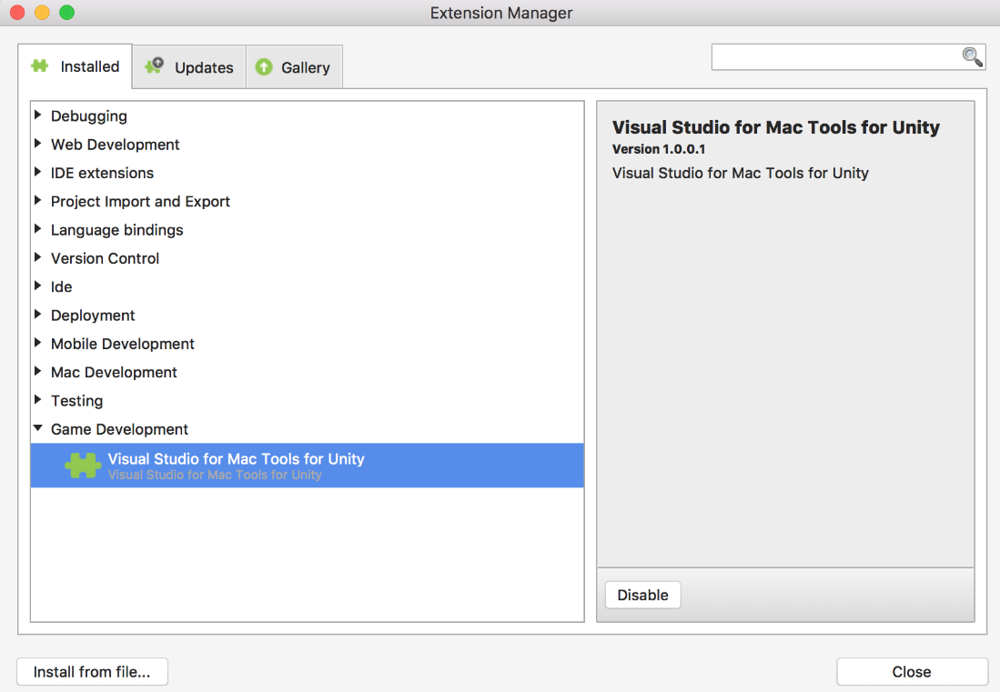
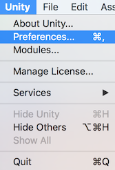
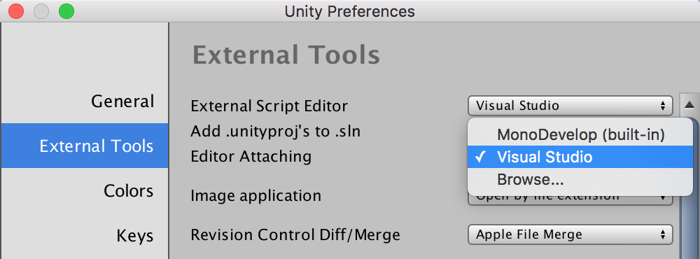
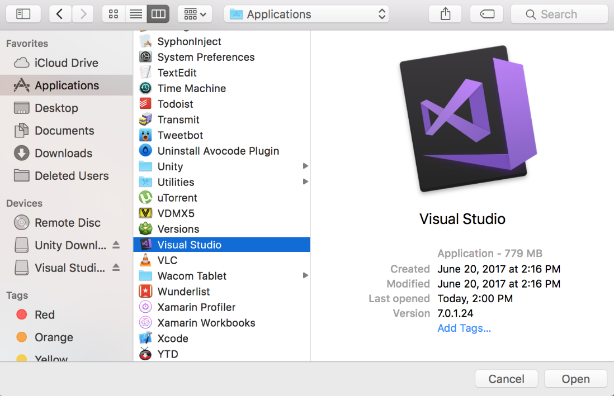

# Set up Visual Studio for Mac Tools for Unity

This section explains how to get started using Visual Studio for Mac Tools for Unity.

## Install Visual Studio for Mac

### Unity Bundled Installation

Starting with Unity 2018.1, Visual Studio for Mac is the default C# integrated development environment (IDE) for Unity, and is included in the Unity Download Assistant as well as the Unity Hub installation tool. Download Unity from [store.unity.com](https://store.unity.com/).

During installation, ensure that Visual Studio for Mac is checked in the list of components to install with Unity:

#### Unity Hub

#### Unity Download Assistant

#### Check for Updates to Visual Studio for Mac

The version of Visual Studio for Mac included with the Unity installation may not be the latest. It is recommended to check for updates to ensure you have access to the latest tools and features.

* [Updating Visual Studio for Mac](update.md)

### Manual installation

If you already have Unity 5.6.1 or above, but don't have Visual Studio for Mac, you can install Visual Studio for Mac manually. All editions of Visual Studio for Mac are bundled with Visual Studio for Mac Tools for Unity, including the free Community edition:

* Download Visual Studio for Mac from [visualstudio.microsoft.com](https://visualstudio.microsoft.com/).
* Visual Studio for Mac Tools for Unity are installed automatically during the installation process.
* Follow the steps in the [installation guide](/visualstudio/mac/installation) for additional installation help.

> [!NOTE]
> Visual Studio for Mac Tools for Unity requires Unity version 5.6.1 or above. To verify that Visual Studio Tools for Unity are enabled in your version of Unity, select **About Unity** from the Unity menu and look for the text "Microsoft Visual Studio Tools for Unity enabled" in the bottom-left of the dialog.
>
> 

## Confirm that the Visual Studio for Mac Tools for Unity extension is enabled

While the Visual Studio for Mac Tools for Unity extension should be enabled by default, you can confirm this and check the installed version number:

1. From the Visual Studio menu, select **Extensions...**.

   

2. Expand the Game Development section and confirm the Visual Studio for Mac Tools for Unity entry.

   

## Configure Unity for use with Visual Studio for Mac

Starting with Unity 2018.1, Visual Studio should be the default external script editor in Unity. You can confirm this or change the external script editor to Visual Studio:

1. Select **Preferences...** from the Unity menu.

   

2. In the Preferences dialog, select the **External Tools** tab.

3. From the External Script Editor dropdown list, choose **Visual Studio** if it is listed, otherwise select **Browse...**.

   

4. If **Browse...** was selected, navigate to the Applications directory and select Visual Studio and then click **Open**.

   

5. Once Visual Studio is selected in the **External Script Editor** list, close the Preferences dialog to complete the configuration process.