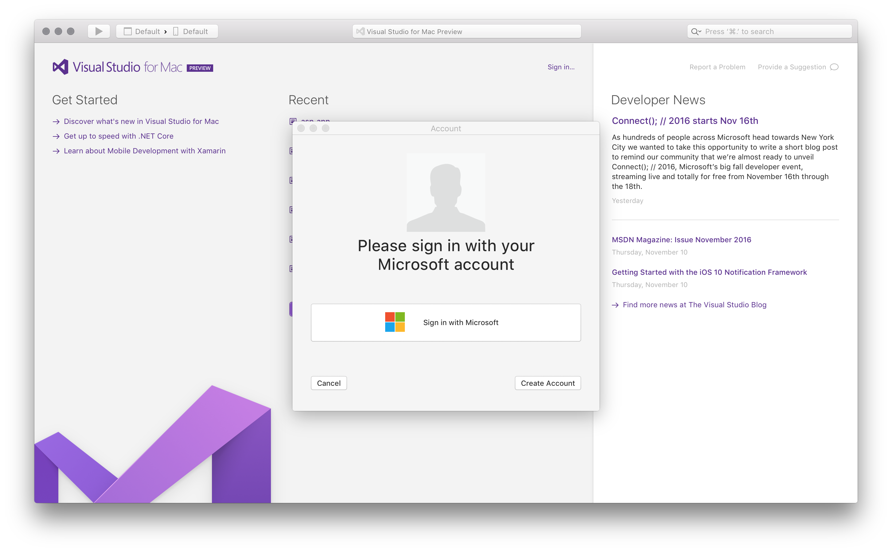

# Signing in to Visual Studio for Mac

When you launch Visual Studio for Mac for the first time, you are prompted to log in using a Microsoft Account. You should use a Microsoft account that is connected to the license that you wish to use. If you do not have a Microsoft account, see [How do I sign up for an account](https://support.microsoft.com/en-us/instantanswers/d18cc497-d839-cf50-dea8-f99c95f2bd16/sign-up-for-a-microsoft-account). 

If you do decide not to log in straight away, you will be able to use an evaluation copy for 30 days. After 30 days you must log in to continue using your copy of Visual Studio for Mac 

## How to sign in to Visual Studio for Mac

Before signing in to Visual Studio for Mac ensure that you are connected to the internet. Subscriptions can only be activate online.
 
To sign in to Visual Studio for Mac, do the following:

1. Click the Sign in link on the Welcome page to display the Accounts Dialog, and press the **Sign In** button:

    

2. Enter your Microsoft Credentials:

    

    Note that you can not use Xamarin Credentials to log into Visual Studio for Mac.

3. Once you have logged in successfully, you will see your license type. From this dialog, you can add additional Microsoft accounts that you may wish you use:

    

## Adding multiple user accounts

Visual Studio for Mac supports adding multiple accounts to your personalization account. These additional accounts can be Microsoft accounts and work or school accounts, and will allow you to access resources, such as Azure, from any added account. 

To add additional user accounts, follow the steps in the [How to sign in to Visual Studio for Mac](#How_to_sign_in_to_Visual_Studio_for_Mac) section.

