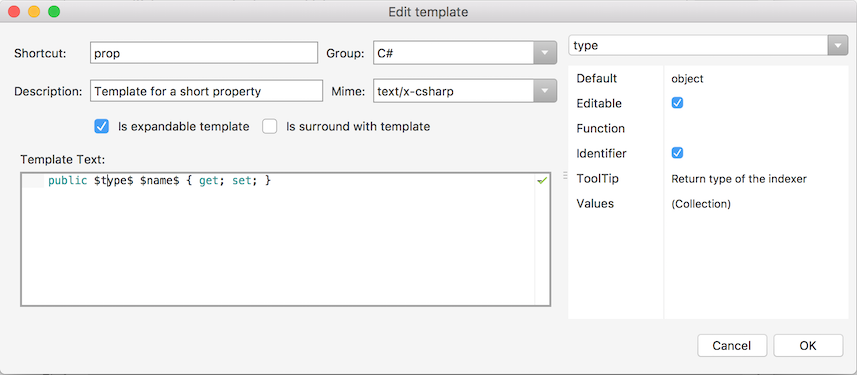
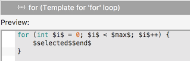
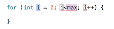

# Code snippets

Code snippets, often referred to as _code templates_, are useful for efficient programming as they allow the insertion and editing of pre-written blocks of code. Using code snippets can be convenient for quickly adding common patterns, or even for learning new patterns when as the developer you are unsure of syntax. There are templates provided for C#, F#, HTML, XML, Python, and Razor.

This section explains how to create, insert, and use snippets in code.

## Inserting a snippet

There are some different ways to add code snippets, some of which are described below:

* **Tab Expansion** - Start typing the template name, select it from the list and press **TAb**, **Tab** to add it:

  

* **Toolbox** - Use the toolbox pad to display a list of all code snippets. Drag any template from the toolbox into the correct position in the source code:

  

* **Insert Templates command** - There is currently no default key binding set for inserting a template. To create one, browse to **Visual Studio > Preferences > Key Bindings** and search for `template`. This allows adding the desired key binding into the Edit Binding field, then click **Apply**:

  

## Creating a new template

While there are many existing templates in a variety of languages that you can use and edit, new templates can also be added by navigating to **Visual Studio > Preferences > Text Editor > Code Snippets**:

## Keywords in code snippets

After a code snippet is inserted into the editor, any keywords defined are highlighted and can be edited by tabbing between them. Keywords behave like a "variable" in the code snippet and are defined by placing a dollar-sign `$` before and after the name of the keyword. 

The **Edit template** window is shown below, with the built-in `prop` snippet. The snippet contains two keywords &ndash; `$type$` and `$name$` &ndash; which can have further properties set (such as a default value and tooltip) on the right side of the window:

- **Is expandable template** &ndash; Ensure this is checked so that the snippet can be inserted at the cursor by typing the shortcut.
- **Is surround with template** &ndash; Check this option to list this shortcut in the **Surround with...** content menu in the editor.

## Using keywords in the editor

To use a snippet with keywords, such as the one defined above, type the shortcut and press **Tab** twice, and the snippet contents will be inserted at the cursor:

Press the **Tab** key to move between `object` and `MyProperty` to customize the snippet for your class.

A keyword can be repeated in a snippet, such as this `for` example, notice the `$i$` keyword appears 3 times:

When used in the editor, the **Tab** key will switch between the first `i` and `max`. If you overtype the `i` with a different variable name, all three instances will be updated:

### Reserved keywords

There are two reserved keywords that you can use in a snippet:

- `$selected$` &ndash; If the snippet has a **Is surround with template** checked, this keyword will be replaced by the text that was highlighted in the editor when the snippet was chosen.
- `$end$` &ndash; When the user has finished editing the keywords in a snippet, the cursor will be placed at the location of the `$end$` keyword.

The `for` snippet in the previous section is an example of both these reserved keywords.

Refer to the [Visual Studio code snippets reference](/visualstudio/ide/code-snippets-schema-reference#keywords) for more information.

## See also

* [Code snippets (Visual Studio on Windows)](/visualstudio/ide/code-snippets)