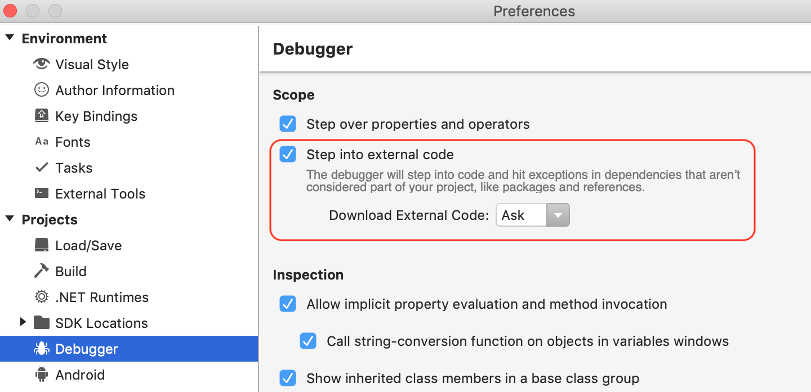
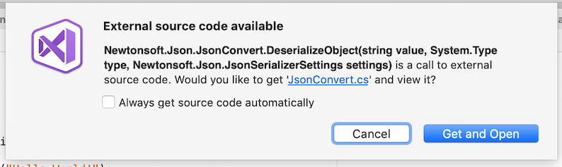

# Debugging into NuGet packages with Source Link

 [!INCLUDE [Visual Studio for Mac](~/includes/applies-to-version/vs-mac-only.md)]

Source Link technology enables source code debugging of .NET assemblies from NuGet that ship .PDBs with links to source files. Source Link executes when developers create their NuGet package and embed source control metadata inside assemblies and the package. When Source Link is enabled in Visual Studio for Mac, the IDE will detect if source files are available for installed packages. Visual Studio for Mac will then offer to download them, which will allow you to step through the package code. Source Link also works with Mono Base Class Library code for Xamarin projects, allowing you to step into .NET Framework code as well. Source Link provides source control metadata to create a great debugging experience.

> [!NOTE]
> Visual Studio for Mac does not currently support symbol servers. Because of this, Source Link with metadata hosted on symbol servers is not supported.

## Enable Source Link

To enable Source Link in Visual Studio for Mac, browse to **Visual Studio > Preferences... > Projects > Debugger** and ensure the **Step into external code** checkbox is checked.

You can change the setting in **Download External Code** to suit your preferences:
* Ask: Visual Studio for Mac will prompt you to download the external code
* Always: Visual Studio for Mac will download the external code automatically
* Never: Visual Studio for Mac won't download the related external code

By default, **Ask** is selected. You'll receive the following prompt when external code is found for a NuGet package:

## See also

- The [Source Link GitHub repository](https://github.com/dotnet/sourcelink/blob/master/README.md)
- [.NET documentation](/dotnet/standard/library-guidance/sourcelink) on Source Link and for more information on how to add Source Link support to packages