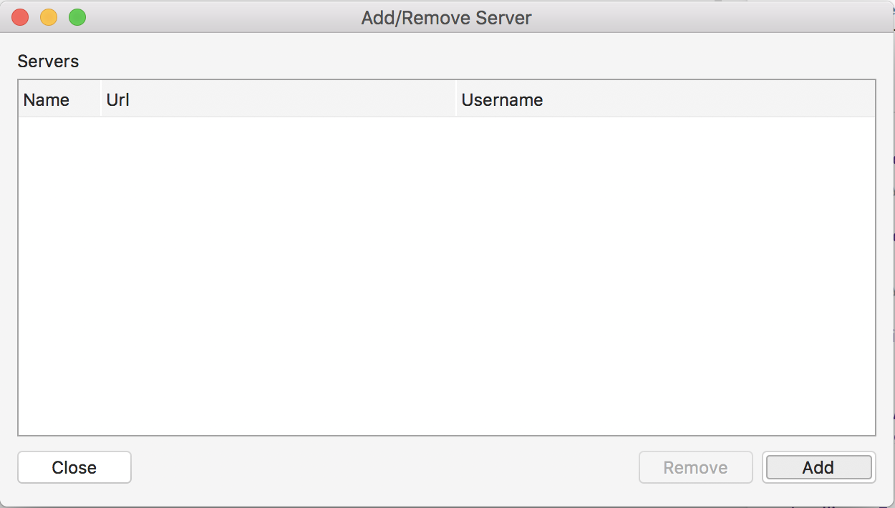
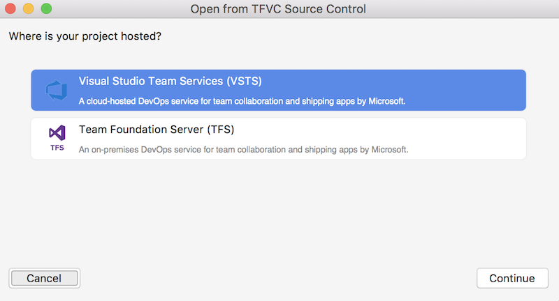
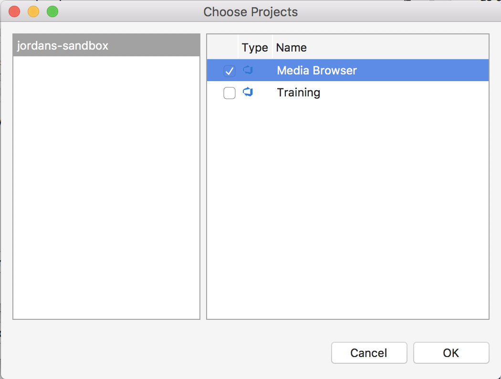
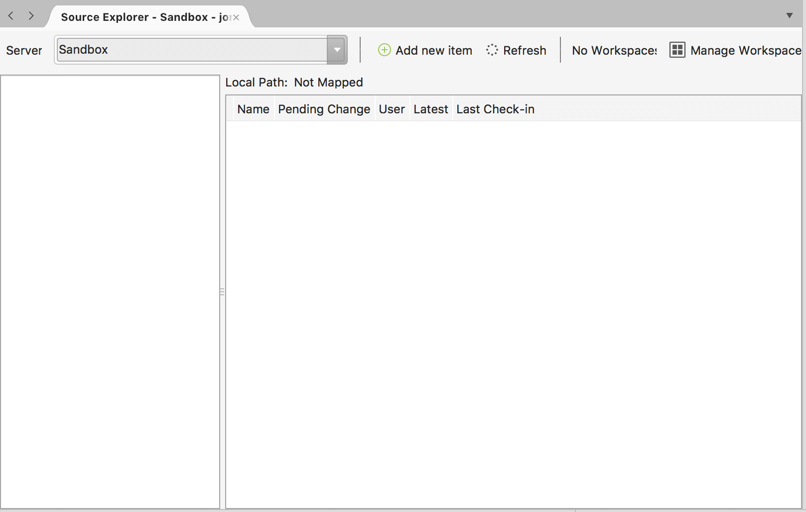
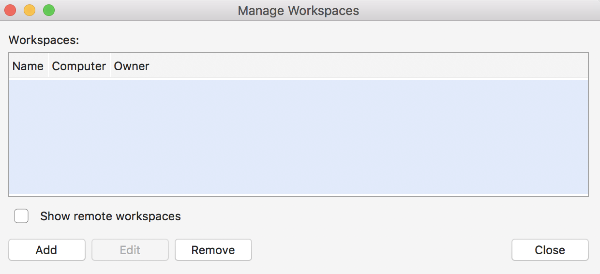
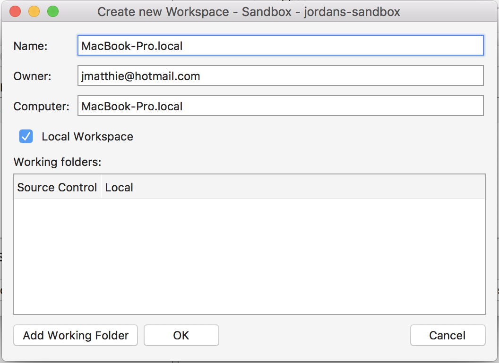

# Connecting to Team Foundation version control 

Visual Studio Team Services (VSTS) and Team Foundation Server (TFS) provide two models of version control: Git, which is distributed version control, and Team Foundation Version Control (TFVC), which is centralized version control. This article provides an overview and a starting point for using Team Foundation Version Control with Visual Studio for Mac.

> [!NOTE]
> **Note**: Team Foundation Version Control support is currently in preview and some functionality is not yet fully working. More changes still to come!

## Requirements

* Visual Studio for Mac version 7.5 or later.
* Visual Studio Team Servers, or Team Foundation Server 2013 and later
* A Project in Visual Studio Team Services or Team Foundation Server, configured to use Team Foundation Version Control.

## Installation

From within Visual Studio for Mac, choose the **Visual Studio > Extensions...** menu. Search for "TF version control" and install the **Team Foundation Version Control** extension. Restart the IDE when prompted.

## Using the add-in

Once the extension is installed, select the **Version Control > TFS/VSTS > Connect to Team Foundation Version Control...** menu. 

Choose either Visual Studio Team Services or Team Foundation Server to get started:

Enter you credentials: 

Then, choose the projects that you want to access: 

To continue, close the dialogs and then use the **Version Control > TFS/VSTS > Source Control Explorer** menu to browse source.

> [!WARNING]
> **Known issue**: In this preview release, the first time you open source control explorer, you'll have to create a new workspace.

From the Source Code Explorer, you can browse your source code on the server and perform the following actions:

- Manage Workspaces (Create, edit, or delete).
- Navigate between project structure.
- Map projects.
- Get projects.
- Lock & Unlock files.
- Rename files.
- Delete files.
- Add new file.
- Check out.
- Check in.
- View history changes.
- Compare changes.

## Creating a new workspace

In the Source Control Explorer, click on the **Manage Workspaces** button. 

Click on **Add** to create a new workspace.

Provide a name for the workspace and then click **Add Working Folder** to map the project to a local folder on your computer.

When done, click **OK**, then close the Manage Workspaces dialog. You're now ready to get files though the Source Code Explorer and get started.