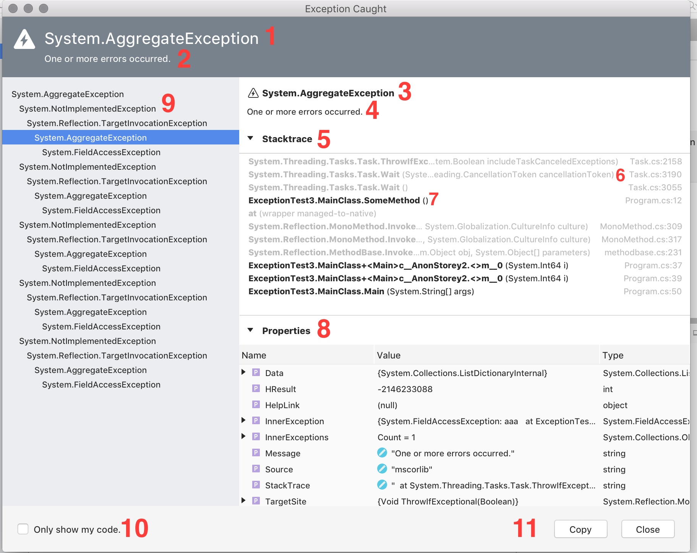

# Troubleshooting

 [!INCLUDE [Visual Studio for Mac](~/includes/applies-to-version/vs-mac-only.md)]

## Viewing logs in Visual Studio for Mac

Logs can be found by browsing to the **Help > Open Log Directory** menu item, as illustrated below:

## Viewing exceptions

When an exception is caught, an exception bubble appears. To view more details, select the **View Details** button:

This displays the **Show Details** dialog, providing more information regarding the exception:

Important sections of the dialog, which are numbered above are described in detail below:

1. The exception type, which shows the full name of the exception type that is being observed.
2. The exception message, which shows the value of the Message property of the exception object.
3. The Inner exception type, which shows the full name of the exception type for the currently selected exception in the Inner exception tree view.
4. The Inner exception message, shows the value of the Message property of the selected exception in Inner exception tree view.
5. Stacktrace view. This can be collapsed via a disclosure arrow and contains stack frames entries.
6. Example of non-user code entries.
7. Example of user code entries.
8. Properties view, which shows all properties and fields of the exception. This can be collapsed via a disclosure arrow.
9. Inner exception tree view. Select inner exceptions in this view via keyboard up/down arrows or with the mouse or trackpad.
10. By default, this is set to what the **Debug project code only** option in debugger settings is set to. Selecting this box will enable all non-user code to collapse into one line in the stacktrace.
11. A copy button to copy the `exception.ToString()` output to clipboard.

Note that some of these sections are only visible when the exception has an inner exception.

## See also

- [Resources for troubleshooting IDE errors (Visual Studio on Windows)](/visualstudio/ide/reference/resources-for-troubleshooting-integrated-development-environment-errors)