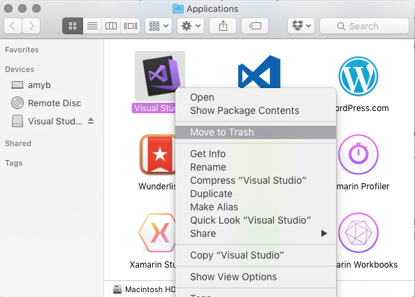

# Uninstall Visual Studio for Mac 

 [!INCLUDE [Visual Studio for Mac](~/includes/applies-to-version/vs-mac-only.md)]

You can use this guide to uninstall each component in Visual Studio for Mac individually by navigating to the relevant section. We recommend you use the scripts provided in the [Uninstall scripts](#uninstall-scripts) section to uninstall everything.

This article is for Visual Studio for Mac. If you're looking for info on VS Code, see [Visual Studio Code set-up](https://code.visualstudio.com/docs/setup/setup-overview).

> [!NOTE]
> We'd like to learn more about why you're uninstalling Visual Studio for Mac so we can make it better. If you have a few minutes, [please share your feedback](https://aka.ms/vs/mac/uninstallsurvey). Thank you!

## Uninstall scripts

There are two scripts that can be used to uninstall Visual Studio for Mac and all components from your machine:

- [Visual Studio and Xamarin script](#visual-studio-for-mac-and-xamarin-script)
- [.NET Core script](#net-core-script)

The following sections provide information on downloading and using the scripts.

### Visual Studio for Mac and Xamarin script

You can uninstall Visual Studio and Xamarin components in one go by using the [uninstall script](https://raw.githubusercontent.com/MicrosoftDocs/visualstudio-docs/master/mac/resources/uninstall-vsmac.sh).

The uninstall script contains most of the commands that you'll find in the article. There are three main omissions from the script and aren't included due to possible external dependencies. To remove, jump to the relevant section below and remove them manually:

- **[Uninstalling Mono](#uninstall-mono-sdk-mdk)**
- **[Uninstalling Android AVD](#uninstall-android-avd)**
- **[Uninstalling Android SDK and Java SDK](#uninstall-android-sdk-and-java-sdk)**

To run the script, do the following steps:

1. Right-click on the script and select **Save As** to save the file on your Mac.
2. Open Terminal and change the working directory to where the script was downloaded:

    ```bash
    cd /location/of/file
    ```

3. Make the script executable and run it with **sudo**:

    ```bash
    chmod +x ./uninstall-vsmac.sh
    sudo ./uninstall-vsmac.sh
    ```

4. Finally, delete the uninstall script and remove Visual Studio for Mac from the dock (if it's there).

### .NET Core script

The uninstall script for .NET Core is located in the [dotnet cli repo](https://raw.githubusercontent.com/dotnet/cli/master/scripts/obtain/uninstall/dotnet-uninstall-pkgs.sh)

To run the script, do the following steps:

1. Right-click on the script and select **Save As** to save the file on your Mac.
2. Open Terminal and change the working directory to where the script was downloaded:

    ```bash
    cd /location/of/file
    ```

3. Make the script executable and then run it with **sudo**:

    ```bash
    chmod +x ./dotnet-uninstall-pkgs.sh
    sudo ./dotnet-uninstall-pkgs.sh
    ```

4. Finally, delete the .NET Core uninstall script.

## Manually removing Visual Studio for Mac

If you prefer to remove Visual Studio for Mac and its dependencies manually (instead of using the scripts from the prior section), this section summarizes the steps you should follow. 

The first step in uninstalling Visual Studio from a Mac is to locate **Visual Studio** app in the **Applications** directory and drag it to **Trash**. Alternatively, control-click and select **Move to Trash** as illustrated in the following image:

::: moniker range="vsmac-2019"



::: moniker-end

::: moniker range="vsmac-2022"

:::image type="content" source="media/vsmac-2022/move-vsmac-application-to-trash.png" alt-text="Screenshot showing how to uninstall Visual Studio for Mac application.":::

::: moniker-end

Deleting this app bundle removes Visual Studio for Mac, but there may still be other files such as Xamarin SDKs, .NET SDKs, or iOS development tools on the file system.

To remove all traces of Visual Studio for Mac, run the following commands in Terminal:

::: moniker range="vsmac-2019"

```bash
sudo rm -rf "/Applications/Visual Studio.app"
rm -rf ~/Library/Caches/VisualStudio
rm -rf ~/Library/Preferences/VisualStudio
rm -rf ~/Library/Preferences/Visual\ Studio
rm -rf ~/Library/Logs/VisualStudio
rm -rf ~/Library/VisualStudio
rm -rf ~/Library/Preferences/Xamarin/
rm -rf ~/Library/Application\ Support/VisualStudio
```

::: moniker-end

::: moniker range="vsmac-2022"

```bash
sudo rm -rf "/Applications/Visual Studio.app"
rm -rf ~/Library/Caches/VisualStudio
rm -rf ~/Library/Preferences/VisualStudio
rm -rf ~/Library/Preferences/Visual\ Studio
rm -rf ~/Library/Logs/VisualStudio
rm -rf ~/Library/VisualStudio
rm -rf ~/Library/Preferences/Xamarin/
rm -rf ~/Library/Application\ Support/VisualStudio
```

::: moniker-end

You might also want to remove the following directory containing various Xamarin files and folders. However, this directory contains the Android signing keys. For more information, see the section **[Uninstalling Android SDK and Java SDK](#uninstall-android-sdk-and-java-sdk)**:

```bash
rm -rf ~/Library/Developer/Xamarin
```

## Uninstall Mono SDK (MDK)

Mono is an open-source implementation of Microsoft's .NET Framework and is used by all Xamarin Products—Xamarin.iOS, Xamarin.Android, and Xamarin.Mac to allow development of these platforms in C#.

> [!WARNING]
> There are other applications outside of Visual Studio for Mac that also use Mono, such as Unity.
> Be sure that there are no other dependencies on Mono before uninstalling it.

To remove the Mono Framework from a machine, run the following commands in Terminal:

```bash
sudo rm -rf /Library/Frameworks/Mono.framework
sudo pkgutil --forget com.xamarin.mono-MDK.pkg
sudo rm -rf /etc/paths.d/mono-commands
```

## Uninstall Xamarin.Android

Many items are required for the installation and use of Xamarin.Android, such as the Android SDK and Java SDK.

Use the following commands to remove Xamarin.Android:

```bash
sudo rm -rf /Developer/MonoDroid
rm -rf ~/Library/MonoAndroid
sudo pkgutil --forget com.xamarin.android.pkg
sudo rm -rf /Library/Frameworks/Xamarin.Android.framework
```

### Uninstall Android SDK and Java SDK

The Android SDK is required for development of Android applications. To completely remove all parts of the Android SDK, locate the file at **~/Library/Developer/Xamarin/** and move it to **Trash**.

> [!WARNING]
> Note that Android signing keys that are generated by Visual Studio for Mac are located in `~/Library/Developer/Xamarin/Keystore`. Make sure to back these up appropriately, or avoid removing this directory if you wish to keep your keystore.

The Java SDK (JDK) doesn't need to be uninstalled, as it's already pre-packaged as part of macOS.

### Uninstall Android AVD

> [!WARNING]
> There are other applications outside of Visual Studio for Mac that also use Android AVD and these additional android components, such as Android Studio. Removing this directory might cause projects to break in Android Studio.

To remove any Android AVDs and other Android components use the following command:

```bash
rm -rf ~/.android
```

To remove only the Android AVDs, use the following command:

```bash
rm -rf ~/.android/avd
```

## Uninstall Xamarin.iOS

Xamarin.iOS allows iOS application development using C# or F# with Visual Studio for Mac.

Use the following commands in Terminal to remove all Xamarin.iOS files from a file system:

```bash
rm -rf ~/Library/MonoTouch
sudo rm -rf /Library/Frameworks/Xamarin.iOS.framework
sudo rm -rf /Developer/MonoTouch
sudo pkgutil --forget com.xamarin.monotouch.pkg
sudo pkgutil --forget com.xamarin.xamarin-ios-build-host.pkg
sudo pkgutil --forget com.xamarin.xamarin.ios.pkg
```

## Uninstall Xamarin.Mac

Xamarin.Mac can be removed from your machine by using the following two commands that remove the product and license from your Mac respectively:

```bash
sudo rm -rf /Library/Frameworks/Xamarin.Mac.framework
rm -rf ~/Library/Xamarin.Mac
```

## Uninstall Workbooks and Inspector

Starting with 1.2.2, Xamarin Workbooks & Inspector can be uninstalled by running the following command in Terminal:

```bash
sudo /Library/Frameworks/Xamarin.Interactive.framework/Versions/Current/uninstall
```

For older versions, you need to manually remove the following artifacts:

* Delete the Workbooks app at `"/Applications/Xamarin Workbooks.app"`
* Delete the Inspector app at `"Applications/Xamarin Inspector.app"`
* Delete the add-ins: `"~/Library/Application Support/XamarinStudio-6.0/LocalInstall/Addins/Xamarin.Interactive"` and `"~/Library/Application Support/XamarinStudio-6.0/LocalInstall/Addins/Xamarin.Inspector"`
* Delete Inspector and supporting files here: `/Library/Frameworks/Xamarin.Interactive.framework` and `/Library/Frameworks/Xamarin.Inspector.framework`

## Uninstall the Xamarin Profiler

```bash
sudo rm -rf "/Applications/Xamarin Profiler.app"
```

## Uninstall the Visual Studio Installer

Use the following commands to remove all traces of the Xamarin Universal Installer:

```bash
rm -rf ~/Library/Caches/XamarinInstaller/
rm -rf ~/Library/Caches/VisualStudioInstaller/
rm -rf ~/Library/Logs/XamarinInstaller/
rm -rf ~/Library/Logs/VisualStudioInstaller/
rm -rf ~/Library/Preferences/Xamarin/
rm -rf "~/Library/Preferences/Visual Studio/"
```

* * *

## See also

- [Uninstall Visual Studio (on Windows)](/visualstudio/install/uninstall-visual-studio)
- [Uninstall Visual Studio Code](https://github.com/Microsoft/vscode/issues/52151)
