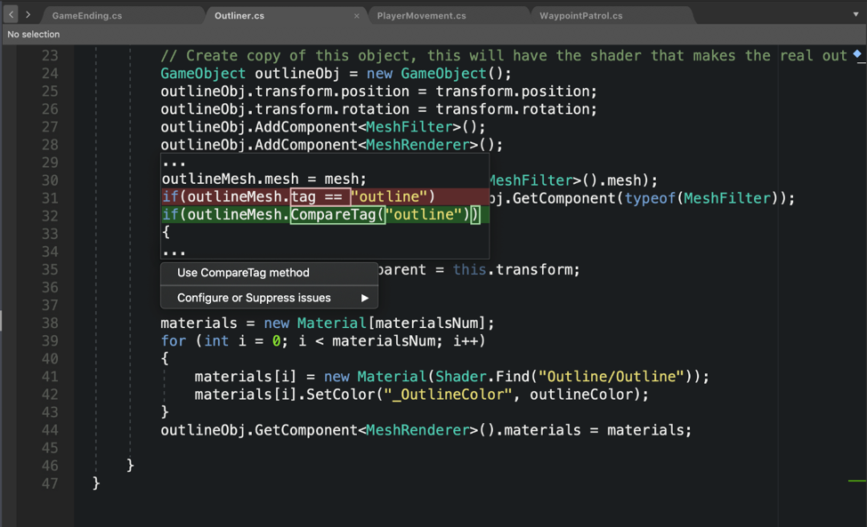

# Visual Studio for Mac Tools for Unity

Visual Studio for Mac Tools for Unity is a free Visual Studio extension that turns Visual Studio for Mac into a powerful tool for developing cross-platform games and apps with the Unity platform.

Unity integration is included out of the box in Visual Studio for Mac, and starting from Unity 2018.1, Visual Studio for Mac is the default C# IDE for Unity projects.

> [!NOTE]
> This information is for Visual Studio for Mac IDE. For Visual Studio Code, see [this guide](https://code.visualstudio.com/docs/other/unity) for more information.

## Overview

Here are some of the key features of Visual Studio for Mac Tools for Unity:

### Compatible with Visual Studio for Mac Community Edition

[Visual Studio for Mac Community Edition](https://visualstudio.microsoft.com/) is available for free, and bundled with Unity installs starting with Unity 2018.1. See the Visual Studio for Mac Tools for Unity [setup documentation](setup-vsmac-tools-unity.md) for more information.

### IntelliSense for Unity messages

IntelliSense makes it fast and easy to [implement Unity messages](using-vsmac-tools-unity.md#intellisense-for-unity-messages) like `OnCollisionEnter`, including their parameters.

### Superior debugging

Visual Studio for Mac Tools for Unity supports all the [debugging](using-vsmac-tools-unity.md#unity-debugging) features that you expect from Visual Studio:

* Set breakpoints, including conditional breakpoints.
* Evaluate complex expressions in the Watch window.
* Inspect and modify the value of variables and arguments.
* Drill down into complex objects and data structures.

### Powerful refactoring and context actions

Write more usable code with quick menus and keyboard shortcuts for [renaming, refactoring, and context actions](refactoring.md).

### Roslyn diagnostics and quick-fixes for Unity

Write better code that captures the best practices with Visual Studio for Mac's deep understanding of Unity projects. 

### Browse and add new files

Browse Unity projects and [add folders, scripts, or shaders](using-vsmac-tools-unity.md#adding-new-unity-files-and-folders), all within the Visual Studio for Mac IDE.

### Use familiar key bindings

Boost productivity by using the key bindings that you know. Visual Studio for Mac provides familiar [key bindings](customizing-the-ide.md) for many popular IDEs, such as Visual Studio on Windows, ReSharper, Visual Studio Code, and Xcode.

### Customize the Visual theme

Give your eyes a rest with the included [dark theme](customizing-the-ide.md).

## Tips for Unity developers getting started with Visual Studio for Mac

These links explain useful features for Unity developers just starting with Visual Studio for Mac:

* [Customizing the IDE](customizing-the-ide.md) – Learn how to [change the visual theme](customizing-the-ide.md#dark-theme) or switch to a more familiar [key binding](customizing-the-ide.md#key-bindings) scheme.
* [Source Editor](source-editor.md) – Learn how Visual Studio for Mac can make writing better code faster and easier, including common [keyboard shortcuts](keyboard-shortcuts.md).
