# Getting started building games with Unity in Visual Studio for Mac

Unity is a game engine that enables you to develop games in C#. This walkthrough shows how to get started developing and debugging Unity games using Visual Studio for Mac and the Visual Studio for Mac Tools for Unity extension alongside the Unity environment.

Visual Studio for Mac Tools for Unity is a free extension, installed with Visual Studio for Mac. It enables Unity developers to take advantage of the productivity features of Visual Studio for Mac, including excellent IntelliSense support, debugging features, and more.

## Objectives

> [!div class="checklist"]
> * Learn about Unity development with Visual Studio for Mac

## Prerequisites

- Visual Studio for Mac ([https://www.visualstudio.com/vs/mac](https://www.visualstudio.com/vs/visual-studio-mac))
- Unity 5.6.1 Personal Edition or higher ([https://store.unity.com](https://store.unity.com/), requires a unity.com account to run)

## Intended Audience

This lab is intended for developers who are familiar with C#, although deep experience is not required.

## Task 1: Creating a basic Unity project

1. Launch **Unity**. Sign in if requested.

2. Click **New**.

    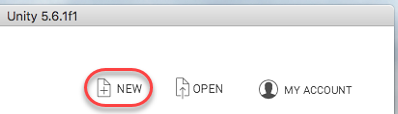

3. Set the **Project name** to **"UnityLab"** and select **3D**. Click **Create project**.

    

4. You're now looking at the default Unity interface. It has the scene hierarchy with game objects on the left, a 3D view of the blank scene shown in the middle, a project files pane on the bottom, and inspector and services on the right. Of course, there's a lot more to it than that, but those are few of the more important components.

    

5. For developers new to Unity, everything that runs in your app will exist within the context of a **scene**. A scene file is a single file that contains all sorts of metadata about the resources used in the project for the current scene and its properties. When you package your app for a platform, the resulting app will end up being a collection of one or more scenes, plus any platform-dependent code you add. You can have as many scenes as desired in a project.

6. The new scene just has a camera and a directional light in it. A scene requires a **camera** for anything to be visible and an **Audio Listener** for anything to be audible. These components are attached to a **GameObject**.

7. Select the **Main Camera** object from the **Hierarchy** pane.

    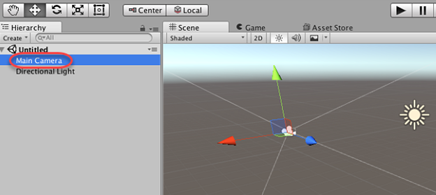

8. Select the **Inspector** pane from the right side of the window to review its properties. Camera properties include transform information, background, projection type, field of view, and so on. An Audio Listener component was also added by default, which essentially renders scene audio from a virtual microphone attached to the camera.

    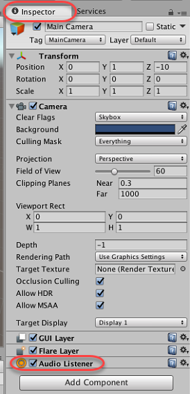

9. Select the **Directional Light** object. This provides light to the scene so that components like shaders know how to render objects.

    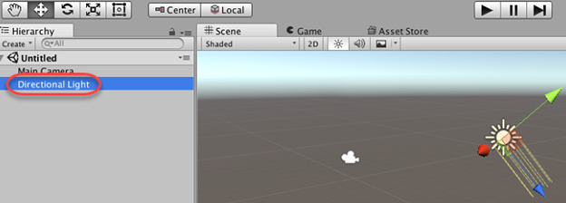

10. Use the **Inspector** to see that it includes common lighting properties including type, color, intensity, shadow type, and so on.

    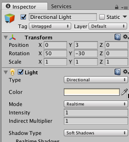

11. It is important to point out that projects in Unity are a little different from their Visual Studio for Mac counterparts. In the **Project** tab on the bottom, right-click the **Assets** folder and select **Reveal in Finder**.

    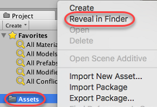

12. Projects contain **Assets**, **Library**, **ProjectSettings**, and **Temp** folders as you can see. However, the only one that shows up in the interface is the **Assets** folder. The **Library** folder is the local cache for imported assets; it holds all metadata for assets. The **ProjectSettings** folder stores settings you can configure. The **Temp** folder is used for temporary files from Mono and Unity during the build process. There is also a solution file that you can open in Visual Studio for Mac (**UnityLab.sln** here).

    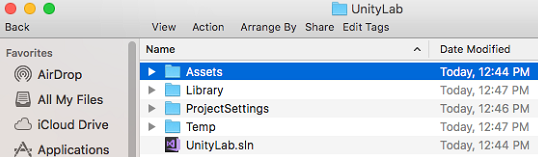

13. Close the **Finder** window and return to **Unity**.

14. The **Assets** folder contains all your assets-art, code, audio, etc. It's empty now, but every single file you bring into your project goes here. This is always the top-level folder in the **Unity Editor**. But always add and remove files via the Unity interface (or Visual Studio for Mac) and never through the file system directly.

    

15. The **GameObject** is central to development in Unity as almost everything derives from that type, including models, lights, particle systems, and so on. Add a new **Cube** object to the scene via the **GameObject > 3D Object > Cube** menu.

    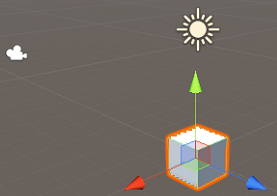

16. Take a quick look at the properties of the new **GameObject** and see that it has a name, tag, layer, and transform. These properties are common to all **GameObjects**. In addition, several components were attached to the **Cube** to provide needed functionality including mesh filter, box collider, and renderer.

    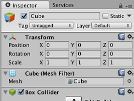

17. Rename the **Cube** object, which has the name **"Cube"** by default, to **"Enemy"**. Make sure to press **Enter** to save the change. This will be the enemy cube in our simple game.

    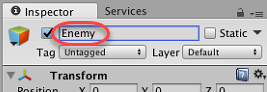

18. Add another **Cube** object to the scene using the same process as above, and name this one **"Player"**.

    

19. Tag the player object **"Player"** as well (see **Tag** drop-down control just under name field). We'll use this in the enemy script to help locate the player game object.

    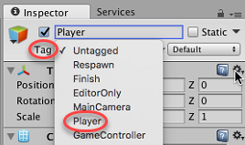

20. In the **Scene** view, move the player object away from the enemy object along the Z axis using the mouse. You can move along the Z axis by selecting and dragging the cube by its **red** panel toward the **blue** line. Since the cube lives in 3D space, but can only be dragged in 2D each time, the axis on which you drag is especially important.

    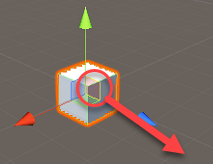

21. Move the cube downward and to the right along the axis. This updates the **Transform.Position** property in the **Inspector**. Be sure to drag to a location similarly to what's shown here to make later steps easier in the lab.

    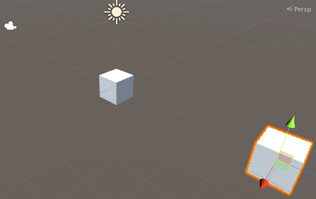

22. Now you can add some code to drive the enemy logic so that it pursues the player. Right-click the **Assets** folder in the **Project** pad and select **Create > C# Script**.

    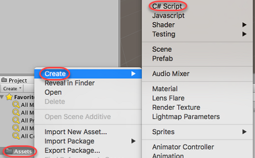

23. Name the new C# script **"EnemyAI"**.

    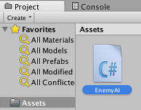

24. To attach scripts to game objects drag the newly created script onto the **Enemy** object in the **Hierarchy** pane. Now that object will use behaviors from this script.

    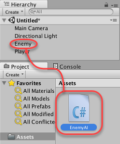

25. Select **File > Save Scenes** to save the current scene. Name it **"MyScene"**.

## Task 2: Working with Visual Studio for Mac Tools for Unity

1. The best way to edit C# code is to use Visual Studio for Mac. You can configure Unity to use Visual Studio for Mac as its default handler. Select **Unity > Preferences**.

2. Select the **External Tools** tab. From the **External Script Editor** dropdown, select **Browse** and select **Applications/Visual Studio.app**. Alternatively, if there's already a **Visual Studio** option, just select that.

    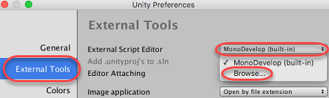

3. Unity is now configured to use **Visual Studio for Mac** for script editing. Close the **Unity Preferences** dialog.

    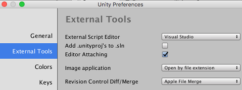

4. Double-click **EnemyAI.cs** to open it in **Visual Studio for Mac**.

    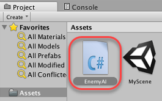

5. The Visual Studio solution is straightforward. It contains an **Assets** folder (the same one from **Finder**) and the **EnemyAI.cs** script created earlier. In more sophisticated projects, the hierarchy will likely look different than what you see in Unity.

    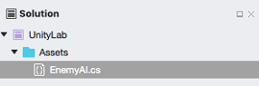

6. **EnemyAI.cs** is open in the editor. The initial script just contains stubs for the **Start** and **Update** methods.

7. Replace the initial enemy code with the code below.

    ```csharp
    public class EnemyAI : MonoBehaviour
    {
        public float Speed = 50;
        private Transform _playerTransform;
        private Transform _myTransform;

        void Start()
        {
            var player = GameObject.FindGameObjectWithTag("Player");
            if (!player)
            {
                Debug.LogError(
                    "Could not find the main player. Ensure it has the player tag set.");
            }
            else
            {
                _playerTransform = player.transform;
            }
            _myTransform = this.transform;
        }

        void Update()
        {
            var moveAmount = Speed * Time.deltaTime;
            _myTransform.position = Vector3.MoveTowards(_myTransform.position,
                _playerTransform.position, moveAmount);

            if (_myTransform.position == _playerTransform.position)
            {
                _myTransform.position = Vector3.back * 10;
            }
        }
    }
    ```

8. Take a quick look at the simple enemy behavior that is defined here. In the **Start** method, we get a reference to the player object (by its tag), as well as its **transform**. In the **Update** method, which is called every frame, the enemy will move towards the player object. The keywords and names use color coding to make it easier to understand the codebase in Visual Studio for Mac.

9. Save the changes to the enemy script in **Visual Studio for Mac**.

## Task 3: Debugging the Unity project

1. Set a breakpoint on the first line of code in the **Start** method. You can either click in the editor margin at the target line or place cursor on the line and press **F9**.

    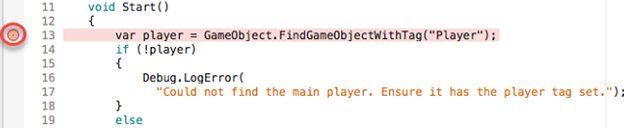

2. Click the **Start Debugging** button or press **F5**. This will build the project and attach it to Unity for debugging.

    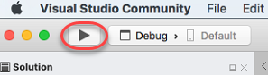

3. Return to **Unity** and click the **Run** button to start the game.

    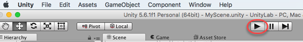

4. The breakpoint should be hit and you can now use the Visual Studio for Mac debugging tools.

    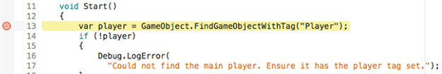

5. From the **Locals** pad, locate the **this** pointer, which references an **EnemyAI** object. Expand the reference and see that you can browse the associated members like **Speed**.

    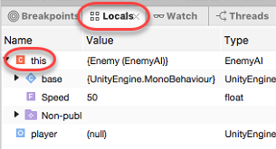

6. Remove the breakpoint from the **Start** method the same way it was added-by either clicking it in the margin or selecting the line and press **F9**.

    

7. Press **F10** to step over the first line of code that finds the **Player** game object using a tag as parameter.

8. Hover the mouse cursor over the **player** variable within the code editor window to view its associated members. You can even expand the overlay to view child properties.

    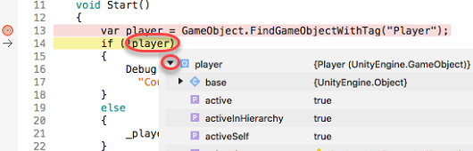

9. Press **F5** or press the **Run** button to continue execution. Return to Unity to see the enemy cube repeatedly approach the player cube. You may need to adjust the camera if it's not visible.

    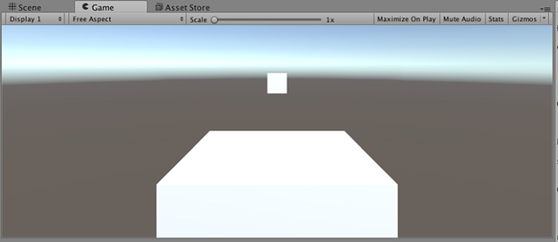

10. Switch back to **Visual Studio for Mac** and set a breakpoint on the first line of the **Update** method. It should be hit immediately.

    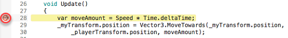

11. Suppose the speed is too fast and we want to test the impact of the change without restarting the app. Locate the **Speed** variable within the **Autos** or **Locals** window and then change it to **"10"** and press **Enter**.

    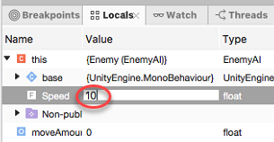

12. Remove the breakpoint and press **F5** to resume execution.

13. Return to **Unity** to view the running application. The enemy cube is now moving at a fifth of the original speed.

    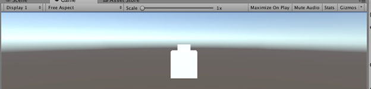

14. Stop the Unity app by clicking the **Play** button again.

    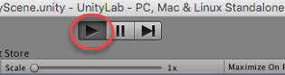

15. Return to **Visual Studio for Mac**. Stop the debugging session by clicking the **Stop** button.

    

## Task 4: Exploring Unity features in Visual Studio for Mac

1. Visual Studio for Mac provides quick access to Unity documentation within the code editor. Place the cursor somewhere on the **Vector3** symbol within the **Update** method and press **⌘ Command + '**.

    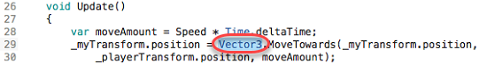

2. A new browser window opens to the documentation for **Vector3**. Close the browser window when satisfied.

    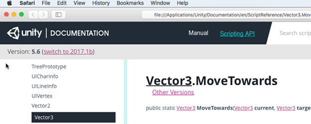

3. Visual Studio for Mac also provides some helpers to quickly create Unity behavior classes. From **Solution Explorer**, right-click **Assets** and select **Add > New MonoBehaviour**.

    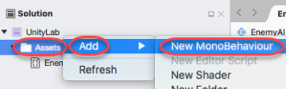

4. The newly created class provides stubs for the **Start** and **Update** methods. After the closing brace of the **Update** method, start typing **"onmouseup"**. As you type, notice that Visual Studio's IntelliSense quickly zeros in on the method you're planning to implement. Select it from the provided autocomplete list. It will fill out a method stub for you, including any parameters.

    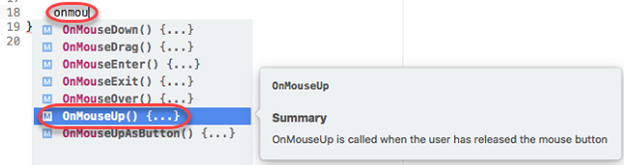

5. Inside the **OnMouseUp** method, type **"base."** to see all of the base methods available to call. You can also explore the different overloads of each function using the paging option in the top-right corner of the IntelliSense flyout.

    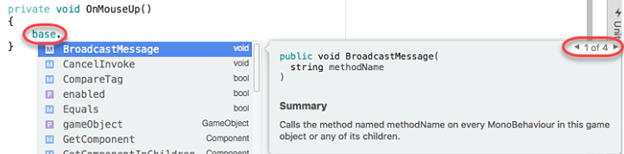

6. Visual Studio for Mac also enables you to easily define new shaders. From **Solution Explorer**, right-click **Assets** and select **Add > New Shader**.

    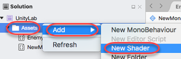

7. The shader file format gets full color and font treatment to make it easier to read and understand.

    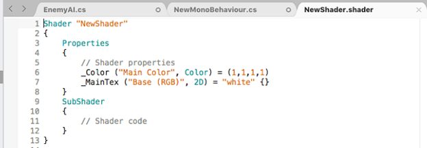

8. Return to **Unity**. You'll see that since Visual Studio for Mac works with the same project system, changes made in either place are automatically synchronized with the other. Now it's easy to always use the best tool for the task.

    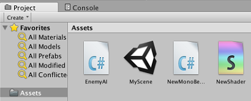

## Summary

In this lab, you've learned how to get started creating a game with Unity and Visual Studio for Mac. See [https://unity3d.com/learn](https://unity3d.com/learn) to learn more about Unity.
