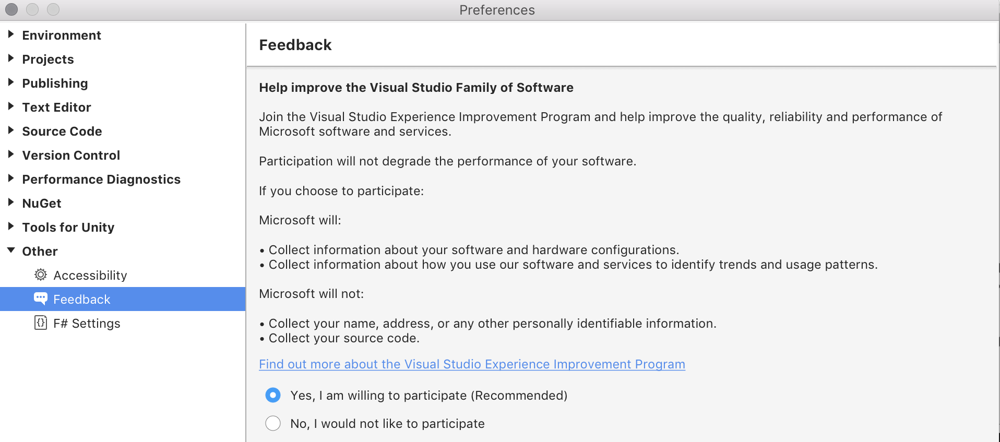

# Visual Studio Customer Experience Improvement Program

The Visual Studio Customer Experience Improvement Program (VSCEIP) is a program designed to help Microsoft improve all Visual Studio products over time. This program collects information about computer hardware and how people use Visual Studio for Mac, without interrupting the users in their tasks at the computer. The information that is collected helps Microsoft identify which features to improve. This document will cover how to opt in or out of the VSCEIP.

For more information about the information collected, processed, or transmitted by the VSCEIP, see the [Microsoft Privacy Statement](https://privacy.microsoft.com/privacystatement).  

## Choice and control over the Visual Studio Customer Experience Improvement Program

The VSCEIP is turned on by default. You can turn it off, or back on again, by following the instructions below.

1. Visual Studio for Mac.
2. Choose **Visual Studio > Preferences > Other > Feedback**.
3. Select your preference for participation:

    

## See also

* [How to report a problem with Visual Studio](report-a-problem.md)  
* [Visual Studio Developer Community](https://developercommunity.visualstudio.com/spaces/41/index.html)  
* [European Union General Data Protection Regulation (GDPR)](https://docs.microsoft.com/microsoft-365/compliance/gdpr)
* [Microsoft Privacy Statement](https://privacy.microsoft.com/privacystatement) 