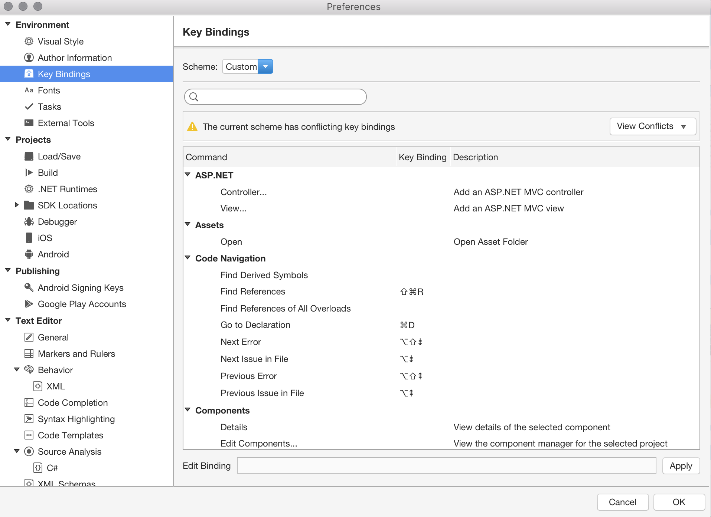

# Visual Studio for Mac for Windows users

 [!INCLUDE [Visual Studio for Mac](~/includes/applies-to-version/vs-mac-only.md)]

Migrating from one operating system to another can be daunting. There are often subtle differences in cross-platform applications, from the user interface to the categorization of menu items. Here you'll learn the most common differences between Visual Studio for Mac and Visual Studio for Windows. You'll also learn a few different conventions between macOS and Windows.

## Keyboard shortcuts

As developers, many of you will be accustomed to using the keyboard for your tasks and navigation. Some keys on the keyboard are common between Macs and Windows PCs. You might think that keyboard actions such as copy and paste use the same key combinations. This is not always the case. Fortunately, you can change your key bindings in Visual Studio for Mac to closely match those of Visual Studio in Windows.

::: moniker range="vsmac-2019"

The first time you run Visual Studio for Mac you'll see the keyboard shortcuts selection window:

If you want to change the key bindings later, you can find the setting in the preferences:

::: moniker-end

::: moniker range="vsmac-2022"

The first time you run Visual Studio for Mac you'll see the keyboard shortcuts selection window:
:::image type="content" source="media/vsmac-2022/keyboard-shortcuts-2022.png" alt-text="Screenshot showing the keyboard shortcuts selection window.":::

If you want to change the keyboard shortcuts later, you can find the setting in **Visual Studio > Preferences...**:
:::image type="content" source="media/vsmac-2022/preferences-keyboard-shortcuts.png" alt-text="Screenshot showing the keyboard shortcuts in the Preferences window.":::

::: moniker-end

::: moniker range="vsmac-2019"

It's important to note that macOS uses different system-wide shortcuts than Windows. Changing the key binding preferences will allow you to use familiar Windows shortcuts in Visual Studio for Mac. However, in other areas of macOS you'll need to be familiar with macOS shortcuts.

::: moniker-end

::: moniker range="vsmac-2022"

It's important to note that macOS uses different system-wide shortcuts than Windows. Changing the keyboard shortcuts preferences will allow you to use familiar Windows shortcuts in Visual Studio for Mac. However, in other areas of macOS you'll need to be familiar with macOS shortcuts.

::: moniker-end

The macOS Command (⌘) modifier key can commonly replace the Control key in Windows. Here are some examples, and other commonly used shortcuts:

|Task                   |Windows Shortcut         |macOS Shortcut      |
|-----------------------|-------------------------|--------------------|
|Copy                   |`Ctrl + C`               |`⌘ + C`             |
|Paste                  |`Ctrl + V`               |`⌘ + V`             |
|Cut                    |`Ctrl + X`               |`⌘ + X`             |
|Undo                   |`Ctrl + Z`               |`⌘ + Z`             |
|Redo                   |`Ctrl + Shift + Z`       |`⌘ + Shift + Z`     |
|Delete right of cursor |`Delete`                 |`fn + Backspace`    |
|Delete word            |`Ctrl + Delete`          |`fn + ⌥ + Backspace`|

> [!TIP]
> You can find a comprehensive list of macOS shortcuts on the [Apple Support website](https://support.apple.com/en-us/HT201236).

## Menus

::: moniker range="vsmac-2019"

Menus in macOS are organized differently than menus in Windows. Visual Studio for Mac is no exception. You can find some of the most common menu options here:

|Task                   |Visual Studio (Windows)                                              |Visual Studio for Mac                |
|-----------------------|---------------------------------------------------------------------|-------------------------------------|
|Preferences (Options)  |Tools > Options...                                                   |Visual Studio > Preferences...       |
|Extensions             |Extensions > Manage Extensions                                       |Visual Studio > Extensions...        |
|Layouts                |Window > Apply Window Layout > [Select layout]                       |View > Layout > [Select layout]               |
|Updates                |Help > Check for Updates                                             |Visual Studio > Check for Updates... |
|NuGet Package Manager  |Tools > NuGet Package Manager > Manage NuGet Packages or Solution... |Project > Manage NuGet Packages...   |
|Find tools             |Edit > Find and Replace > [Select tool]                              |Search > [Select tool]               |
|About Visual Studio    |Help > About Microsoft Visual Studio                                 |Visual Studio > About Visual Studio  

::: moniker-end

::: moniker range="vsmac-2022"

Menus in macOS are organized differently than menus in Windows. Visual Studio for Mac is no exception. You can find some of the most common menu options here:

|Task                   |Visual Studio (Windows)                                              |Visual Studio for Mac                |
|-----------------------|---------------------------------------------------------------------|-------------------------------------|
|Preferences (Options)  |Tools > Options...                                                   |Visual Studio > Preferences...       |
|Extensions             |Extensions > Manage Extensions                                       |Visual Studio > Extensions...        |
|Layouts                |Window > Apply Window Layout > [Select layout]                       |Window > Layout > [Select layout]               |
|Updates                |Help > Check for Updates                                             |Visual Studio > Check for Updates... |
|NuGet Package Manager  |Tools > NuGet Package Manager > Manage NuGet Packages or Solution... |Project > Manage NuGet Packages...   |
|Find tools             |Edit > Find and Replace > [Select tool]                              |Search > [Select tool]               |
|About Visual Studio    |Help > About Microsoft Visual Studio                                 |Visual Studio > About Visual Studio  

::: moniker-end

> [!NOTE]
> You can find an overview of most common features in Visual Studio for Mac in the [IDE Tour](ide-tour.md)
