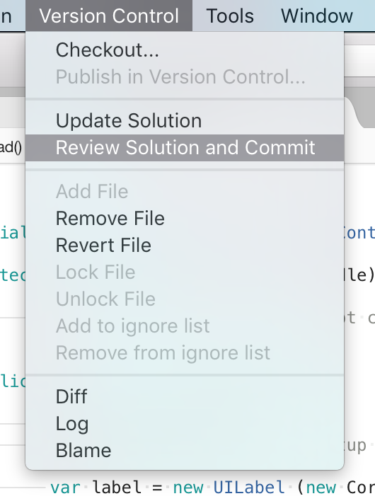
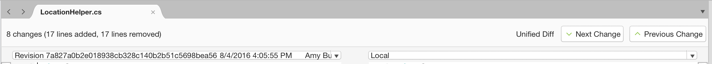
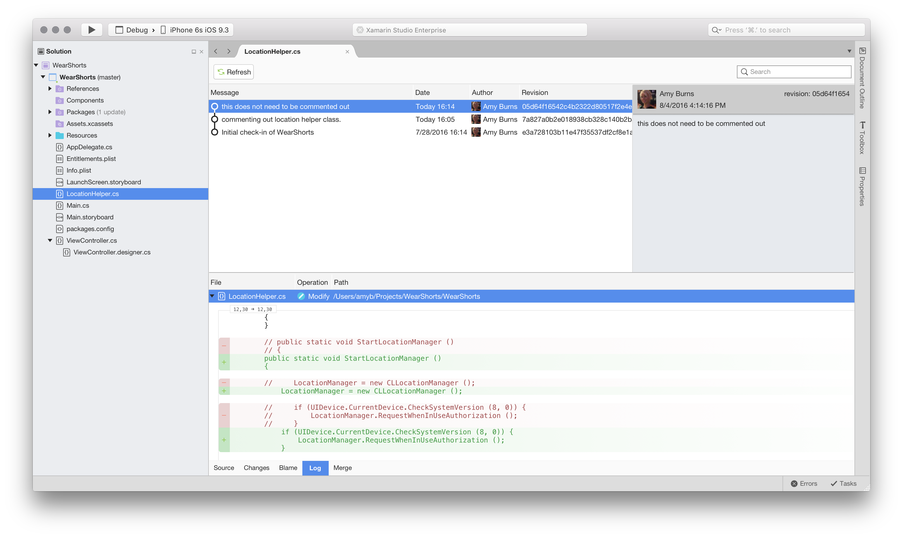
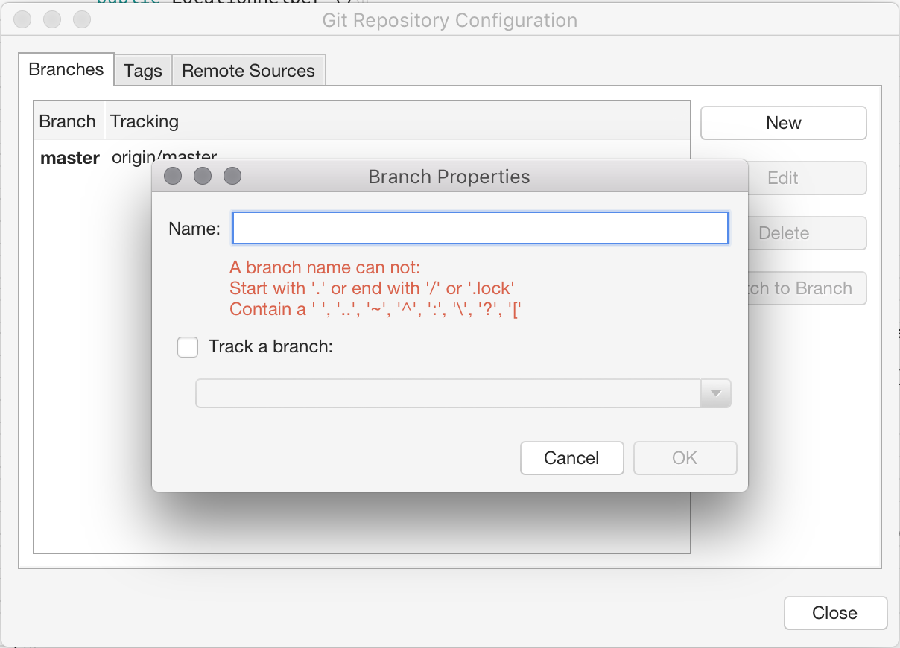
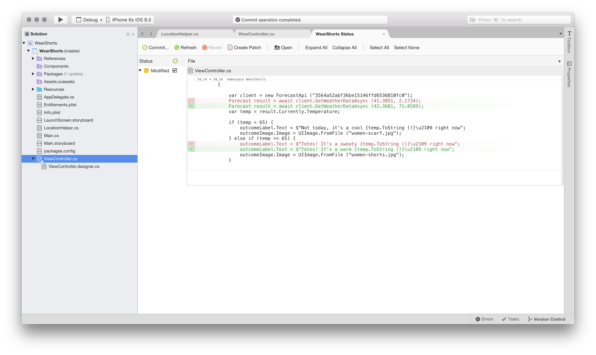
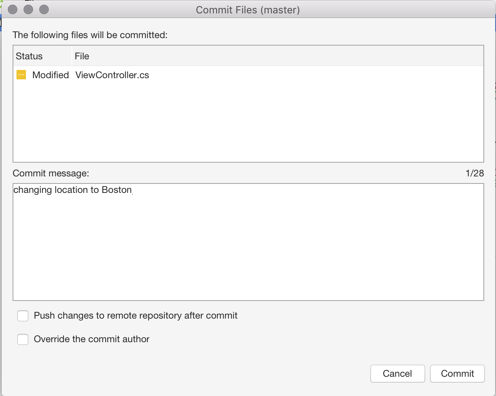

# Working with Git

Git is a distributed version control system that allows teams to work on the same documents simultaneously. This means that there is a central server that contains all the files, but when a repository is checked out from this central source, the entire repository is cloned to the local machine.

The sections below will explore how Git can be used for version control in Visual Studio for Mac.

## Git version control menu

The image below illustrates the options provided by Visual Studio for Mac by the Version Control menu item:

## Push and Pull

Pushing and Pulling are two of the most commonly used actions within Git. To synchronize changes that other people have made to the remote repository, you must **Pull** from there. This is done in Visual Studio for Mac by selecting **Version Control > Update Solution**.

Once you have updated your files, reviewed and committed them, you must then **Push** them to the remote repository to allow others to access your changes. This is done in Visual Studio for Mac by selecting **Version Control > Push Changes**. This will display the Push dialog, allowing you to view the committed changes, and select the branch to push to:

You can also Commit and Push your changes at the same time, via the Commit dialog:

## Blame, Log, and Merge

At the bottom of the window, there are five tabs displayed, as illustrated below:

These allow the following actions:

* **Source** - Displays your source code file.
* **Changes** - Displays the change in code between your local file and the base file. You can also compare different versions of the file from different hashes:

    

* **Blame** - Displays the username of the user associated with each section of code.
* **Log** - Displays all the commits, times, dates, messages, and users that are responsible for the file:

    

* **Merge** - This can be used if you have a merge conflict when committing your work. It shows a visual representation of the changes made by you and the other developer, allowing you to combine both sections of code cleanly.

## Switching branches

By default, the first branch created in a repository is known as the **Master** branch. There isn't technically anything different between the master branch and any other, but the master branch is the one that is most often thought of in development teams as the 'live' or 'production' branch.

An independent line of development can be created by branching off Master (or any other branch, for that matter). This provides a new version of the master branch at a point in time, allowing for development independently of what is 'live.' Using branches in this way is often used for features in software development

Users can create as many branches as they like for each repository, but it is recommended that once they have finished using a branch, it is deleted it to keep the repository organized.

Branches are viewed in Visual Studio for Mac by browsing to **Version Control > Manage Branches and Remotes...**:

Switch to another branch by selecting it in the list and pressing the **Switch to Branch** button.

To create a new branch select the **New** button in the Git repository configuration dialog. Enter the new branch name:

You can also set a remote branch to your _tracking_ branch. Read more about tracking branches in the [Git documentation](https://git-scm.com/book/en/v2/Git-Branching-Remote-Branches#Tracking-Branches).

See the current branch in the Solution Pad, next to the project name:

 

## Reviewing and committing

To review changes in the files, use the Changes, Blame, Log, and Merge tabs on each document, illustrated earlier in this topic.

Review all changes in your project by browsing to the **Version Control > Review Solution and Commit** menu item:

This allows viewing of all the changes in each file of a project with the option to Revert, Create a Patch, or Commit.

To commit a file to the remote repository, press **Commit**, enter a commit message, and confirm with the Commit Button:

Once you have committed your changes, push them to the remote repository to allow other users to see them.

## Related Video

> [!Video https://channel9.msdn.com/Shows/Visual-Studio-Toolbox/Visual-Studio-for-Mac-Manage-Projects-with-Git/player]

## See also

* [Share your code with Visual Studio 2017 and Azure Repos Git](/azure/devops/repos/git/share-your-code-in-git-vs-2017)
