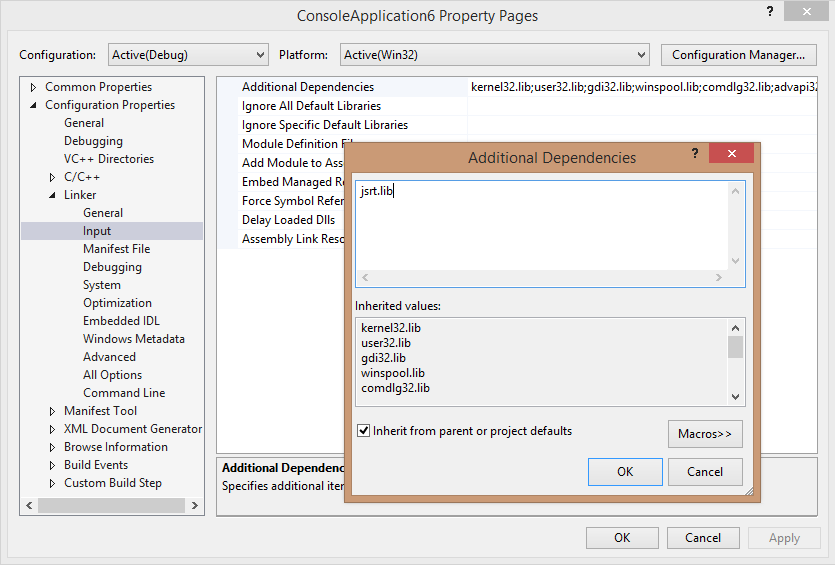
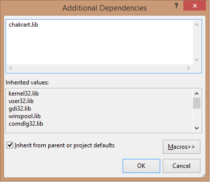

# Targeting Edge vs. Legacy Engines in JsRT APIs
Starting in Windows 10, one of the changes that we've made to Chakra (the JavaScript engine), which is aligned with Windows 10's browser strategy of supporting a new Edge rendering engine, is to support two different Chakra engines:  
  
-   The old Chakra engine (also called the *legacy engine* or jscript9.dll below) that ships with and supports Internet Explorer 11. This engine is frozen in time and will remain fundamentally unchanged from Win8.1/IE11 release.  
  
-   The new Chakra engine (also called the *Edge engine* or chakra.dll below) that ships with and supports the new browser in Windows 10, Microsoft Edge. This engine will be continually updated and will support a "living" [Edge](http://blogs.msdn.com/b/ie/archive/2014/11/11/living-on-the-edge-our-next-step-in-interoperability.aspx) engine. A living Edge engine implies that unlike the legacy engine, the Edge engine would not carry forward any form of versioning script functionality to opt into.  
  
 When creating an app using the JavaScript Runtime Hosting (JsRT) API, you can choose to target either the legacy or the Edge engine.  
  
-   If you need to emphasize backward compatibility of your existing applications, target the legacy engine.  
  
-   If you want your app to be forward looking and support new JavaScript features as they are released (for example, ECMAScript 6), target the Edge engine.  
  
 This topic includes details that describe how to target the different engines.  
  
## Target your preferred version  
 When creating an app, you can select the version of the JsRT that supports either the Edge engine or the legacy engine. You can choose the JsRT version based on the guidelines above. To accommodate these distinctions, the following changes have been made to `JsCreateRuntime`, `JsCreateContext`, and `JsStartDebugging`.  
  
 For `JsCreateRuntime`:  
  
-   When targeting the legacy engine, the `JsRuntimeVersionEdge` enumeration value is deprecated, and a message will suggest using the `JsRuntimeVersionInternetExplorer11` value instead.  
  
-   When targeting the edge engine, the version parameter is omitted from the `JsCreateRuntime` function.  
  
    ```cpp  
    JsErrorCode JsCreateRuntime(JsRuntimeAttributes attributes, JsThreadServiceCallback callback, _Out_ JsRuntimeHandle* runtime);  
    ```  
  
 For `JsCreateContext` and `JsStartDebugging`:  
  
-   When targeting the legacy engine, the `IDebugApplication` interface is used to supply your own non-remote debugging methods. For debugging purposes, `JsCreateContext` and `JsStartDebugging` functions take `IDebugApplication` as parameter.  
  
-   When targeting the Edge engine, the `IDebugApplication` interface is deprecated. The Chakra engine enables native and script debugging capability with Visual Studio debugger without requiring an implementation of `IDebugApplication` from user. The interface is no longer a parameter for `JsCreateContext` and `JsStartDebugging` as a result.  
  
 The signatures for the preceding APIs in the legacy engine are as follows:  
  
```cpp  
JsErrorCode JsCreateRuntime(JsRuntimeAttributes attributes, JsRuntimeVersion version, JsThreadServiceCallback callback, _Out_ JsRuntimeHandle* runtime);  
  
JsErrorCode JsCreateContext(JsRuntimeHandle runtime, IDebugApplication *debugApplication, JsContextRef *newContext);  
  
JsErrorCode JsStartDebugging(IDebugApplication *debugApplication);  
```  
  
 The signatures for the preceding APIs in the Edge engine are as follows:  
  
```cpp  
JsErrorCode JsCreateRuntime(JsRuntimeAttributes attributes, JsThreadServiceCallback callback, _Out_ JsRuntimeHandle* runtime);  
  
JsErrorCode JsCreateContext(JsRuntimeHandle runtime, JsContextRef *newContext);  
  
JsErrorCode JsStartDebugging();  
```  
  
## Compile for your preferred version using Visual C++  
 When using Visual C++, import the JsRT API by including the jsrt.h header, and ensure that jsrt.lib is included in your linker input files list:  
  
```cpp  
#include <jsrt.h>  
```  
  
   
  
 If you want to target the Edge engine binaries, you need to define the macro `USE_EDGEMODE_JSRT` before including jsrt.h, and instead of linking against jsrt.lib, you should link against chakrart.lib:  
  
```cpp  
#define USE_EDGEMODE_JSRT  
#include <jsrt.h>  
```  
  
   
  
 If you're starting with a new application, you are now ready to start writing code against the JsRT API.  
  
## Compile for your preferred version using .NET  
 If you're using .NET and P/Invoke, you must change your JsRT API [DllImport] declarations to import chakra.dll instead of jscript9.dll. In addition, change the definition of `JsCreateRuntime` to remove the `JsRuntimeVersion` parameter and the definition of `JsCreateContext` and `JsStartDebugging` to remove the `IDebugApplication` parameter.  
  
 For the legacy engine, use the following code.  
  
```c#  
[DllImport("jscript9.dll")]  
public static extern JsErrorCode JsCreateRuntime(  
    JsRuntimeAttributes attributes,  
    JsRuntimeVersion version,  
    JsThreadServiceCallback callback,  
    out JsRuntimeSafeHandle runtime  
);  
  
[DllImport("jscript9.dll")]  
public static extern JsErrorCode JsCreateContext(  
    JsRuntimeSafeHandle runtime,  
    IDebugApplication debugApplication,  
    out JsContextRef newContext  
);   
  
[DllImport("jscript9.dll")]  
public static extern JsErrorCode JsStartDebugging(  
    IDebugApplication debugApplication,  
);  
```  
  
 For the Edge engine, use the following code.  
  
```c#  
[DllImport("chakra.dll")]  
public static extern JsErrorCode JsCreateRuntime(  
    JsRuntimeAttributes attributes,  
    JsThreadServiceCallback callback,  
    out JsRuntimeSafeHandle runtime  
);  
  
[DllImport("chakra.dll")]  
public static extern JsErrorCode JsCreateContext(  
    JsRuntimeSafeHandle runtime,  
    out JsContextRef newContext  
);   
  
[DllImport("chakra.dll")]  
public static extern JsErrorCode JsStartDebugging();  
```  
  
> [!CAUTION]
>  If you are manually marshaling the function pointer (such as via LoadLibrary/GetProcAddress), it is critical that you do not mix the declarations of the method, or else you will unbalance the stack, which will result in unpredictable behavior such as causing your app to crash. The same problem will occur if you perform a global search-and-replace of instances of jscript9.dll in your import code, because you'll miss the `version` parameter being dropped.  
  
## Summary  
 In Windows 10, the JavaScript Runtime Hosting APIs are splitting into two. These APIs now support a "living" Edge engine, whose language capabilities will be aligned with the "living" Edge engine in the Microsoft Edge. You can leverage these capabilities from your desktop or Store apps to create new and exciting ways to extend your application and to leverage modern Web skills in your existing code base. However, because there are subtle differences between previous versions, you must be aware of the following points when targeting the Edge or legacy engine.  
  
-   Your app can support only one version of JsRT per process.  
  
     For example, you can't create an Edge engine runtime and then a legacy engine runtime and expect them to run correctly in the same process. This is unsupported and may result in undocumented behavior, such as failure to load the second DLL.  
  
-   When targeting the Edge engine, your app may unexpectedly acquire new features when the underlying platform is automatically updated.  
  
     For example, the Internet Explorer 11 mode of the legacy runtime supports block-scoping variable declarations such as `let` and `const`. If the Edge engine automatic versioning behavior had been the standard previously, code that had worked in Internet Explorer 10 mode, which did not have block-scoping rules, may have started failing when the platform had automatically upgraded. This must be a consideration when choosing which runtime model to use. While we believe you should target the Edge engine whenever possible, you must be careful about using JavaScript code structures that may become invalid in the future.  
  
-   JsRT for the Windows Store only supports the Edge engine (chakra.dll). Apps attempting to link against any JsRT API in jscript9.dll will fail certification.  
  
-   It is critical that you do not confuse the declaration of `JsCreateRuntime`, `JsCreateContext`, and `JsStartDebugging` between jscript9.dll and chakra.dll, because it will result in imbalancing the stack.  
  
     When using C and C++, you will receive a linker error if you try to use the wrong declaration, as long as you're not doing something like calling `LoadLibrary` and then `GetProcAddress`. .NET developers may not find this problem as easily, so double-check your code when using this feature.  
  
## See Also  
 [JavaScript Runtime Hosting](../chakra-hosting/javascript-runtime-hosting.md)