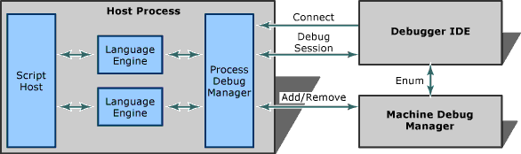

# Active Script Debugging Overview
The Active Script Debugging interfaces allow language-neutral, host-neutral debugging, and support a wide variety of development environments.  
  
   
Figure 1  
  
 A language-neutral debugging environment can support any programming language or mix of programming languages, without having specific knowledge of any of those languages. The debugging environment also supports cross-language stepping and breakpoints. (This overview focuses primarily on support scripting languages, such as VBScript and [!INCLUDE[javascript](../javascript/includes/javascript-md.md)].)  
  
 A host-neutral debugger can be automatically used with any Active Scripting host, such as Internet Explorer or a custom host. The host controls what the debugger presents to the user, from the structure of the document tree to the contents and syntax coloring of the debug documents. This allows the debugged source code to be shown in the context of the host document. For example, Internet Explorer can show a script in an HTML page.  
  
 In the subsections below, each key component in Active Debugging and its associated interfaces are discussed. However, before proceeding further, several key Active Debugging concepts must be defined:  
  
 **host application**  
 The application that hosts the script engines and provides a scriptable set of objects (or "object model").  
  
 **language engine**  
 A component that provides parsing, execution, and debugging abstractions for a particular language.  
  
 **debugger IDE**  
 The application that provides debugging UI by communicating with the host application and language engines.  
  
 **machine debug manager** 
 A component that maintains a registry of debuggable application processes.  
  
 **process debug manager**  
 A component that maintains the tree of debuggable documents for a particular application, tracks the running threads, and so on.  
  
 **document context**  
 A document context is an abstraction representing a specific range in the source code of a host document.  
  
 **code context**  
 A code context represents a particular location in the running code of a language engine (a "virtual instruction pointer".)  
  
 **expression context**  
 A particular context (for example, a stack frame) in which expressions may be evaluated by a language engine.  
  
 **object browsing**  
 A structured, language-independent representation of an object's name, type, value, and sub-objects, suitable for implementing a "watch window" UI.  
  
 Below is an overview of each of the key Active Debugging components and corresponding, associated interfaces, followed by the details of those interfaces.  
  
## Language Engine  
 The language engine provides:  
  
- Language parsing and execution.  
  
- Debugging support (breakpoints and so on).  
  
- Expression evaluation.  
  
- Syntax coloring.  
  
- Object browsing.  
  
- Stack enumeration and parsing.  
  
  Below are the interfaces that a script engine needs to support to provide debugging, expression evaluation, and object browsing. These interfaces are used by the host application to map between its document context and the engine's code contexts, and also by the debugger UI to do expression evaluation, stack enumeration, and object browsing.  
  
  [IActiveScriptDebug Interface](../winscript/reference/iactivescriptdebug-interface.md)  
  Provides syntax coloring and code context enumeration.  
  
  [IActiveScriptErrorDebug Interface](../winscript/reference/iactivescripterrordebug-interface.md)  
  Returns document contexts and stack frames for errors.  
  
  [IActiveScriptSiteDebug Interface](../winscript/reference/iactivescriptsitedebug-interface.md)  
  Host provided link from script engine to debugger.  
  
  [IDebugCodeContext Interface](../winscript/reference/idebugcodecontext-interface.md)  
  Provides a virtual "instruction pointer" in a thread.  
  
  [IEnumDebugCodeContexts Interface](../winscript/reference/ienumdebugcodecontexts-interface.md)  
  Enumerates the code contexts that correspond to a document context.  
  
  [IDebugStackFrame Interface](../winscript/reference/idebugstackframe-interface.md)  
  Represents a logical stack frame on the thread stack.  
  
  [IDebugExpressionContext Interface](../winscript/reference/idebugexpressioncontext-interface.md)  
  Provides context in which expressions can be evaluated.  
  
  [IDebugStackFrameSniffer Interface](../winscript/reference/idebugstackframesniffer-interface.md)  
  Provides a way to enumerate logical stack frames.  
  
  [IDebugExpression Interface](../winscript/reference/idebugexpression-interface.md)  
  Represents an asynchronously evaluated expression.  
  
  [IDebugSyncOperation Interface](../winscript/reference/idebugsyncoperation-interface.md)  
  Allows a script engine to abstract an operation that needs to be performed while nested in a particular blocked thread.  
  
  [IDebugAsyncOperation Interface](../winscript/reference/idebugasyncoperation-interface.md)  
  Provides asynchronous access to a synchronous debug operation.  
  
  [IDebugAsyncOperationCallBack Interface](../winscript/reference/idebugasyncoperationcallback-interface.md)  
  Provides status events related to progress of an `IDebugAsyncOperation` interface evaluation.  
  
  [IEnumDebugExpressionContexts Interface](../winscript/reference/ienumdebugexpressioncontexts-interface.md)  
  Enumerates a collection of `IDebugExpressionContexts` objects.  
  
  [IProvideExpressionContexts Interface](../winscript/reference/iprovideexpressioncontexts-interface.md)  
  Provides a way to enumerate expression contexts known by a certain component.  
  
  [IDebugFormatter Interface](../winscript/reference/idebugformatter-interface.md)  
  Allows a language or IDE to customize the conversion between VARIANT values or VARTYPE types and strings.  
  
  [IDebugStackFrameSnifferEx Interface](../winscript/reference/idebugstackframesnifferex-interface.md)  
  Enumerates the logical stack frames for the PDM.  
  
## Hosts  
 The host:  
  
- Hosts the language engines.  
  
- Provides an object model (set of objects that can be scripted).  
  
- Defines a tree of documents that can be debugged and their contents.  
  
- Organizes scripts into virtual applications.  
  
  There are two kinds of hosts:  
  
- A dumb host supports just the basic Active Scripting interfaces. It has no control over document structure or organizations; this is determined entirely by the scripts provided to the language engines.  
  
- A smart host supports a larger set of interfaces that allows it to define the document tree, document contents, and syntax coloring. There is a set of helper interfaces, described in the next subsection, which make it much easier for a host to be a smart host.  
  
### Smart-host Helper Interfaces  
 The `IDebugDocumentHelper` methods provide a greatly simplified set of interfaces that a host can use to gain the benefits of smart-hosting without handling the full complexity (and power) of the full host interfaces.  
  
 A host is not required to use these interfaces, of course. However using these interfaces can avoid implementing or using a number of more complicated interfaces.  
  
 [IDebugDocumentHelper Interface](../winscript/reference/idebugdocumenthelper-interface.md)  
 Implemented by PDM and provides implementations for many interfaces necessary for smart hosting.  
  
 [IDebugDocumentHost Interface](../winscript/reference/idebugdocumenthost-interface.md)  
 Implemented (optionally) by the host to expose host-specific functionality, such as syntax coloring, to the debugger.  
  
 For more information, see [Implementing Smart Host Helper Interfaces](../winscript/implementing-smart-host-helper-interfaces.md).  
  
### Full Smart-host Interfaces  
 Below is the full set of interfaces that a smart-host must implement or use if it is not using the helper interfaces.  
  
 Interfaces implemented by host:  
  
 [IDebugDocumentInfo Interface](../winscript/reference/idebugdocumentinfo-interface.md)  
 Provides information on a document, which may or may not be instantiated.  
  
 [IDebugDocumentProvider Interface](../winscript/reference/idebugdocumentprovider-interface.md)  
 Provides the means for instantiating a document on demand.  
  
 [IDebugDocument Interface](../winscript/reference/idebugdocument-interface.md)  
 The base interface for all debug documents.  
  
 [IDebugDocumentText Interface](../winscript/reference/idebugdocumenttext-interface.md)  
 Provides access to a text-only version of the debug document.  
  
 [IDebugDocumentTextAuthor Interface](../winscript/reference/idebugdocumenttextauthor-interface.md)  
 Allows editing of the text-only version of the debug document.  
  
 [IDebugDocumentContext Interface](../winscript/reference/idebugdocumentcontext-interface.md)  
 Provides an abstract representation of a portion of the document being debugged.  
  
 Interfaces implemented by PDM on behalf of the host:  
  
 [IDebugApplicationNode Interface](../winscript/reference/idebugapplicationnode-interface.md)  
 Extends the functionality of the `IDebugDocumentProvider` interface by providing a context within a project tree.  
  
## Debugger IDE  
 The IDE is a language-independent debugging UI. It provides:  
  
- Document viewers/editors.  
  
- Breakpoint management.  
  
- Expression evaluation and watch windows.  
  
- Stack frame browsing.  
  
- Object/Class browsing.  
  
- Browsing the virtual application structure.  
  
  Interfaces implemented by the debugger:  
  
  [IApplicationDebugger Interface](../winscript/reference/iapplicationdebugger-interface.md)  
  The primary interface exposed by a debugger IDE session.  
  
  [IApplicationDebuggerUI Interface](../winscript/reference/iapplicationdebuggerui-interface.md)  
  Gives an external component more control over the user interface (UI) of the debugger.  
  
  [IDebugExpressionCallBack Interface](../winscript/reference/idebugexpressioncallback-interface.md)  
  Provides status events for `IDebugExpression` evaluation progress.  
  
  [IDebugDocumentTextEvents Interface](../winscript/reference/idebugdocumenttextevents-interface.md)  
  Provides events indicating changes to the associated text document.  
  
  [IDebugApplicationNodeEvents Interface](../winscript/reference/idebugapplicationnodeevents-interface.md)  
  Provides the event interface for the `IDebugApplicationNode` interface.  
  
### Machine Debug Manager  
 The machine debug manager provides the hookup point between virtual applications and debuggers by maintaining and enumerating a list of active virtual applications.  
  
 [IDebugSessionProvider Interface](../winscript/reference/idebugsessionprovider-interface.md)  
 Establishes a debug session for a running application.  
  
 [IMachineDebugManager Interface](../winscript/reference/imachinedebugmanager-interface.md)  
 The primary interface to the machine debug manager.  
  
 [IMachineDebugManagerCookie Interface](../winscript/reference/imachinedebugmanagercookie-interface.md)  
 Similar to the `IMachineDebugManager` interface, but this interface supports debug cookies.  
  
 [IMachineDebugManagerEvents Interface](../winscript/reference/imachinedebugmanagerevents-interface.md)  
 Signals changes in the running application list maintained by the machine debug manager.  
  
 [IEnumRemoteDebugApplications Interface](../winscript/reference/ienumremotedebugapplications-interface.md)  
 Enumerates the running applications on a machine.  
  
### Process Debug Manager  
 The PDM does the following:  
  
- Synchronizes the debugging of multiple language engines.  
  
- Maintains a tree of debuggable documents.  
  
- Merges stack frames.  
  
- Coordinates breakpoints and stepping across language engines.  
  
- Tracks threads.  
  
- Maintains a debugger thread for asynchronous processing.  
  
- Communicates with the machine debug manager and the debugger IDE.  
  
  Following are the interfaces provided by the process debug manager.  
  
  [IProcessDebugManager Interface](../winscript/reference/iprocessdebugmanager-interface.md)  
  Primary interface to the process debug manager. This interface can create, add, or remove a virtual application from a process.  
  
  [IRemoteDebugApplication Interface](../winscript/reference/iremotedebugapplication-interface.md)  
  Represents a running application.  
  
  [IDebugApplication Interface](../winscript/reference/idebugapplication-interface.md)  
  Exposes non-remotable debugging methods for use by language engines and hosts.  
  
  [IRemoteDebugApplicationThread Interface](../winscript/reference/iremotedebugapplicationthread-interface.md)  
  Represents a thread of execution within a particular application.  
  
  [IDebugApplicationThread Interface](../winscript/reference/idebugapplicationthread-interface.md)  
  Allows language engines and hosts to provide thread synchronization and to maintain thread-specific, debug-state information.  
  
  [IEnumRemoteDebugApplicationThreads Interface](../winscript/reference/ienumremotedebugapplicationthreads-interface.md)  
  Enumerates the running threads in an application.  
  
  [IDebugThreadCall Interface](../winscript/reference/idebugthreadcall-interface.md)  
  Dispatches marshaled calls.  
  
  [IDebugApplicationNode Interface](../winscript/reference/idebugapplicationnode-interface.md)  
  Maintains a position for a document in the hierarchy.  
  
  [IEnumDebugApplicationNodes Interface](../winscript/reference/ienumdebugapplicationnodes-interface.md)  
  Enumerates child nodes of a node associated with an application.  
  
  [IEnumDebugStackFrames Interface](../winscript/reference/ienumdebugstackframes-interface.md)  
  Enumerates the stack frames corresponding to a thread, merged from the engines.  
  
  [IDebugCookie Interface](../winscript/reference/idebugcookie-interface.md)  
  Allows the debug cookie to be set in script debuggers.  
  
  [IDebugHelper Interface](../winscript/reference/idebughelper-interface.md)  
  Serves as a factory for object browsers and simple connection points for script engines.  
  
  [ISimpleConnectionPoint Interface](../winscript/reference/isimpleconnectionpoint-interface.md)  
  Provides a simple way for describing and enumerating the events fired on a particular connection point, for script engines.  
  
## See also  
 [Active Script Debugger Interfaces](../winscript/reference/active-script-debugger-interfaces.md)
