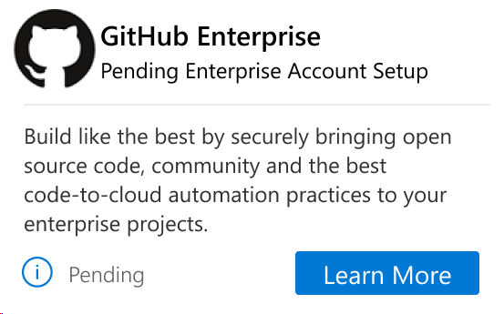
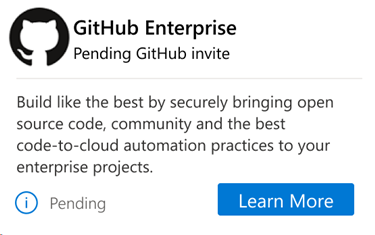
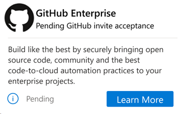
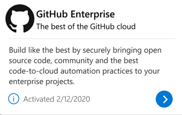

# Visual Studio subscriptions with GitHub Enterprise 

## What's on this page

+ ***Eligibility:*** *Learn which Visual Studio subscriptions include GitHub Enterprise.*
+ ***Setup Access:*** *Follow steps for admins and users to link accounts and accept invites.*
+ ***Get Help:*** *Find links to GitHub resources, FAQs, and troubleshooting guides.*

## Overview

Customers who have Enterprise Agreements (EA) with Microsoft are eligible to purchase a new subscription offer that brings together Visual Studio standard subscriptions and GitHub Enterprise. It's an easy and economical way for Visual Studio subscribers to acquire GitHub Enterprise. 

+ Innovate at scale with Visual Studio and GitHub by securely bringing open source code, community, and best practices into your IDE and workflows.
+ Use best-in-class development tools and services for developers with the most comprehensive set of resources to create, deploy, and manage great applications. 
+ Collaborate and manage "pull requests" on GitHub Enterprise and review source code where it was written - in the editor. 

## What's available? 

The following options are available:

+ Visual Studio Enterprise with GitHub Enterprise
+ Visual Studio Professional with GitHub Enterprise

Visual Studio Enterprise, Visual Studio Professional, and GitHub Enterprise continue to be available separately. 

To learn more about benefits and options, visit <https://visualstudio.microsoft.com/subscriptions/visual-studio-github>. 

## What is the Visual Studio subscription with GitHub Enterprise setup process?

Visual Studio subscriptions with GitHub Enterprise are managed in two parts:
1. The Visual Studio subscription (Enterprise or Professional)
2. GitHub Enterprise 

When you're assigned to a Visual Studio subscription with GitHub Enterprise, you receive an email letting you know that your Visual Studio subscriptions admin assigned a subscription to you. At that point, you can view available subscription benefits at <https://my.visualstudio.com/benefits>.

**Note:** Management of the combined Visual Studio + GitHub Enterprise entitlement occurs across **two systems**—the Visual Studio Subscriptions Admin Portal and the GitHub Enterprise administration interface. These responsibilities might be performed by **one person or multiple administrators**, depending on your organization’s structure.

Once assigned, the GitHub Enterprise benefit looks like this:

   > [!div class="mx-imgBorder"]
   >   

A GitHub administrator manages GitHub Enterprise separately from Visual Studio subscriptions. When your company sets up a GitHub Enterprise account, you receive an email from GitHub notifying you that your Visual Studio subscription is linked and the benefit tile is updated as seen on the next screenshot. Setting up this account might take some time and is dependent on your company completing the setup process. After you receive the email, you can reach out to the appropriate GitHub organization admin to request an invitation to their organization and/or repo.  

Even when the same individual holds both administrative roles, both steps must still be completed:  
1. Assign the Visual Studio subscription  
2. Invite the user to the correct GitHub Enterprise organization

   > [!div class="mx-imgBorder"]
   >   

## Accessing Your GitHub Enterprise Benefit

When an administrator assigns your subscription, you receive a confirmation email. After your GitHub org admin (which might be the same person) invites you to the GitHub Enterprise organization, the benefit tile updates accordingly.

If the GitHub Enterprise benefit doesn’t appear for you, your organization might not be finished with the required setup steps. You can't self‑assign this benefit.  
  
Use the [Contact your admin](https://learn.microsoft.com/visualstudio/subscriptions/contact-my-admin) tool, to get a hold of your administrator for further help. 

   > [!div class="mx-imgBorder"]
   >   

After you accept the GitHub organization invitation, the status shown on the tile changes from "Pending" to "Activated."

   > [!div class="mx-imgBorder"]
   >   

## Get started with GitHub

If you're new to GitHub, here are some helpful resources:

| Subject | GitHub Help article |
| ------- | ----------------- |
| General questions/information | [GitHub Help](https://help.github.com) |
| What is GitHub? How do I learn more? | [About GitHub](https://help.github.com/categories/about-github) |
| How do I get started using GitHub? | [Bootcamp](https://help.github.com/categories/bootcamp) |
| How do I manage my user account and profile? | [Setting up and managing your GitHub user account](https://help.github.com/categories/setting-up-and-managing-your-github-user-account) |
| How do I manage my access to GitHub? | [Authenticating to GitHub](https://help.github.com/categories/authenticating-to-github) |
| How does GitHub use and protect my data? | [Understanding how GitHub uses and protect your data](https://help.github.com/categories/understanding-how-github-uses-and-protects-your-data) |

## Administrator resources

Administrators can reference:

+ [Set up GitHub Enterprise licenses with Visual Studio subscriptions](https://learn.microsoft.com/visualstudio/subscriptions/assign-github)
+ See video about [Managing Licenses in GitHub Enterprise for Visual Studio subscriptions](https://www.youtube.com/watch?v=RWG3sHLIRts) in YouTube
+ [Understand GitHub Enterprise setup requirements](https://docs.github.com/enterprise-cloud@latest/billing/how-tos/set-up-payment/set-up-vs-subscription)

## Frequently asked questions

### Where is my GitHub subscription?

A: The process for setting up a GitHub Enterprise account can take a while. If you've been waiting, you might want to reach out to your GitHub admin. It's possible that your admin is still working on it or elected not to create a GitHub Enterprise account. 

### Why doesn’t my GitHub Enterprise benefit appear even though I was assigned to a Visual Studio subscription?  

A: Your subscription might already be assigned, but your organization might still need to complete the GitHub Enterprise setup steps. The GitHub portion of the benefit requires the admin (who might also be the Visual Studio admin) to configure the GitHub Enterprise account and invite you to their organization.

### What should I do if my GitHub Enterprise benefit shows as "Pending"?
  
A: A "Pending" state means GitHub Enterprise setup is still in progress and can include:  
+ GitHub Enterprise account provisioning  
+ Waiting for your GitHub organization invite  
+ Administrator setup not yet completed  

Once the GitHub admin sends the invitation and you accept it, your GitHub Enterprise tile switches from "Pending" to "Activated."  

### Can I activate my GitHub Enterprise access myself?
  
A: No. Users can't self‑assign access to GitHub Enterprise. You must be assigned a GitHub‑enabled Visual Studio subscription and then be invited to the appropriate GitHub Enterprise organization.

If you don't know who manages your subscription, use the “[Contact my admin](https://learn.microsoft.com/visualstudio/subscriptions/contact-my-admin)” tool.

### Who assigns my GitHub Enterprise license?
  
A: A Visual Studio subscription administrator performs the subscription assignment. The GitHub Enterprise organization owner/admin performs the GitHub invitation. These roles **might be held by the same person or different people** in your organization.

### Why do I need both a subscription assignment and an organization invite?
  
A: Visual Studio and GitHub Enterprise are managed in two separate systems.

### Do I get the full Visual Studio subscription benefits?

A: Yes. When you receive GitHub Enterprise, you also receive the full set of Visual Studio subscription benefits. You still get software downloads, cloud services, technical support, and partner offers. It’s the same set of benefits you would have if you purchased the subscription separately.

### Is GitHub Enterprise included in subscriptions purchased in all channels?

A: No. GitHub Enterprise is currently available to organizations who purchase using Enterprise Agreements.  

## Support resources

+ Learn more about GitHub assignment at [GitHub Docs](https://docs.github.com/en/enterprise-cloud@latest/billing/managing-licenses-for-visual-studio-subscriptions-with-github-enterprise/about-visual-studio-subscriptions-with-github-enterprise)
+ Find answers to questions on a wide array of GitHub articles at [GitHub Help](https://help.github.com).
+ Need more help? Contact [GitHub Support](https://support.github.com/)
+ Get help from other GitHub users in the [GitHub Community Forum](https://github.community/).
+ For assistance with sales, subscriptions, accounts, and billing for Visual Studio Subscriptions, visit our [Get Help](https://aka.ms/vssubscriberhelp) page.
+ Have a question about Visual Studio IDE, Azure DevOps Services, or other Visual Studio products or services? Visit [Visual Studio Support](https://visualstudio.microsoft.com/support/).
+ Get [technical support](https://support.microsoft.com/en-us/supportforbusiness/productselection?sapId=b77fe80f-5417-80bd-4b2a-275cf0018c24) for GitHub Enterprise.   

## See also

+ [Visual Studio documentation](/visualstudio/)
+ [Azure DevOps Services documentation](/azure/devops/)
+ [Azure documentation](/azure/)
+ [Microsoft 365 documentation](/microsoft-365/)

## Next steps

If you're new to GitHub, check out the [GitHub Learning Lab](https://github.com/apps/github-learning-lab), which takes you through a series of fun and practical projects, sharing helpful feedback along the way.
